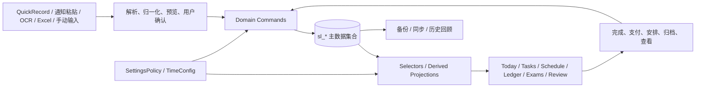

# 学习生活台：FINAL PRODUCT AUDIT

审计日期：2026-09-02
审计阶段：Final Product Audit
范围：全项目产品、功能、UX、数据闭环、移动端、桌面端、无障碍、发布风险与功能减法审计。
结论：本轮只审计和提出方案；没有删除组件、重做导航、重写首页、修改同步协议、开发 AI 或修改 `release.config.js`。

## 0. 结论先行

“学习生活台”已经不是“功能不足”的产品，而是一个核心能力基本齐全、但首页和入口开始变重的产品。

最终判断：

- 产品复杂度：**B. 功能刚好，但出现局部偏多和认知重复**。
- 当前最需要：**B. UX 打磨 + C. 功能减法 + D. 发布前稳定性**。
- 暂不需要：**E. P2-C AI**。
- 不建议进入 P2-C，也不建议继续增加新的业务模块。
- 最值得先做的事情不是扩展能力，而是让用户只看到“现在该做什么、什么有风险、下一步怎么处理”。

当前最重要的三个问题：

1. 首页默认模块过多：`接下来`、`今日行动清单`、`专注`、`今日待办`、`今天课程`、`待安排`、`快速记录`、`收件箱`、`课程负荷`、`近期提醒`、`本周概况`、`本周脉搏`等均可能出现。数据多时，首页仍然容易退化成多个模块缩小版的拼盘。
2. 同步和发布仍有真正的验收门槛：正式远端、iPhone Safari、Android Chrome、回滚自身失败、同步提交中关闭应用，以及源码签名门禁尚未闭环。
3. 核心领域命令已经建立，但写入边界还没有完全封闭：交易的删除/撤销、任务和倒计时撤销、课程复制、清单和吃什么模块仍有页面直接改集合的路径。

## 1. 审计基线与证据

审查对象为当前工作树 `D:\study-life\study-life`，不是只依据旧的 `SYSTEM_CLOSURE_AUDIT.md`。本次重新检查了：

- `src/` 全部 views、components、composables、store、domain、router、配置与样式；
- `tests/` 全部 53 个测试文件；
- `package.json`、`main.js`、`routePreload.js`、`AGENTS.md`、`release.config.js`；
- 1440×900 桌面空数据首页；
- 390×844 手机空数据首页、快速记录入口、更多功能入口、Tasks、Ledger、Weekly Review；
- 数据主权、直接写入、Legacy 引用、术语和错误文案扫描。

当前验证结果：

| 项目 | 结果 | 备注 |
|---|---|---|
| 测试 | PASS | 53 个测试文件，383 tests 全部通过 |
| lint | PASS | `npm run lint` |
| typecheck | PASS | `npm run typecheck` |
| build | BLOCKED | `release.config.js` 的源码签名/RELEASE_NOTES 门禁未同步 |
| Git | 未提交 | 工作树包含既有修改；本轮没有覆盖或恢复 |
| Push | 未执行 | 本轮没有发布操作 |

构建失败是确定性的发布门禁，不是本轮审计引入的编译错误。当前提示要求发布负责人按发布流程确认 `RELEASE_NOTES` 后更新签名；本轮遵守“不修改 `release.config.js`”的约束。

## 2. 产品边界

建议产品定义：

> 学习生活台是一个以“今天”为中心，把课程、作业、重要日期、日常收支和轻量生活记录串起来的个人行动台；它帮助用户快速记录、安排、执行和回顾，不要求用户管理底层数据系统。

它不应该发展成：

- 完整 ERP 或学生管理系统；
- 完整 Notion、知识图谱或第二大脑；
- 专业财务软件；
- 社交、邮件、联系人或万能个人操作系统；
- 会自动替用户改写日程和业务实体的万能 AI Agent。

今后的边界判断标准：如果一个能力不能明显服务“课程、待办、重要日期、收支、轻量回顾”中的至少一项，就不应进入核心产品。

## 3. 当前真实功能地图

| 功能 | 当前主数据 | 主要入口 | 主要读取方 | 分类 | 审计判断 |
|---|---|---|---|---|---|
| 首页 / Today | 无独立业务集合 | `/` | Today、行动中心、提醒、周脉搏 | C Projection / View | 核心入口，但信息层级需收敛 |
| 课程 / 课表 | `sl_courses` | Schedule、手动编辑、文字/图片/Excel 导入 | Schedule、Today、Course、Review | A 核心功能 | 必须保留；设置入口过多 |
| 作业 / 待办 | `sl_tasks` | Tasks、QuickRecord、通知、课程详情、Focus | Tasks、Today、Reminder、Focus、Review | A 核心功能 | `homework` 是 Task 的类型，不应独立成第二实体 |
| 日程 | `sl_events` | QuickRecord、通知解析 | Today、提醒、Review | A 核心数据 | 有创建和展示，但缺少独立管理入口 |
| 重要日期 / 考试 / 倒计时 | `sl_exams` | Exams、QuickRecord、课程详情 | Exams、Today、Reminder、Review | A 核心功能 | 数据已统一；用户概念仍有“考试/倒计时”分叉 |
| 固定账单 | `sl_bills` | Ledger、QuickRecord | Ledger、Today、Reminder、Review | A 核心功能 | 与 Transaction 关系清楚，但暂停/归档/删除需要收敛 |
| 收支记录 | `sl_expenses` | Ledger、QuickRecord、Bill 支付 | Ledger、Today/Review | A 核心功能 | 单一 Transaction 已成立；删除路径未完全命令化 |
| 快速笔记 / 收件箱 | `sl_quick_notes` | QuickRecord、通知保存 | Today Inbox、Review、关系来源 | B 上下文入口 + A 输入收件箱 | 足够轻量；缺少独立笔记管理页 |
| 专注 | `sl_focus_sessions`、`sl_focus_active` | Today FocusPanel | Today、Review、Task 计数 | A 核心能力 | 可关联 Task，也可自由专注；方向正确 |
| 课程反馈 / 心情 | `sl_course_checkins`、`sl_mood_log` | Today | Today、WeeklyPulse、Review | C Projection + 轻量记录 | 心情价值有限，应保持弱入口 |
| 清单 | `sl_checklists` | Lists | Lists、备份/同步 | A 辅助模块 | 与 Task 有认知重叠；暂不删，但应弱化 |
| 吃什么 | `sl_food_places`、`sl_food_history` | Food | Food、备份/同步 | G 低优先级辅助模块 | 有趣但非核心，不能继续扩张 |
| 提醒 | 不持久化 | Selectors、Today、Ledger 自有规则 | Today、Ledger | C Projection | 方向正确，但仍有跨页面重复规则 |
| 周回顾 | 不持久化 | `/review`、首页入口 | WeeklyReview | C Projection | 已满足基础价值，不应继续堆统计 |
| 数据管理 / 同步 | 多个 `sl_*` 键、同步元数据 | DataManager | 用户主动备份/迁移/同步 | D Settings / Policy | 能力完整但复杂度最高，必须保持低频入口 |

## 4. 核心数据流与数据主权

当前推荐的真实数据流如下：



核心判断：

- 没有发现 `HomeTask`、`CourseHomework`、`ReminderTask` 等新的业务副本。
- 作业通过 `Task.kind = homework` 表达；复习任务通过 `sourceType = milestone-review` 表达；提醒是选择器结果，不是新集合。
- `course`、`courseName` 是展示回退字段；`courseId`、`sourceType/sourceId` 是关系元数据，属于可接受的关系信息。
- `Bill` 是未来义务，`Transaction` 是已经发生的财务事实，两者不是重复实体；Bill 支付会生成单一 Transaction。
- 仍然存在页面可以直接改 `sl_*` 集合的例外，因此“数据主权已设计”不等于“数据主权已被接口完全强制”。

### 4.1 主要闭环

| 闭环 | 当前状态 | 断点 / 说明 |
|---|---|---|
| 输入 → 待办 → Today → 完成 → 历史/回顾 | 基本成立 | 页面级端到端验收覆盖仍少；撤销路径未完全命令化 |
| 课程 → 添加作业 → Task → Today → Reminder → Complete | 基本成立 | 课程详情可带 `courseId` 打开 QuickRecord；提醒与首页投影仍可能并列出现 |
| 重要日期 → Review Task → Today Focus → Complete | 成立 | Review Task 是 Task，不是新业务副本 |
| 普通消费 → Transaction → Ledger → Weekly Review | 成立 | Today 没有轻量收支摘要；交易删除/撤销有直接集合写入例外 |
| Bill → Reminder → 支付 → Transaction → 下一周期 | 成立 | UI 上“暂停/归档/删除”概念尚未完全统一；Bill 归档命令没有明显主入口 |
| Note → 保存 → 转 Task/Event → 关系保留 → 归档 | 部分成立 | 没有独立笔记管理页，已保存笔记的长期可发现性不足 |
| OCR/导入 → 预览 → 课程主数据 → Today | 基本成立 | 流程复杂，移动端真机仍待验收 |
| Local → Preview → Conflict decision → Base → Push/Pull | 基本成立 | 回滚自身失败与关闭窗口时的恢复仍 BLOCKED |

## 5. 页面与功能职责审计

### 5.1 Today / 首页

当前首页在空数据下的实际顺序是：问候 → 心情 → 接下来 → 专注 → 本周概况 → 本周脉搏；数据出现后还会加入行动清单、今日待办、课程、待安排、事件摘要、收件箱、课程负荷和近期提醒。

已经做对的地方：

- 空状态不再堆叠巨大插画卡片；没有数据的多数模块通过 `v-if` 隐藏。
- `接下来`是明显的最高优先级入口。
- `displayTasks`、`dailyAgenda`、`unifiedReminders` 已有部分去重逻辑。
- 首页没有另建业务集合，全部来自主数据或选择器。
- 手机端先渲染基础入口，降低首屏挂载压力。

主要问题：

1. 默认 `HOME_MODULES` 包含 11 个可见模块；“允许用户在个性化里关闭模块”把产品层级问题转嫁给用户。
2. 页面结构仍然按“模块存在就展示”，不是按“今天最值得注意的三件事”排序。
3. `FocusPanel` 是一个完整的交互工具，被放在 Today 早期位置，可能把“今天该做什么”向下推。
4. “今日行动清单”目前排除了课程、Task、Bill，主要展示事件/节点；标题仍容易让用户以为它包含全部今日行动。
5. `今天课程`与`课程表`是合理的 Projection/主模块关系，但课程过多时首页仍会变成课表缩略版。
6. `待安排`只显示最多 3 条，没有清晰的全局计数徽标；无日期事项仍可能长期堆积。
7. `快速记录`摘要实际主要展示未来事件，标题和“日程与笔记”的说明不完全匹配。
8. `课程负荷`、`近期提醒`、`本周概况`、`本周脉搏`均在回答“最近需要关注什么”或“进展如何”，存在信息语义重叠。
9. 首页目前没有稳定、统一的“异常”区；异常信息会分散在逾期 Task、近期提醒、课程负荷和同步提示中。
10. 首页在没有数据时能回答“现在没有课程/可以自由安排”，但不能清楚展示“今天应该做什么”和“是否有风险”；这在空状态是可接受的，但在真实数据下必须用统一行动中心解决。

首页建议的收敛形态：

```text
今天
├─ 接下来：课程或最早的事项
├─ 现在该做：最多 3 条可直接完成的 Task / Bill / 节点动作
├─ 需要注意：逾期、临近考试、即将到期账单
└─ 轻量摘要：课程、完成进度、周回顾入口
```

完整课程、完整待办、完整账本、完整考试仍进入原模块；首页不再保留每个模块的缩小版。

### 5.2 Tasks

Tasks 底层三态 `unplanned / scheduled / completed` 合理，且没有必要改变底层模型。

当前体验：

- 页面文案为“待安排 / 已安排 / 已完成 / 全部”，语义基本可理解。
- `待安排`指没有日期，`已安排`指有日期且未完成；这两个标签应继续配合解释性副文案，而不是改数据模型。
- 无日期事项不会自动进入今天，也不会自动被赋予日期，这是正确的安全策略。
- 首页最多显示 3 条待安排事项，存在提醒价值，但容易被忽略。

建议：

- 将“待安排”改为更行动化的“待安排日期”，或在标签下增加“没有日期的事项”；“已安排”增加“已有日期”说明。
- 在首页或导航显示轻量 `待安排 3`，只提醒用户整理，不自动安排日期。
- 对逾期 Task 使用“需要重新安排”作为主动作；不要只显示“已逾期”。
- Task 卡片默认只显示：标题、今天/逾期/日期、课程或优先级中的一个；备注、来源、提醒详情进入详情。
- 保持“完成”作为 Task 的主动作，不把编辑、归档、删除同时放到首屏。

### 5.3 Focus

Focus 独立存在是合理的：它支持从 Task 开始、输入临时目标、完全自由专注三种模式，符合“Focus 不等于 Task”的要求。

已成立：

- Task 关联通过 `todoId`，不是复制 Task。
- 自由专注可在结束后选择加入待办。
- 结束后可标记关联 Task 完成。

需要留意：

- `FocusPanel` 在保存专注时直接修改 Task 的 `focusCount/focusTotalSeconds/lastFocusedAt`，这是对 Task 主实体的页面级直接变更。它当前没有破坏性问题，但应视为领域写入例外。
- Focus 计时器、休息、声音、通知、临时目标和历史记录已足够，不应继续增加学习分析或 AI 反馈。

### 5.4 Course / Schedule

课程表承担了大量职责：课程显示、手动编辑、课程管理、模板、学期、校区、作息季、特殊日期、批量导入、OCR、Excel、皮肤和课程关联。

职责边界基本清楚：

- `Course` 是其他学习对象的关联主数据；
- `Semester` 是学期起始周配置；
- `TimeConfig` 是校区/作息季/节次时间配置；
- `ScheduleException` 是具体日期的调课/停课规则；
- OCR/Excel/文本是输入方式，不是新的课程数据模型。

复杂度风险：

- `ScheduleView.vue` 与 `TimeSettingsModal.vue` 都非常大，课程编辑与作息管理都集中在同一功能域，维护成本高。
- 用户可在课程表顶部操作“校区、作息、周次、视图、批量录入、添加课程”，同时从多个弹窗管理“学期、特殊日期、课程模板、作息方案”。这对桌面可接受，对手机过重。
- 当前有 `课程表设置`、`学期设置`、`作息与时间设置`、`特殊日期`四类入口。它们不是完全重复，但用户很容易不知道该去哪一个。
- `duplicateSelectedCourses()` 直接向 `courses.value` `push` 课程副本，没有经过 `domain.create...` 命令；这是本轮最明确的数据主权例外之一。

课程 → 作业路径：

```text
课程表 → 课程详情 → 添加作业 → QuickRecord（已预填课程）→ 保存
```

这条路径的方向正确，后续只需做入口文案和移动端弹窗高度打磨，不应再创建 CourseHomework 集合。

### 5.5 Exams / Milestone

当前 `sl_exams` 已统一承载考试、生日、纪念日、项目等重要节点，`kind` 区分 `exam/countdown`，学习类节点可以创建 Review Task。

判断：

- 数据层已经收敛，不能再拆成考试集合、倒计时集合、纪念日集合。
- UI 仍将整个模块叫“我的倒计时”，但内容说明是“考试、生日、纪念日等重要节点”，概念略不一致。
- 建议用户主概念逐步收敛为“重要日期”，卡片里继续显示“还有 X 天”；“倒计时”作为表现方式，而不是第二种实体。
- `reviewAction` 已提供“安排 25 分钟复习”，价值明确；不应自动为每个考试生成大量 Review Task。
- 删除后的撤销在 `ExamsView.vue` 直接 `splice` 回插，可能绕过墓碑/更新时间规则，属于同步边界例外。

### 5.6 Ledger / Bill / Transaction

数据关系是正确的：

- `Transaction` 表示实际发生的收支；
- `Bill` 表示未来应处理的固定账单；
- Bill 支付通过 `billId + billingPeriodKey` 幂等生成 Transaction；
- 删除 Bill 不删除已经发生的 Transaction，只清理悬挂关系。

当前 UI 对普通用户已经够快：全局 `＋记录`可进入 Expense，账本页也有`＋记一笔`，表单支持保存并继续。

仍需收敛：

- Ledger 首页有“待处理、常记、最近记录、即将到来、之后、已暂停、分类分布、月历点迹”等较多区域；在数据较多时会接近专业财务工具。
- “待处理”与“即将到来”有相近账单提示；首页“近期提醒”也可能再展示同一 Bill，虽然选择器有部分排除。
- Bill UI 有“已支付、跳过本次、暂停、恢复、删除”，而 Domain 还保留 `archiveBill/restoreBill`，用户没有清晰的“归档”入口。建议普通用户只保留：`暂停`、`删除`，历史查看由账本记录承担；如果保留归档，就把它定义为长期隐藏而非第三种相近状态。
- `LedgerView.vue:240` 的 QuickRecord 撤销直接过滤 `expenses`；`LedgerView.vue:291` 的详情删除也直接过滤 `expenses`。Transaction 没有对应的统一 `deleteTransaction` 命令，这是明确的领域边界缺口。
- 账本与 Weekly Review 共享 Transaction，但 Today 目前没有轻量“今天已花/待付”异常摘要；是否加入应以一行摘要为限，不应增加财务仪表盘。

### 5.7 Note

当前 Note 支持：保留原文、标题、内容、标签、转换成 Task、转换成 Event、保留来源关系、归档。这个范围已经足够。

不要做：知识图谱、双向链接、复杂检索、第二大脑。

真实问题是可发现性：

- Note 主要在 Today 的 Inbox 出现；没有独立 Notes 页面。
- 转换为 Task/Event 后，原 Note 保留，用户可能同时看到“原文”和“已转换结果”，需要明确“已整理”状态。
- `Note → Event` 后，Event 没有独立管理页，用户难以编辑或删除后续日程。

建议只做轻量补强：在 Inbox 或数据管理中提供“查看已保存笔记/已整理记录”的入口；不要发展成新产品。

### 5.8 Reminder

Reminder 已正确定位为 Projection，但目前有三套近似表达：

1. `selectReminders/selectActionCenter`；
2. Today 的近期提醒；
3. Ledger 的 `pendingBills/dueBills` 等本地规则。

建议把“是否进入提醒”的规则集中到 selector 或 policy；页面只负责展示。提醒主操作控制在 1～2 个：

| 类型 | 当前主动作 | 审计判断 |
|---|---|---|
| Task | 完成 | 合理 |
| Bill | 已支付 | 合理；补“查看”作为次动作即可 |
| Course | 查看课程表 | 合理 |
| Event | 目前跳到 `/tasks` | 不合理；没有 Event 管理页面，存在明显错路由 |
| Milestone | 查看倒计时 | 合理；创建复习任务应在节点页完成 |

“Event 的查看”当前在 `TodayView.vue` 中路由到 `/tasks`，这不是用户期待的目标页面，应列为 P1 UX Bug；在修复前不应把 Event 提醒描述为完整闭环。

### 5.9 Weekly Review

当前周回顾已经回答：

- 本周完成什么；
- 本周学习节奏和笔记新增；
- 本周收支和账单；
- 本周心情；
- 下周先看什么。

这已经足够。它与 Today 的边界应保持：

- Today：现在和今天的行动；
- Weekly Review：已经发生的本周事实和下周风险。

风险是 Today 的“本周概况 / 本周脉搏”和 Review 的四张统计卡回答了相近的问题。建议首页只保留一行“本周进展 + 回顾入口”，把详细统计留给 Review。

### 5.10 Mood

心情是低成本记录，不应删除数据能力，但应弱化入口：

- 保留 Today 一排表情和可选备注；
- 保留 Weekly Review 的简单趋势；
- 不加 AI 心理分析、建议或评分；
- 不让心情卡片抢占首页行动区域。

### 5.11 Settings / DataManager

当前设置已经分成：个性化、快速记录设置、专注设置、数据管理、课程表设置。它们各自有理由，但手机“更多”一次性暴露全部入口。

建议分为两组即可：

- 使用偏好：个性化、快速记录、专注；
- 数据与系统：备份/恢复、迁移、同步、更新。

不要再增加三级菜单。常用设置应保持两步内可达；数据管理属于低频高风险功能，可以进入单一 DataManager 后用顶部锚点或分区。

## 6. 重复功能矩阵

| 功能 A | 功能 B | 当前区别 | 是否重复 | 建议 |
|---|---|---|---|---|
| QuickRecord | QuickCapture / QuickLedger | QuickRecord 是当前统一输入；旧组件只是兼容壳 | 是，历史入口重复 | 保留兼容壳，禁止重新接入旧保存链 |
| QuickRecord | 课程详情“添加作业” | 一个是全局入口，一个带课程上下文 | 否，是上下文入口 | 两者统一进入 QuickRecord + Domain Command |
| Today 行动清单 | Today 今日待办 | 前者主要是事件/节点，后者是 Task | 部分认知重复 | 改名为“今天还有”或合并为统一行动中心 |
| Today 今日课程 | Schedule 课程表 | 前者是今日投影，后者是完整管理 | 否，Projection/主模块 | 保留，但首页最多展示必要课程 |
| Today 近期提醒 | Ledger 待处理/即将到来 | 前者跨实体，后者账本上下文 | 部分重复 | 统一提醒规则，页面保留上下文专属操作 |
| Task | Homework | Homework 是 Task.kind | 否，类型关系 | 对用户只用“作业/待办”，不新建实体 |
| Task | Milestone Review Task | 都是 Task；来源不同 | 否，来源/用途不同 | 保持同一 Task 模型，UI 只显示“复习任务” |
| Exam | Countdown | 当前共用 `sl_exams`/Milestone | 概念重复 | 用户概念收敛为“重要日期”，继续展示倒计时 |
| Milestone | Countdown | 一个是实体，一个是日期表现 | 否，技术上清楚 | 不向用户暴露 Milestone 术语 |
| Bill | Transaction | 未来义务 vs 已发生事实 | 否 | 保持分开，强调“支付后记入账本” |
| Today 本周概况 | Today 本周脉搏 | 完成/待处理/专注指标重叠 | 是，首页重复 | 首页保留一个紧凑摘要，详细保留 Weekly Review |
| Weekly Review | Today | Week vs Today | 否，但摘要重叠 | 明确“回顾已发生 / Today 做现在” |
| Note Inbox | History/回放 | 当前记录可从收件箱或回放发现 | 部分重复 | 明确“待整理”和“已归档”位置 |
| Lists | Tasks | 都可表达待做事项；清单多了数量/购买状态 | 认知重叠 | 保留为低频辅助，禁止进入 Today 主任务流 |
| Food | Ledger | 食物地点选择 vs 实际消费 | 否 | Food 保持独立低频，不加入财务/Today 主链 |

## 7. 导航审计

### 7.1 桌面端

当前一级导航：

- 学习与计划：首页、课程表、作业与待办、倒计时；
- 生活管理：我的清单、账本、今天吃什么；
- 周回顾不在侧栏主组中，主要从首页或手机“更多”进入；
- 数据管理、个性化、快速记录、专注设置、检查更新在侧栏底部。

判断：桌面侧栏已接近可接受上限。把周回顾加入一级导航会增加一项，但目前它是低频入口，暂不必加入；应确保首页和侧栏底部都能稳定找到它。

### 7.2 手机端

实际为：

```text
首页 | 课程 | ＋记录 | 待办 | 更多
```

这是合理的主导航：高频动作集中在中间，课程和待办是核心一级页面。

问题在“更多”：当前一次性显示本周回顾、倒计时、清单、账本、吃什么、个性化、专注设置、快速记录设置、数据管理、检查更新，共 10 个入口。它没有严重的层级错误，但已接近功能垃圾桶。

建议分为两个视觉分组，不增加层层菜单：

```text
更多
├─ 学习与回顾：重要日期、周回顾
├─ 生活：账本、清单、吃什么
└─ 数据与设置：个性化、快速记录、专注、数据管理、检查更新
```

常用功能 2～3 步可达即可；数据管理和检查更新不应与高频业务入口同等强调。

## 8. 信息密度与响应式审计

### 8.1 320～430px 手机

实际 390×844 检查结果：

- 底部导航能显示五个入口，`＋记录`可达；
- QuickRecord 以 Bottom Sheet/Modal 方式打开，输入框和类型按钮可见；
- 更多功能弹层可见，当前没有明显横向溢出；
- Tasks、Ledger、Weekly Review 空状态高度适中；
- 390×844 空首页没有横向溢出，底部导航不会覆盖主要入口。

静态风险仍有：

- QuickRecord 的类型/动作行使用横向滚动，低端设备上可能让用户不知道还有隐藏按钮；
- DataManager 手机分区多、同步操作按钮多，预览和冲突列表可能超过首屏高度；
- `TimeSettingsModal` 在 520px 以下仍保留多列时间编辑结构，多个 92px 输入框在 320px 宽度下有拥挤风险；
- 课表本身有刻意的横向滚动，这是可接受的业务结构，但需要明显提示当前可横向浏览；
- Bottom Sheet、Toast、固定底部导航的层叠关系需要 iPhone Safari 真机确认，尤其是安全区和键盘弹出时。

### 8.2 1440～1920px 桌面

1440×900 空首页检查到：

- 页面没有横向溢出；
- 空首页正文宽度被限制，未出现整屏拉宽；
- 主要内容高度约 965px，需要纵向滚动，但空状态没有大量空卡片。

桌面结构总体可接受。风险集中在有数据时的首页和账本宽版，而不是全局 `max-width`：应按内容阅读宽度限制列表、统计和表单，保留课表/账本必要的宽度。

## 9. 键盘与无障碍基本审计

已有基础：

- 大多数交互使用真正的 `button`、`a`、`input`、`select`、`textarea`；
- 全局样式提供 `focus-visible` 轮廓；
- Modal 使用 `role="dialog"`、`aria-modal="true"` 和标题关联；
- Escape 可关闭 Modal；
- 图标按钮多数有 `aria-label`，例如关闭、更多操作、快速记录、主题色。

缺口：

- `Modal.vue` 没有 focus trap，也没有打开时聚焦第一个控件、关闭后恢复原焦点的逻辑；键盘 Tab 可能进入遮罩后的页面。
- 课程、账本、同步、QuickRecord 等复杂 Modal 的键盘顺序需要真实 Tab/Enter/Escape 验收。
- 部分卡片使用整块 `@click` 打开编辑，同时内部又有按钮；需要确认键盘用户不会误触父级卡片动作。
- 纯图标按钮应继续保持 `aria-label/title`，不要用视觉文字替代语义名称。

结论：基础可访问性已有良好底座，但 Modal focus trap 是明确的 UX/无障碍 P1 收尾项。

## 10. 简体中文、术语、按钮与颜色

### 10.1 统一 UI 术语表

| 概念 | 统一名称 | 不建议混用 |
|---|---|---|
| 快速输入入口 | 快速记录 | QuickCapture、快速录入 |
| 普通事情 | 待办 | Task、事项（技术/解释文档除外） |
| 有课程语境的 Task | 作业 | Homework |
| 未来重要日期实体 | 重要日期 | Milestone、节点（用户界面） |
| 日期表现 | 倒计时 | Countdown（用户界面） |
| 周期性付款义务 | 固定账单 | 周期账单、Bill（用户界面） |
| 已发生财务事实 | 账本记录 / 收支记录 | Transaction（用户界面） |
| 低结构输入 | 笔记 | Note（用户界面） |
| 当前/历史动作 | 归档 / 历史 | Archive 混用 |
| 用户提交表单 | 保存 | 确定、提交（除非是确认动作） |
| 业务动作 | 完成 / 已支付 / 安排 | 保存 |
| 危险动作 | 删除 | 清除、移除、确定 |

当前 UI 绝大多数为简体中文，但仍有可见混用：品牌中的 `STUDY & LIFE`、设置说明中的 `Today`/`QuickRecord`，以及源码术语容易渗入提示。技术术语可以留在代码和审计文档，用户界面应使用上表名称。

### 10.2 错误与 Loading

同步、OCR、备份和更新已经有较多阶段化进度文案，例如“正在本机解密”“正在校验数据结构”“已创建拉取前快照”。方向正确。

后续检查标准：

- 每个超过瞬时操作的状态都说明“正在做什么”；
- 失败消息说明是否影响本地数据、是否影响云端数据、下一步做什么；
- 不直接向用户显示 `Error`、`Failed`、`Invalid`、堆栈或内部对象名；
- `Sync error`、`Conflict`、`Archive` 等只留在代码/测试或翻译层，不进入普通用户文案。

### 10.3 颜色语义

整体颜色语义已有大致一致性：主色用于主操作，绿色用于成功/完成，橙色用于提醒，红色用于危险/逾期。问题不是换主题，而是组件内仍有较多硬编码颜色，未来新增 UI 时容易漂移。建议只建立少量语义 token，不进行整套视觉重做。

## 11. 数据层直接写入与删除审计

### 11.1 必须后续收口的例外

| 位置 | 例外 | 风险 | 建议 |
|---|---|---|---|
| `src/composables/quickRecord/adapters.js:12` | 通用 undo 直接按 ID 过滤集合 | 可能绕过 Tombstone、审计时间和实体级删除规则 | 为每类实体提供命令级撤销，或由保存命令返回可撤销操作 |
| `src/views/LedgerView.vue:240` | QuickRecord 交易撤销直接过滤 `expenses` | 交易删除没有统一 Domain Command | 增加明确的 `deleteTransaction`/撤销命令并保留同步元数据 |
| `src/views/LedgerView.vue:291` | 交易详情删除直接过滤 `expenses` | 同上；删除行为与 Bill 删除保护不一致 | 统一经 Domain Command，并处理历史引用 |
| `src/views/TasksView.vue:282` | Task 删除撤销直接 `splice` 回插 | 可能保留已记录 Tombstone，跨设备有复活风险 | 用“恢复/撤销删除”命令清理对应 Tombstone并更新版本 |
| `src/views/ExamsView.vue:244` | Milestone 删除撤销直接 `splice` 回插 | 同步墓碑和时间戳可能不一致 | 同上 |
| `src/views/ScheduleView.vue:346` | 课程复制直接 `courses.value.push` | 创建路径绕过领域归一化、来源和稳定更新时间 | 增加 `createCourse` 命令或让复制调用同一创建入口 |
| `src/views/ListsView.vue` | 清单/条目页面直接 push/filter/splice | 清单不在 Domain Commands，删除无统一语义 | 作为独立低频模块保留，但至少封装自身 commands；不要接入 Today 主链 |
| `src/views/FoodView.vue` | 食物地点页面直接 push/filter/splice | 独立模块写入边界弱，且不带统一更新时间 | 保持独立，不扩展同步关系；后续可做局部 store 封装 |
| `src/composables/store/timeConfig.js` | 启动时直接迁移旧 `sl_courses`/模板 | 属于 Legacy Compatibility | 可以保留；明确标注一次性迁移，不当作业务写入例外 |

这张表不是要求本轮立刻修复；它是下一轮 UX/稳定性收尾时的明确边界清单。

### 11.2 Legacy Code

| Legacy | 当前状态 | 建议 |
|---|---|---|
| `QuickCapturePanel.vue` | 17 行兼容壳，当前无生产引用 | 保留一轮兼容周期，禁止重新作为入口 |
| `QuickLedgerPanel.vue` | 18 行兼容壳，当前无生产引用 | 同上 |
| `src/composables/quickCapture.js` | 已标记废弃；被 `tests/quickCapture.test.js` 保留引用 | 保留测试兼容，未来删除前先迁移/删除旧测试 |
| `NoticePaste.vue` | 仍是 `NoticeUnderstanding.vue` 的兼容包装 | 目前仍被 Tasks 入口使用，不能删除 |
| `archiveBill/restoreBill` | Domain API 存在，当前页面无明显调用 | 核对是否为未来历史兼容；若确认无外部调用，可在专门清理轮次移除 |
| `archiveEvent/restoreEvent` | Domain API 存在，当前没有完整 Event 管理页 | 先补清晰的 Event 处理策略，再决定保留或删除 |

### 11.3 过度工程化 / Ponytail 审计清单

- `delete:` 不要再增加新的首页模块；把已有“课程负荷/本周脉搏/周概况/近期提醒”先合并语义。`src/views/TodayView.vue`、`src/composables/appearance.js`
- `yagni:` 不要为 AI 自动规划建立第二套任务模型；现有 Task + selectors + policy 已能承载确定性规则。`src/composables/domain/`
- `yagni:` 不要把 Note 扩展为知识图谱、双向链接或复杂搜索系统。`src/components/InboxPanel.vue`、`src/components/MemoryView.vue`
- `shrink:` 不要在每个页面各自实现提醒规则；统一 selector/policy，页面只呈现上下文操作。`src/composables/domain/selectors.js`、`src/views/LedgerView.vue`
- `delete:` 不要继续向“吃什么”增加习惯、天气、外卖、联系人等能力；它应保持独立的低频小模块。`src/views/FoodView.vue`
- `shrink:` 课程设置需要先做入口分组和表单分步收敛，再考虑拆分大组件；不要先引入新的抽象层。`src/views/ScheduleView.vue`、`src/components/schedule/TimeSettingsModal.vue`
- `yagni:` 不要为了理论上的同步绝对事务重写整个存储层；先用 recovery marker / lastKnownGood 做小范围补强并验证真实窗口。

## 12. 测试覆盖审计

383 tests 的强项是纯函数、解析器、领域命令、关系修复、同步合并、CAS、manifest、稳定 ID、回滚和兼容数据。它不是“测试过度”到应大规模删除的状态，当前更像是“底层测试充分，界面级主路径相对薄”。

应优先补而不是继续堆单元测试的风险：

1. 浏览器级：QuickRecord → Task/Expense/Event/Bill → Today/Tasks/Ledger 的真实界面路径；
2. Course → 添加作业 → Task 带 `courseId` → Today → 完成；
3. Event Reminder 的目标路由不应跳到 Tasks；
4. 首页有多个实体同时出现时的去重和信息层级；
5. 390px/320px 的 QuickRecord、DataManager、冲突弹窗、TimeSettings；
6. Modal 的 Tab/Enter/Escape/focus trap；
7. 交易删除和 QuickRecord undo 的同步墓碑行为；
8. Task/Milestone 删除后撤销再跨设备 Pull；
9. 同步提交窗口中 `pagehide`/关闭应用后的恢复；
10. 正式远端错误码、延迟、权限和坏包。

测试减法建议：未来若出现大量重复的选择器内部实现测试，应保留“用户可感知行为”和“数据不丢失/不复活”的测试，减少对排序实现细节的重复断言。当前没有证据要求马上删除现有 383 tests。

## 13. 发布前风险与 Blocker

### 13.1 必须发布前完成

| 风险 | 严重度 | 可能性 | 发布判断 |
|---|---|---|---|
| `release.config.js` 源码签名门禁 | 高 | 必然触发当前构建 | BLOCKER；由发布流程负责人确认说明后处理 |
| 正式远端测试账号 / 隔离 namespace | 高 | 当前缺失 | BLOCKER；没有它不能宣称云同步发布验收完成 |
| iPhone Safari 真机 | 高 | 当前未执行 | BLOCKER（若移动端发布在范围内） |
| Android Chrome 真机 | 高 | 当前未执行 | BLOCKER（若移动端发布在范围内） |
| 正式远端错误/权限/真实延迟 | 高 | 当前未执行 | BLOCKER（同步功能发布前） |
| Event Reminder 跳错页面 | 中高 | 代码路径已确认 | P1 UX blocker；至少应在发布前修复或移除该操作 |
| Modal focus trap | 中 | 键盘用户会遇到 | P1 收尾项；桌面无障碍验收前完成 |

### 13.2 可接受但必须公开记录的已知风险

- Rollback 自身失败时没有 recovery snapshot/transaction marker；
- 同步 commit 窗口内直接关闭浏览器/App 没有可证明的恢复机制；
- 事件没有独立管理页面；
- 笔记没有独立管理页；
- 交易和部分撤销操作还存在命令绕过；
- UI 级跨页主路径测试较少；
- 课表作息大弹窗和同步冲突长列表仍需真机观察。

## 14. Rollback 自身失败与关闭窗口风险再评估

### 14.1 Rollback 自身失败

| 项目 | 评估 |
|---|---|
| Severity | 高：本机可能停留在部分提交状态，用户对“撤销”失去信任 |
| Likelihood | 低到中：需要 localStorage 写入中途失败、配额/浏览器异常或设备被强制终止 |
| 当前保护 | 拉取前 undo 快照、批量恢复、错误提示；正常失败路径已有测试 |
| 当前缺口 | 回滚自身失败时没有第二份 recovery snapshot，没有启动时恢复标记 |
| 轻量方案 | 提交前写入短生命周期 `lastKnownGood`/`recovery` 元数据；commit 完成后清除；启动时检测未完成 marker 并允许恢复 |
| 是否值得继续开发 | 值得做小型恢复边界；不值得为此重写存储层或扩展同步协议 |

### 14.2 同步中关闭浏览器/App

| 项目 | 评估 |
|---|---|
| Severity | 高：极端情况下可能留下本地与 Base 不一致 |
| Likelihood | 低：危险窗口只在本地批量提交/页面被终止的短时间内 |
| 当前保护 | `pagehide`/`beforeunload` flush 普通待写入；正常同步按钮互斥；错误时不主动覆盖云端 |
| 当前缺口 | 没有同步 commit marker，也没有启动时识别半提交的恢复流程 |
| 轻量方案 | 在 commit 前写 marker + lastKnownGood；每个批次完成更新阶段；启动时按 marker 选择恢复或提示用户 |
| 是否值得继续开发 | 若云同步是正式发布能力，值得作为发布前小型稳定性补强；不值得追求理论绝对事务 |

## 15. P2-C AI 价值评估

| AI 功能 | 用户价值 | 风险 | 开发复杂度 | 是否推荐 |
|---|---|---|---|---|
| AI 自动安排任务 | 中 | 误改日期、失去控制、隐私/API/离线问题 | 高 | 不推荐 |
| AI 学习建议 | 中低 | 泛化建议、打扰、数据隐私 | 中高 | 不推荐 |
| AI 消费建议 | 低 | 财务隐私、建议责任、实际收益不明显 | 中 | 不推荐 |
| AI 周总结 | 中 | 与 Weekly Review 重复，增加 API 成本 | 中 | 暂不推荐；规则摘要已够用 |
| AI 优先级推荐 | 中 | 不透明、可能错误改变用户判断 | 中 | 不推荐；用确定性规则提示 |

当前最值得做的是“轻智能”：

- 逾期 Task：提示“重新安排日期”；
- 考试还有 7 天但没有 Review Task：提示“安排复习”；
- Bill 即将到期：显示“已支付 / 跳过本次”；
- 待安排事项持续存在：显示“待安排 N”；
- Event 已创建但没有管理页：提供可靠查看入口。

这些都不需要 AI，不应把确定性规则改成模型判断。

**P2-C 决策：不建议执行。** 先完成 UX 收敛、功能减法和发布前稳定性；未来若重新评估 AI，只能从只读建议开始，并且 AI 不得直接写入 Task、Bill、Course 或其他业务实体，所有落地动作仍必须经过 Domain Command 和用户确认。

## 16. 复杂度最终判断

选择：**B. 功能刚好，局部已经偏多；不是 D. 明显过度复杂。**

理由：

- 核心用户路径已经覆盖学习、生活、收支、回顾和同步；
- 没有发现多个独立业务副本互相争夺主权；
- 手机一级导航仍控制在五项；
- 空首页通过条件渲染避免了所有空卡片堆叠；
- 但首页模块、More 入口、课表设置、Ledger 分区和同步确认层已出现明显复杂热点；
- 清单、吃什么、氛围/心情属于低频附加能力，继续扩张会推动产品进入 D。

## 17. 核心用户路径

以下为当前代码和界面推断的日常路径估算，点击数不包含滚动、输入字符和浏览器返回：

| 路径 | 预计点击/动作 | 页面/表面 | 是否重复 | 审计结论 |
|---|---:|---|---|---|
| 快速记录作业 | 3：打开、输入、保存 | 当前页 + QuickRecord | 否 | 核心路径，应保持 |
| 查看今天 | 1：打开首页 | Today | 否 | 核心路径；首页应更聚焦 |
| 完成待办 | 1：点完成 | Today 或 Tasks | 有两个入口 | 合理，但视觉只保留一个主动作 |
| 安排无日期事项 | 2～3：进 Tasks、编辑/安排、保存 | Tasks | 否 | 增加“待安排 N”提醒，不自动排期 |
| 从课程添加作业 | 约 3～4：课程表、课程详情、添加作业、保存 | Schedule + QuickRecord | 否 | 上下文预填正确，移动端需验收 |
| 快速记账 | 3：打开、输入金额/用途、保存 | 当前页 + QuickRecord | 否 | 核心路径；不要变成专业财务表单 |
| 支付固定账单 | 2：打开账本、固定账单/已支付 | Ledger | 部分与 Today Reminder 重复 | 保留两种上下文入口，但共享命令 |
| 准备考试 | 2～3：More、重要日期、安排复习 | Exams | 否 | Review Task 闭环成立 |
| 查看课程 | 1：进入课程 | Schedule | 否 | 核心路径 |
| 查看周回顾 | 2：More/首页入口、本周回顾 | Weekly Review | 与首页入口重复但可接受 | 低频入口；不必升为手机一级导航 |
| 同步 | 4+：More、数据管理、同步区、确认/预览/提交 | DataManager | 否 | 低频高风险路径；必须先完成真实远端和真机验收 |

## 18. 功能减法建议

### 18.1 建议合并

- 合并首页“本周概况”和“本周脉搏”为一个紧凑的“本周进展”；
- 将首页“今日行动清单”和“近期提醒”统一为一个按风险排序的行动中心，保留来源标签；
- 将“考试 / 倒计时 / 重要节点”的用户概念收敛为“重要日期”，底层继续使用同一 Milestone；
- 将 Reminder 规则与 Ledger 的待处理规则统一到 selector/policy；
- 将“快速记录 / 快速录入 / QuickCapture / QuickLedger”统一为“快速记录”，Legacy 仅保留兼容壳。

### 18.2 建议弱化

- More 中的“吃什么”：保留但低强调，不进入 Today；
- More 中的“清单”：保留为生活辅助，不和 Task 混入 Today；
- Today 的心情、课程反馈、氛围装饰：保留轻量入口，不进入最高优先级；
- Ledger 的月历点迹、分类分布：保留在账本回顾，不放到默认首页；
- DataManager 的数据健康、检查更新：保留，但不与同步主操作同等突出；
- 首页可配置模块：保留兼容，但默认只显示真正影响今天行动的模块。

### 18.3 建议删除或未来清理

本轮不直接删除，但可以列入专门清理轮次：

- 确认无外部调用后的 `QuickCapturePanel.vue`、`QuickLedgerPanel.vue`；
- 迁移旧测试后删除 `quickCapture.js`；
- 确认无业务入口后的未使用 `archiveBill/restoreBill` API；
- 如果产品决定不提供独立 Event 管理，应该删除“Event 可查看/提醒”的假入口，不能保留错路由。

## 19. 绝对不应该删除的核心功能

以下能力是产品身份，不应因减法误删：

- Today / 首页行动投影；
- 统一 QuickRecord 入口和解析确认流程；
- Task 单一实体，以及作业/复习任务的类型和来源关系；
- 课程主数据、课程到作业的上下文入口；
- 重要日期 / 考试与 Review Task；
- Transaction 与 Bill 的分离及 Bill 支付幂等；
- 手动备份、恢复和可控同步；
- Weekly Review 的“完成什么 / 发生什么 / 下周注意什么”三类价值；
- 用户确认后才执行的破坏性同步操作；
- 关系完整性、稳定 ID、墓碑和旧数据兼容能力。

## 20. P0 / P1 / P2 优化建议

### P0：发布门禁与真实验收

- 按发布流程处理 `release.config.js` 签名与 `RELEASE_NOTES`，不要在产品审计中绕过；
- 建立正式远端测试账号和隔离 namespace；
- 完成 iPhone Safari、Android Chrome、真实远端权限/延迟/错误验收；
- 明确云同步发布是否接受“rollback/shutdown window”已知风险；若不接受，加入轻量 marker + lastKnownGood 设计；
- 保持当前 53/383、lint、typecheck 全绿。

### P1：UX 收尾与数据边界

- 首页收敛为“接下来 / 现在该做 / 需要注意 / 本周摘要”；
- 修复 Event Reminder 跳错 `/tasks` 的路径；
- 给 Task 的“待安排”增加轻量数量提醒和更自然文案；
- 统一 Reminder selector 与 Ledger 的账单规则；
- 给交易删除/撤销、Task/Milestone 撤销补命令级边界；
- 给 Modal 增加 focus trap、初始焦点和关闭焦点恢复；
- 对课程复制、清单和吃什么写入路径做最小封装，不做大重构；
- 把“本周概况 / 本周脉搏”合为一个首页摘要。

### P2：只做低风险的简化，不进入 AI

- 统一“重要日期 / 固定账单 / 快速记录 / 待安排日期”等术语；
- More 页面做两组或三组视觉分组，不增加新的深层菜单；
- 低频模块默认弱化但保留数据；
- 删除确认无引用的 Legacy 壳和废弃解析器；
- 仅在真实用户反馈明确要求时，再考虑一个只读 AI 摘要实验。

## 21. 推荐执行顺序

1. **发布前稳定性**：正式远端、两种真机、release 签名门禁、同步阻塞项。
2. **首页和提醒 UX 收敛**：让首页只回答四个问题，不再展示模块缩小版。
3. **功能减法与术语统一**：合并首页重复摘要，弱化 More、清单、吃什么和装饰性模块。
4. **数据边界收口**：交易删除/撤销、Task/Milestone undo、课程复制、Focus 对 Task 计数改为命令路径。
5. **补关键 UI 验收**：核心路径、Event Reminder、Modal 键盘、320～430px、同步冲突长列表。
6. **重新评估产品边界**：只有当上述步骤完成且有真实用户问题时，才讨论极少量 P2-C；默认仍不做 AI。

## 22. 终局建议

最终选择：

- 第一优先级：**D. 发布前稳定性**。同步和发布门禁仍有明确 BLOCKER，真机/正式远端不能靠自动化测试替代。
- 第二优先级：**B. 做 UX 打磨**。首页已经是 Projection，但仍没有稳定地把“现在该做什么”和“风险是什么”放在第一层。
- 第三优先级：**C. 做功能减法**。重点是合并首页摘要、弱化 More 和低频模块、统一重要日期/提醒概念。
- 暂不执行：**A. 继续增加功能**和**E. P2-C AI**。

一句话结论：

> 学习生活台已经具备作为个人学习生活行动台发布的核心形态；下一阶段不是让它更大，而是让它更短、更清楚、更可验证，并在正式发布前把同步与移动端剩余风险关掉。

本审计完成后停止，不进入 P2-C，等待下一轮明确选择：UX 收尾、功能减法或发布准备。

## FINAL-1 RELEASE CODE HARDENING（2026-09-02）

本附录只更新本阶段实际完成的代码缺口；前文审计记录保留为历史基线。

| 缺口 | FINAL-1 状态 | 修复与验证 |
|---|---|---|
| Event Reminder 错误跳转 `/tasks` | 已完成 | 没有独立 Event 页面，改为 Today 内轻量详情 Modal；领域选择器测试与全量测试通过 |
| Transaction 删除/撤销边界 | 已完成 | 新增 `deleteTransaction`、`restoreDeletedTransaction`；Bill 支付记录禁止普通删除，提供语义化 `undoBillPayment`；测试覆盖普通交易与 Bill 周期一致性 |
| QuickRecord Undo 直接改集合 | 已完成 | 撤销改为调用 Task/Transaction/Event/Milestone/Note/Bill 领域命令 |
| Task/Milestone Undo 绕过 Tombstone | 已完成 | 新增恢复命令，清理墓碑、更新时间；Milestone 即时撤销恢复原复习关系 |
| Course 复制绕过创建入口 | 已完成 | `createCourse` 生成新稳定 ID，仅复制业务字段，不继承同步/墓碑元数据 |
| Focus 更新 Task 统计/完成状态 | 已完成 | 新增 `recordTaskFocusSession`、`completeTask`，Focus 页面不再直接改 Task 字段 |
| Modal 焦点管理 | 已完成 | 基础 Modal 支持初始焦点、Tab/Shift+Tab 循环、关闭恢复及嵌套栈；测试通过 |
| 同步提交中断与回滚失败 | 已完成（代码层） | 本地提交增加 marker 与 `lastKnownGood`；启动只恢复本地快照、不自动 Pull/Push；恢复失败保留恢复数据并锁定同步；测试覆盖成功清理、启动恢复与恢复失败 |

FINAL-1 未处理首页重构、功能减法、术语大改、AI、OCR、QuickRecord 重做、同步云端协议或 `release.config.js`。正式远端、iPhone/Android 真机和发布签名门禁仍是发布前置条件。

## FINAL-2 UX CLOSURE（2026-09-02）

本阶段完成“UX 收尾 + 功能减法 + 信息架构收敛”，不扩展业务范围：

- 首页收敛为“接下来 / 需要注意 / 现在该做 / 本周进展”，空状态保持轻量；Focus、心情和节日入口保留但下移弱化。
- More 改为“学习与回顾 / 生活 / 设置与数据”三组；清单与吃什么保留为低频入口，不删除其数据或能力。
- 待办页统一为“待办”，逾期事项可直接“重新安排”日期；课程表的历史课程、批量管理、导入、学期/作息/特殊日期等低频设置收进“更多设置”。
- 账本首页降低信息密度，突出本月收支、固定账单和最近记录；考试/倒计时相关用户文案统一为“重要日期”。
- 首页收件箱改为紧凑可展开入口，保存的笔记仍可转待办、转日程或归档。

FINAL-2 验证：`npm run lint` PASS；`npm run typecheck` PASS；`npm test -- --run` PASS（54 个测试文件、396 tests）；浏览器巡检覆盖 320/375/390/1440px 视口及待办、课程表、账本、重要日期、本周回顾路由，未发现横向溢出或运行时错误。`npm run build` 仍被既有 `release.config.js` 源码签名/RELEASE_NOTES 门禁阻断，提示签名 `0e850df1e6`；按要求未修改该文件，未 commit、未 push。

FINAL-1 最终门禁：`npm run lint` PASS；`npm run typecheck` PASS；`npm test -- --run` PASS（53 个测试文件、394 tests）；`npm run build` BLOCKED 于既有源码签名/RELEASE_NOTES 门禁，提示应更新签名 `2717604346`。`release.config.js` untouched by this phase，未 commit、未 push。

## FINAL-3 CLEANUP & FREEZE（2026-09-02）

本阶段只做清理与验证，不进入 P2-C，不新增业务功能，不修改同步协议、Task/归档/Bill/Transaction 语义或 `release.config.js`。

### 清理报告

1. 删除文件：`src/components/AgendaPanel.vue`、`src/components/CourseFeedbackPanel.vue`、`src/components/WeeklyPulsePanel.vue`；它们没有生产 import、路由、动态加载、测试或运行时字符串引用。
2. 删除无引用脚手架资源：`src/assets/hero.png`、`src/assets/vite.svg`、`src/assets/vue.svg`；public 图标、PWA 图标和 OCR 模型全部保留。
3. `NoticePaste.vue` 保留为兼容包装；删除其中被 `v-if="false"` 永久屏蔽的旧解析 UI、状态、样式和重复逻辑，Tasks 仍有真实生产入口。
4. `QuickCapturePanel.vue`、`QuickLedgerPanel.vue` 保留为兼容壳；没有生产主入口，不重新接入旧保存链路。
5. `quickCapture.js` 及其旧测试保留；新 parser 与旧实现行为并非完全等价，贸然迁移会丢失旧回归语义；文件已标明 `@deprecated`。
6. 删除 `/today` 的重复 route preload 映射；`/today → /` 历史 redirect 保留，路由表无新增或删除。
7. 删除课程解析器整套开发期 parser 日志、OCR 开发期诊断打印；保留正式错误日志、静默存储告警和 OCR 降级告警，生产源码无 `console.log/debug`。
8. 删除待办智能整理对 `tasks.value` 的直接整数组替换，改为逐项走 `domain.updateTask`，保留更新时间与同步脏标记。
9. 课程编辑器新建课程草稿改用浏览器 `crypto.randomUUID()`；Task/Course/Event/Milestone/Note/Bill/Transaction 的主要创建仍走统一 Domain Command。
10. 未删除 Domain API；`archive/restore` 等无独立按钮的能力仍是生命周期模型和未来兼容所需，删除/恢复命令也仍被撤销、测试或同步关系使用。
11. 未发现可安全删除的 npm dependency；`package.json`、lockfile 和 scripts 未改动，也未升级依赖。
12. CSS 仅随 `NoticePaste` 死实现一起删除；未做主题、Button、Modal 或设计系统重写。硬编码颜色与大组件拆分列为 future cleanup。
13. 未发现可安全删除的 public 资源；旧 icon 文件为历史链接/缓存兼容保留。

### 入口、安全与边界审计

14. Legacy：QuickCapture/QuickLedger/quickCapture/NoticePaste 的结论如上；NoticePaste 仍由 `TasksView` 调用，旧 parser 仍由测试保护。
15. 死路由：未发现 404、重复 path 或错误重定向；历史 `/today` redirect 保留，旧 QuickCapture/Ledger 没有路由入口。
16. 死按钮/死入口：静态检查和页面巡检未发现可见但无 handler、错误跳转或指向不存在页面的入口。
17. TODO/FIXME/HACK/TEMP：未发现发布风险注释或遗留待办标记；测试无意外 `.only/.skip/.todo/xit/xdescribe`。
18. 敏感日志：未发现生产 console 输出 password、secret、token、完整 Transaction/Note、同步 payload、解密内容或 sync key；同步函数只处理数据，不打印 payload。
19. 同步元数据：普通页面未直接修改 manifest/base/tombstone/revision/lastKnownGood；这些仍由 sync layer / recovery layer 管理。
20. 直接 `sl_*` 写入剩余例外：`ListsView`、`FoodView` 的辅助模块仍独立写入；`ScheduleView` 的课表批量导入/整表替换/撤销是明确导入例外；DataManager、LocalTransfer、迁移和 store 层写入均属其职责。核心 Task 直接整表写入已收口。
21. 稳定 ID：核心 Domain Command 使用统一生成逻辑；课程编辑草稿已改 UUID。Lists/Food/分类/模板/作息等辅助实体的时间戳 ID保留为已知例外。
22. 日期逻辑：未重构日期系统；`DataManager`/`CourseManagerModal`/`WeeklyReviewView` 等展示仍有 `toLocale*` 或 `new Date()` 路径，属于非阻塞维护项，需后续统一时区时再处理。
23. P2-C：未发现 AI/recommend/assistant/smart plan/auto plan 的半成品用户入口；本阶段未进入 P2-C。

### 验证结果

24. Runtime：127.0.0.1 既有数据冷启动无 console error/warning；localhost 隔离空数据启动无 undefined/null/NaN/Invalid Date；7 个路由和 DataManager 入口均能打开。
25. Legacy data compatibility：既有 legacy/corrupt/sync fixtures 继续由全量测试覆盖；未删除任何 fixture、用户数据或测试 namespace。
26. Core smoke：QuickRecord、Task、Milestone、Transaction、Bill、Focus、Archive/Restore、Modal 相关 6 个测试文件共 62 tests PASS；全量测试覆盖其余操作路径。
27. Sync smoke：manifest、merge、tombstone、CAS、sandbox、rollback、旧 payload 和连续 Pull/Push 全量自动化 PASS；正式远端仍未验收。
28. Responsive smoke：390px、1440px 快速巡检 PASS；无横向溢出。此前 320/375/1920px 结果保持不变。
29. `npm run lint`：PASS。
30. `npm run typecheck`：PASS。
31. 全量测试：54 个测试文件、396 tests PASS，数量未因清理下降。
32. `npm run build`：BLOCKED。`release.config.js` 源码签名门禁要求新签名 `de864a7322`；本阶段未修改签名、RELEASE_NOTES 或 release 配置。
33. Git：未 commit、未 push；既有工作树修改全部保留。未跟踪审计文档、FINAL-2 新增源码/测试和测试 helper 均只列入 status，未擅自删除。

### 剩余发布 Blocker 与非阻塞技术债

- 发布 Blocker：正式远端账号/隔离 namespace、真实远端权限/错误/延迟、iPhone Safari、Android Chrome、release signature gate。
- 非阻塞技术债：同步 rollback 自身失败/关闭窗口的真实设备验收；ScheduleView、DataManager 等组件体积；Lists/Food 独立写入；部分展示日期尚未完全走 SettingsPolicy；旧兼容壳与 public 历史图标继续保留。

### CODE FREEZE 判断

代码层可以进入 `CODE FREEZE`：lint、typecheck、396 tests、桌面启动、隔离空数据启动、路由/响应式巡检均通过，未发现新的 P0/P1 代码 Bug。该判断不等于 `RELEASE READY`；上述正式远端、真机和签名门禁仍必须在发布准备阶段完成。本阶段结束后停止开发，不进入 FINAL-4、P2-C、AI、新 UX 或新模块。
