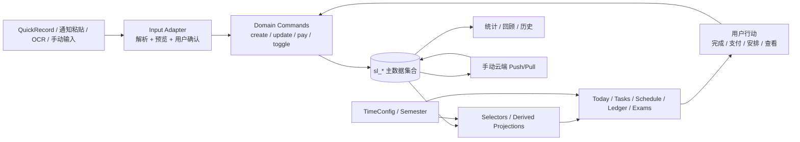
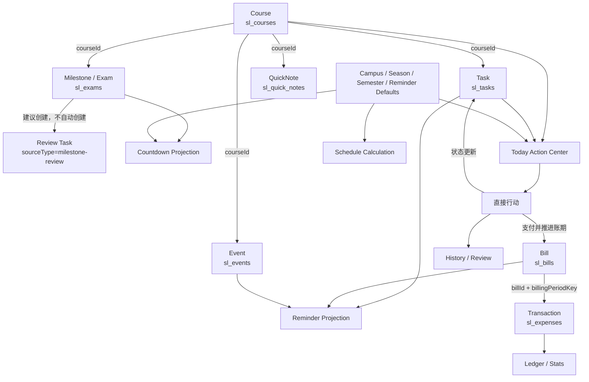

# 学习生活台系统级闭环审计与方案

审计日期：2026-09-02
范围：系统级联动审计、数据主权审计、闭环方案设计；仅实现 Bill 删除/QuickRecord 撤销后的引用完整性小修复。
方法：静态代码追踪、现有领域测试与针对 Bill 边界的回归测试；本阶段未进行大规模 UI 或数据结构改造。

## 结论先行

当前项目已经具备“输入落到真实业务集合”的基础：QuickRecord、通知粘贴和 OCR 课程导入都不是单独保存一份业务副本；Task、Milestone/Exam、Transaction、Bill、Event、QuickNote 分别落在稳定的 `sl_*` 集合中，首页和回顾主要读取这些集合。

但系统还没有完全形成统一的闭环运行时。最重要的缺口按优先级是：

- 首页同一 Task 可能同时出现在“今日行动清单”“今日待办”“近期提醒”，课程也可能同时出现在行动清单和课程卡片；当前只做了提醒与待办之间的部分去重。
- Reminder 已有纯计算选择器，但账单页、首页和待办页仍各自维护相近的提醒/逾期规则，且提醒不能统一直接执行“完成 / 已支付 / 查看”。
- Task 同时有 `done` 和 `status`，Milestone 通过日期推断过去，Bill 通过 `nextDate` 推断状态，Event 没有完成状态，状态语义还没有统一。
- `QuickCapturePanel`、`QuickLedgerPanel` 和旧 `quickCapture.js` 仍保留直接写入业务集合的旧入口；目前未从 `App.vue` 接入，但它们构成未来重新接入时的数据主权风险。
- 云同步有服务端 `revision`、本地 `updatedAt` 和冲突阻止，但拉取是按键覆盖，`mergeSyncValue` 没有接入实际拉取流程；设备间实体级合并尚未成立。
- 基础配置目前实际驱动校区、作息季、节次和首页模块，但没有统一的时区、默认提醒、默认账户配置，QuickRecord 和 Bill 也没有消费这些缺失配置。

已完成的小修复：删除 Bill（包括 QuickRecord 的 5 秒撤销）只删除 Bill，保留后续 Transaction，并清空 `billId`、`billingPeriodKey`、指向 Bill 的 `sourceId`/`relationId`；交易仍保留 `source: 'bill'` 与 `createdFrom: 'bill'` 作为历史来源。详见 `src/composables/domain/commands.js`、`src/composables/quickRecord/adapters.js` 和 `src/views/LedgerView.vue`。

## 1. 当前完整功能地图

| 能力 | 当前主存储 | 创建/写入入口 | 当前读取方 | 闭环判断 |
|---|---|---|---|---|
| 课程 / 课表 | `sl_courses` | 手动编辑、文字批量、图片 OCR、Excel、模板 | Schedule、Today、CourseEditor、回顾 | 基本闭环；课程是其他学习对象的关联主数据 |
| 作业 / 待办 | `sl_tasks` | Tasks、通知解析、QuickRecord、倒计时“安排复习” | Tasks、Today、CourseEditor、Focus、回顾 | 主链路已存在；首页和 Reminder 重复投影 |
| 日程 | `sl_events` | Tasks 通知处理、QuickRecord | Today、Schedule、回顾、Reminder | 有日期读取；没有统一完成/行动接口 |
| 考试 / 倒计时 | `sl_exams` | Exams、QuickRecord | Exams、Today、CourseEditor、回顾、Reminder | Exam 与 Countdown 共用 Milestone；倒计时不是副本 |
| 固定账单 | `sl_bills` | Ledger、QuickRecord | Ledger、Today、Reminder、回顾 | 支付与周期推进已有；删除关系边界已修复 |
| 交易 / 收支 | `sl_expenses` | Ledger、QuickRecord、Bill 支付 | Ledger、Today 未显示统计、回顾 | 支出/收入方向已有；首页缺轻量收支摘要 |
| 快速笔记 | `sl_quick_notes` | QuickRecord、通知处理 | Today Inbox、Schedule 关联、回顾 | Inbox → Task/Event 会保留原 Note，需明确来源保留规则 |
| 心情 | `sl_mood_log` | Today | Today、WeeklyPulse、Memory | 轻量记录与回顾存在 |
| 课程反馈 | `sl_course_checkins` | Today 课后反馈 | Today、Experience/WeeklyPulse | 可驱动复习建议；不是课程本体的副本 |
| 专注 | `sl_focus_sessions` / `sl_focus_active` | FocusPanel | Today、WeeklyPulse、回顾 | 可关联 Task；完成后没有统一更新 Task 的命令 |
| 清单 | `sl_checklists` | Lists | Lists、备份/同步 | 与 Task 并行，当前不进入 Today 主闭环 |
| 吃什么 | `sl_food_places` / `sl_food_history` | Food | Food | 独立生活辅助模块，当前不进入财务闭环 |
| 校区 / 作息 / 学期 | `sl_timecfg` / `sl_semester` / `sl_schedule_exceptions` | Schedule 设置与 OCR 作息识别 | Schedule、Today | 已驱动课程展示；配置语义仍分散 |
| Reminder | 不存储，选择器即时计算 | `selectReminders` / `selectActionCenter` | Today，账单/任务页另有本地规则 | 方向正确，但实现尚未统一 |
| 云同步 | 所有允许同步的 `sl_*` 键 + 服务端 revision | 用户主动 Pull / Push | DataManager / CloudSync | 手动原则正确；实体合并和迁移一致性有风险 |

## 2. 核心实体列表与数据主权

| 实体 | 主键 | 主数据源 | 允许的关系 | 备注 |
|---|---|---|---|---|
| `Course` | `Course.id` | `sl_courses` | `courseId` | 课程名称是展示回退，不应作为长期关系键 |
| `Task` | `Task.id` | `sl_tasks` | `courseId`、`sourceType/sourceId` | 作业是 `kind = homework` 的 Task，不应再有 Homework 集合 |
| `Event` | `Event.id` | `sl_events` | `courseId`、来源引用 | 一次性日程，不等同于固定课程 |
| `Milestone` | `Milestone.id` | `sl_exams` | `courseId`、来源引用 | UI 的 Exam 和 Countdown 共用同一实体；`kind` 区分用途 |
| `Bill` | `Bill.id` | `sl_bills` | Transaction 的 Bill 来源 | `nextDate` 是当前待处理账期指针 |
| `Transaction` | `Transaction.id` | `sl_expenses` | `billId + billingPeriodKey` | 是实际发生的财务事实，不能因 Bill 撤销而回滚 |
| `QuickNote` | `QuickNote.id` | `sl_quick_notes` | 可作为 Task/Event 的来源 | 是输入收件箱，不应变成第二份业务事实 |
| `MoodEntry` | 日期键 | `sl_mood_log` | 无 | 当前是一张按日期索引的日志，而不是数组实体 |
| `CourseCheckin` | `date:courseId` | `sl_course_checkins` | `courseId` | 每门课每天一条最新反馈 |
| `FocusSession` | `sessionId` | `sl_focus_sessions` | `todoId` | 专注事实；是否完成 Task 需要明确策略 |
| `ReminderProjection` | `sourceType:sourceId` | 无 | 指向真实实体 | 只能保存计算结果，不能复制业务记录 |

当前没有发现 `HomeTask`、`CourseHomework` 或 `ReminderTask` 三份独立业务集合。现有 `course`/`courseName` 是兼容展示字段，`sourceType/sourceId` 是来源关系，属于可接受的关系元数据；但调用方仍然可以直接写集合，主权还没有被接口完全保护。

## 3. 数据流图



目标形态是：输入层可以多种多样，但从用户确认后只能进入 Domain Commands；业务集合只保存一次；页面、Reminder、统计和回顾都只能从主数据选择器读取。

## 4. 功能关系图



## 5. QuickRecord 最后关联边界

### 当前证据

- QuickRecord Bill 创建只调用 `domain.createBill`，不会创建 Transaction。
- `payBill` 通过 `billId + billingPeriodKey` 防止同一账期重复生成 Transaction，并推进 `Bill.nextDate`。
- 支付生成的 Transaction 目前同时带有 `billId`、`sourceType = bill`、`sourceId = bill.id`、`billingPeriodKey`。
- 原实现的 QuickRecord 撤销只过滤 Bill；如果账单已被支付，会留下指向不存在 Bill 的引用。

### 已实施规则

`deleteBill(id)` 现在执行：

1. 删除 Bill 本身。
2. 保留所有已经产生的 Transaction。
3. 清空指向该 Bill 的 `billId`、`billingPeriodKey`、`sourceId` 和 `relationId`。
4. 保留 `source: 'bill'` 和 `createdFrom: 'bill'`，让历史仍可读为“曾来自固定账单”。
5. 不回滚用户后来明确做出的支付操作。

QuickRecord 撤销和 Ledger 手动删除均调用同一领域命令。相关测试覆盖“已支付后撤销”和“手动删除后保留交易”两种路径。

## 6. 学习闭环审计

目标链路：`Course → Task(kind=homework) → Today → Reminder → Complete → History`。

当前已成立的部分：

- QuickRecord 作业通过 `useQuickRecordAdapters → domain.createTask` 写入真实 `sl_tasks`。
- `courseId` 可由唯一课程名称匹配；Tasks、CourseEditor、Today 使用同一个 Task 对象。
- Task 完成由 `domain.toggleTask` 同时更新 `done`、`status`、`completedAt`，因此 CourseEditor 的关联待办和 Today 会读到同一状态。
- Reminder 以 `sourceType=task`、`sourceId=task.id` 指向真实 Task；完成后 `isTaskActionable` 使其消失。

当前断点：

- Today 的 `AgendaPanel` 和主区域“今日待办”都接收同一个 Task；`displayTasks` 只与“近期提醒”去重，没有与行动清单去重。
- 课程详情有 `linkedTasks`，但没有统一的课程详情行动命令；它主要是读取和跳转。
- 没有真正的浏览器端验收测试串起“创建 → 三处出现 → 完成后三处同步”；现有测试已覆盖 QuickRecord、选择器和字段关系，但仍应补一条界面级验收。
- 无日期 Task 不进入 Today 的主要任务列表，第二天不会自然进入“待安排”区；逾期、无日期、延期在数据层已有部分能力，在首页没有统一分区。

建议的唯一学习主链：

`Task` 是唯一作业事实；Course 只通过 `courseId` 展示；Today/Reminder 都是 `Task` 的不同投影；完成只调用 `toggleTask`；History 读取 `completedAt`，不复制一份完成记录。

## 7. 考试闭环审计

当前模型正确地把考试和倒计时收敛到 `Milestone`（存储键 `sl_exams`）：倒计时由 `sortCountdowns` 根据 `date/time/repeat` 计算，没有再创建独立的“六级考试 12 月 12 日”副本。

当前行为：

- 学习类节点在 UI 上显示为 Exam，非学习节点显示为 Countdown，但都由同一集合保存。
- “安排 25 分钟复习”是建议联动，使用 `sourceType=milestone-review` 和 `sourceId=milestone.id` 防止重复创建未完成复习 Task。
- 复习 Task 完成会更新 Task 历史；Milestone 本身过去与否由日期推断，没有独立的 `completedAt`。

方案：

- 创建考试只创建一个 `Milestone(kind=exam)`。
- 保存后提示“是否同时显示倒计时？”，用户选择只影响 pinned/首页显示策略，不创建第二个实体。
- “安排复习”保持建议联动；未来若要支持多次复习，应让每个 Review Task 通过 `relationId` 指向 Milestone，而不是复制考试文本。
- 若考试需要明确完成，增加 Milestone 的状态/完成命令；在此之前“过去”不能等同于“已完成”。

## 8. 财务闭环审计

### 固定账单

已有链路：`Bill → Upcoming/Reminder → Due → payBill → Transaction(expense) → nextDate`。

- `payBill` 使用当前 `nextDate` 作为账期键，重复点击同一账期返回 `duplicate`，不会重复 Transaction。
- 下一周期由 `cycle` 推进，月末日期使用当月最后一天钳制。
- `Bill` 与 Transaction 已有稳定关联字段；删除 Bill 的悬空引用已修复。

仍需在 P0/P1 明确：

- `autoRenew` 当前被保存但没有改变 `payBill/nextBillDate` 行为，属于“设置存在但不驱动业务”。
- `once` 周期没有在账单 UI 的周期选项中完整呈现，数据层虽能接受。
- `Bill.nextDate` 是当前指针，不是账期历史表；历史应以 Transaction 为事实来源，账单页不能把 Bill 删除当成删除历史。
- Ledger、Today Selector、`pendingBills`/`dueBills` 各自计算账单状态，需统一使用一个 `billStatus` 选择器。

### 普通收支

- QuickRecord expense/income 都进入 `sl_expenses`，`direction` 区分 `expense` 与 `income`。
- `buildLedgerIndex` 对收入单独统计，不计入 `todayTotal` 和支出总额；回顾也按方向分开。
- 当前撤销直接移除 Transaction，因此账本索引、日统计和月统计会恢复；这条行为已有 QuickRecord 测试。
- Today 没有展示“今日支出”轻量摘要，无法直接形成用户要求的每日闭环读数（如 `今日支出 ¥48`）。

## 9. Today / 首页审计与动态聚合方案

当前首页已经有“接下来”“今日行动清单”“今日待办”“今天课程”“近期提醒”“本周概况”等模块，且空的“快速记录日程”与“近期提醒”会隐藏，方向已经接近动态聚合。

当前重复：

- 同一课程可出现在“今日行动清单”和“今天课程”。
- 同一 Task 可出现在“今日行动清单”“今日待办”，并在条件满足时进入“近期提醒”。
- 同一 Bill 可出现在行动清单、近期提醒和账单页“待处理”列表。

建议首页使用一个统一的 `ActionItem` 投影，再按优先级和位置分配：

| 优先级 | 默认位置 | 来源 | 行动 |
|---|---|---|---|
| P0 | 顶部行动区 | overdue、马上发生、马上截止、异常 | 完成 / 已支付 / 查看 |
| P1 | 今日区 | 今日课程、今日 Task、今日日程、今日 Bill | 查看或执行 |
| P2 | 底部轻量区 | 支出摘要、完成率、心情、长期节点 | 查看回顾 |

去重键统一为 `sourceType + sourceId`。同一个实体默认只进入一个主位置：例如今天截止的 Task 进入行动区时，不再进入近期提醒；课程作为时间表事实进入“今日课程”，行动清单只显示没有更合适主位置的日程或异常。

空模块不渲染大卡片；只保留必要的入口文本或不显示。首页不保存任何 `Home*` 数据。

## 10. Reminder 统一方案

当前 `selectReminders` 已经是正确方向：Reminder 不存储完整业务记录，只返回 `sourceType/sourceId/title/dueAt/kind/entity`。问题是账单页和 Today 仍有独立规则：`pendingBills`、`dueBills`、`displayTasks`、`selectDayAgenda`、`selectActionCenter` 之间存在重复计算。

目标接口（设计，不在本阶段实现）：

```js
selectReminders({ tasks, bills, milestones, events }, now)
  -> [{ key, sourceType, sourceId, kind, dueAt, priority }]

resolveReminderAction(item)
  -> { action: 'complete' | 'pay' | 'view', targetType, targetId }
```

业务实体保存日期、截止时间、周期和状态；Reminder 只计算“现在需要注意什么”。点击提醒直接调用真实领域命令或打开真实实体，不再“提醒 → 找模块 → 找记录”。

建议行动规则：Task → 完成；Bill → 已支付；Milestone/Event → 查看；已完成、已取消、已归档的对象不再产生待处理 Reminder。

## 11. 状态一致性

当前状态来源不统一：

| 对象 | 当前状态语义 |
|---|---|
| Task | `done` + `status`，逾期由截止时间推断 |
| Bill | `active` + `nextDate` 推断 upcoming/due/overdue |
| Milestone | 日期过去即 `isPast`，没有 completed |
| Event | 没有完成状态 |
| QuickNote | `inbox/organized/archived` |
| CourseCheckin | understood/unclear/review/absent |

P0 方案不是马上把所有对象硬改成同一个字段，而是先定义统一读模型：`pending / in_progress / completed / overdue / cancelled / archived`。每种对象保留自身事实字段，但所有页面通过状态选择器读取；命令负责状态变化并更新 `updatedAt`，禁止页面直接拼出另一套定义。

## 12. 删除、解除关联与归档

已有较好的课程删除策略：`detachCourseRelations` 按 ID 解除 Task、Milestone、Event、Note 关系，同时保留可读的旧课程名称；课程详情也明确提示“删除课程只会解除关联”。这满足高风险数据默认不级联删除的原则。

需要统一到领域命令的部分：

- Tasks、Exams、Ledger 目前仍在 View 中直接 `splice/filter` 删除；关系清理和更新时间容易遗漏。
- 删除课程时没有给用户“仅解除 / 同时删除关联内容 / 取消”的显式策略选择，当前固定采用仅解除；这是安全默认，但应在确认界面说明影响。
- 完成 Task、过去 Milestone、已支付 Transaction 应保留用于统计和回顾；当前部分列表用过滤隐藏，属于展示归档，不应物理删除。
- Bill 删除已经只解除交易关系，不删除历史 Transaction。

建议删除命令返回影响预览：`{ target, related: { tasks, milestones, events, notes, transactions }, defaultAction: 'detach' }`，由 UI 在高风险对象上确认；不在本阶段实现。

## 13. OCR / QuickRecord 输入闭环

QuickRecord 新链路是：`QuickRecordPanel → parseQuickRecord → useQuickRecordAdapters → Domain Commands → sl_*`，满足 Input Adapter 原则。

课程 OCR 链路是：`Image/Excel/Text → parse → preview/conflict plan → user confirm → sl_courses → Schedule calculation → Today`。OCR 不建立独立课程集合；作息 OCR 主要进入 `sl_timecfg`，再被课程时间计算使用。

需要清理的输入层风险：

- `QuickCapturePanel.vue` 仍直接 push `sl_tasks/sl_exams/sl_expenses`。
- `QuickLedgerPanel.vue` 仍直接 push `sl_expenses`。
- `quickCapture.js` 已标注旧版废弃，但仍被旧面板引用。

建议 P1：保留兼容读取，停止旧面板作为可用入口；若确实需要重新启用，必须改为调用同一套 Domain Commands，并共用同一撤销/来源/重复保护。

## 14. 基础设置驱动检查

已实际驱动的配置：

- `currentCampus/currentSeason/autoSeason` 影响 `currentTimes`、课程时间展示和 Today 的课程上下文。
- `semester.start` 影响周次和课程是否出现。
- schedule exception 影响具体日期的停课/调课。
- `appearance.homeModules` 影响首页模块可见性。

缺失或分散的配置：

- `Timezone` 没有统一配置；日期/账单/Reminder 多处使用浏览器本地时区。
- `Default Reminder` 没有统一配置；Task、Bill 各自有默认值。
- `Default Account` 没有配置；QuickRecord 解析到账户后才写入，Bill 表单默认空。
- OCR 词汇表会影响识别，但不是明确的基础设置契约。

建议先建立 `SettingsPolicy` 只读接口，由 QuickRecord、Bill、Reminder、Schedule 和 Today 消费；不让每个页面自行读取 localStorage。

## 15. 每日、隔天、每周闭环

### 每日

当前早上可看到课程、今日 Task、日程、账单/节点提醒，白天的完成 Task、QuickRecord 支出、增加 Task 会自动更新共享 Ref；心情也可即时记录。缺口是首页缺少今日支出和统一“完成 x/y”行动统计，且重复模块会放大同一事实。

### 隔天

已有逾期计算和 `rescueTaskPatch` 的“今晚/明天/下周/归档”动作，但 Today 主任务主要筛选 `dueDate === today`，无日期 Task 没有独立“待安排”区域。建议明确三类投影：

- 逾期：保留原截止日期，标红并允许重新安排。
- 待安排：没有日期，不自动改成今天。
- 已重新安排：用户明确修改 `dueDate` 后进入新日期。

### 每周

`weeklyPulse` 已有本周完成 Task、专注分钟、复习课程数和心情天数；Today 的 `weekReview` 也有本周完成数，但“计划专注”实际是未完成 Task 的预计时长，命名和语义不完全一致。周回顾目前具备数据基础，建议 P2 做轻量只读回顾，不强制日报。

## 16. 自动 / 建议 / 手动联动表

| 类型 | 联动 | 当前/建议规则 |
|---|---|---|
| 自动 | Task 完成 → Today、CourseEditor、Reminder 更新 | 保留；只通过同一 Task 状态读取 |
| 自动 | Bill 支付 → Transaction + 当前账期推进 | 保留；必须以账期键幂等 |
| 自动 | 课程删除 → 解除关联但保留 Task/Exam/Event/Note | 保留安全默认 |
| 自动 | 主数据变更 → Ledger/History/Today 重算 | 保留；禁止页面维护副本 |
| 建议 | 创建 Exam → “是否同时显示倒计时？” | 不自动创建第二个实体 |
| 建议 | 学习节点 → “安排 25 分钟复习” | 当前已有，继续保持用户确认 |
| 建议 | 逾期 Task → 今晚/明天重新安排 | 当前已有，不能自动改日期 |
| 手动 | 课程详情 → 添加笔记 | 用户主动行为 |
| 手动 | 云端 Pull / Push | 当前原则正确，不能启动自动同步 |
| 手动 | 课程删除时选择关联内容处理方式 | 默认解除，删除关联内容必须二次确认 |

## 17. 防循环触发与幂等

已有防重复机制：

- Bill 支付使用 `billId + billingPeriodKey`。
- Milestone 复习 Task 使用 `sourceType + sourceId` 查重。
- 首页投影使用 `sourceType + sourceId` 作为 key。
- 云端 Push 使用 `expectedRevision` 原子比较。

仍需补齐：

- 所有跨实体命令都应接受/生成 `operationId`，并记录在关系元数据或操作日志中；当前普通创建没有统一 operationId。
- Note 转 Task/Event 目前会创建新业务对象，同时把 Note 标为 organized；应明确这是“来源保留”而非第二份可编辑业务事实，或改为引用式 Inbox。
- `autoRenew`、账期推进和同步重放应明确哪些操作可重试，避免“重试一次又推进一次”。

## 18. 云同步闭环与风险

正确部分：

- 连接只验证访问码和读取元数据，不自动 Pull/Push。
- Push 有服务端 revision compare-and-swap，旧页面不会静默覆盖新版本。
- 本地业务对象有 `updatedAt`，服务端有 `revision/updatedAt/device` metadata。
- Pull 前有本机快照，可撤销本次 Pull。

风险：

- Pull 对选中 `sl_*` 键直接应用远端值，不使用已存在的 `mergeSyncValue`；同一实体在两台设备各自修改时，可能整条记录被覆盖。
- `sl_domain_schema` 不在同步键中；设备 B 已经是新 schema 后再 Pull 旧数据，不一定会重新触发一次领域迁移。
- 关系字段没有完整性校验：例如 Task.courseId、Transaction.billId、sourceId 指向不存在对象时，当前主要依靠页面回退显示。
- Pull 是按模块覆盖，用户需要理解选择模块可能覆盖本地集合；当前 UI 有撤销但没有实体级冲突预览。

P2 方案：先保持手动同步产品原则，再引入每实体 `updatedAt` 的合并与删除墓碑；同步前后执行关系完整性审计，并把 schema 版本/迁移版本纳入同步兼容策略。不要自动拉取或自动推送。

## 19. 修改文件范围

### 本阶段已修改

- `src/composables/domain/commands.js`：新增安全 `deleteBill` 命令，解除交易对已删除 Bill 的引用并保留交易历史。
- `src/composables/quickRecord/adapters.js`：QuickRecord Bill 撤销调用 `deleteBill`。
- `src/views/LedgerView.vue`：手动删除 Bill 也调用 `deleteBill`。
- `tests/quickRecordAdapters.test.js`：增加已支付后撤销、手动删除后关系解除的回归测试。

### 确认方案后才建议修改

- P0：`domain/commands.js`、`domain/selectors.js`、`domain/state.js`、`TodayView.vue`、`AgendaPanel.vue`、`TasksView.vue`、`LedgerView.vue`、`ExamsView.vue`，以及对应领域/集成测试。
- P1：`QuickCapturePanel.vue`、`QuickLedgerPanel.vue`、`quickCapture.js`、OCR 入口适配和设置策略模块。
- P2：`cloudSyncData.js`、`cloudSync.js`、同步 UI、回顾与归档策略。

本阶段没有修改首页布局、Reminder 大逻辑、同步协议或核心数据结构。

## 20. P0 / P1 / P2 实施顺序

### P0：先把同一天的事实闭环做稳

1. 固化实体主权和关系完整性检查：所有核心写操作走领域命令，删除/解除关系有统一命令。
2. 统一状态读取：Task、Bill、Milestone、Event 先通过选择器映射到统一状态，不立即强制所有存储字段同形。
3. 统一 Reminder 与 ActionItem：一个来源键、一个去重规则、一个行动解析器。
4. 重做 Today 聚合为单一投影：解决行动清单/今日待办/近期提醒/课程卡片重复；空模块不占大卡片。
5. 补自动化验收测试：作业、考试、账单、支出/收入、完成同步、Bill 幂等与删除关系。

### P1：补全跨模块和输入层

1. 旧 QuickCapture/QuickLedger 入口统一接入 Input Adapter/Domain Commands，或明确移除旧入口引用。
2. 考试、复习 Task、Today 和 Reminder 的直接查看/行动路径。
3. 逾期 / 待安排 / 重新安排三态投影，不篡改原截止日期。
4. SettingsPolicy 驱动默认提醒、默认账户、时区，并验证 QuickRecord/Bill/Today/Reminder 使用它。
5. Note 转换的来源保留规则，避免“原文 Note + 可编辑业务对象”形成难以解释的重复。

### P2：回顾和同步成熟化

1. 周回顾：完成、课程、重要截止、消费、下周事项，全部只读聚合。
2. 归档视图：完成作业、过去考试、旧课程、已支付账单可回顾但不干扰当前行动区。
3. 实体级云同步合并、删除墓碑、关系完整性校验和 schema 迁移兼容。
4. 在不改变“用户决定 Pull/Push”的前提下，提供冲突预览和按实体撤销。

## 验收样例

确认 P0 方案后，至少用以下数据跑通：

1. `周五18点交高数第三章作业`：唯一 Task、`kind=homework`、`courseId` 正确；Today/课程详情/Reminder 只出现一个主行动位置；完成后所有投影同步且有 `completedAt`。
2. `12月12日六级考试`：只产生一个 Milestone；倒计时读取其日期；用户确认后才创建复习 Task；不自动生成第二份考试记录。
3. `每月15号39元话费`：提醒、到期、支付、Transaction、下一周期成立；重复支付幂等；删除账单不删除交易也不留悬空引用。
4. `午饭18元` 与 `生活费500`：分别进入 expense/income；Today、Ledger、月度与分类统计方向正确；撤销恢复统计。
5. 一天混合场景：课程、截止任务、账单、两个待办、支出、心情完成后，首页能动态压缩为空模块并显示可行动的完成摘要，不要求填写日报。

这份文档是系统闭环审计基线。2026-09-02 已按本文件执行 P0，并完成下述复审；P1/P2 仍未执行。

## 21. P0 执行复审（2026-09-02）

### 已完成

1. **实体主权与关系边界**：Task、Milestone、Course、Bill 的删除均经领域命令；删除 Course 只解除 Task/Milestone/Event/Note 关联并保留可读名称；删除 Milestone 会解除其复习 Task 来源；删除 Bill 保留历史 Transaction 并清空 Bill 指针。Tasks、Exams、Schedule、Ledger 的相关删除入口已统一到这些命令。
2. **状态读取统一**：Today、Tasks、Focus、课程负荷、课程详情、应用标题计数和考试复习任务查重使用 `taskStatus` / `isTaskActionable`；逾期为投影状态，不改写原截止日期。
3. **Reminder / ActionItem**：Reminder 使用 `sourceType:sourceId` 作为单一 key；`selectActionCenter` 接受已展示 key 的排除集合；`reminderAction` 将待办、账单、节点、日程解析为完成、支付或查看动作。
4. **Today 单一投影**：课程保留在“接下来/今天课程”，Task 保留在“今日待办”，当天 Event/Milestone 保留在“今日行动清单”，Bill 进入提醒动作；各区之间按来源 key 去重，空列表不再渲染空大卡片。
5. **自动化验收**：补充了任务状态与投影一致性、投影排除、Reminder 行动解析、QuickRecord 实体主权、账单同周期幂等/历史交易不可变、删除关系边界测试。

### 复审后的单一数据流

`QuickRecord 输入 → Domain Command → sl_* 业务集合 → taskStatus/billStatus → selectors → Today / Tasks / Focus / Course / Reminder`。

完成 Task 只改变同一 Task 的 `done/status/completedAt/updatedAt`，所有页面重新从该记录投影；支付 Bill 创建带 `billId + billingPeriodKey` 的 Transaction 后推进 Bill 的 `nextDate`；删除 Bill 不删除 Transaction。没有新增 Today/Reminder 业务副本。

### 验证结果

- `npm test -- --run`：48 个测试文件、340 个测试通过。
- `npm run lint`：通过。
- `npm run typecheck`：通过。
- `npm run build`：被既有 `release.config.js` 源码签名门禁拦截，要求同步 RELEASE_NOTES 并更新签名；本次按范围未修改发布安全配置。

### 未执行与剩余风险

- P1 未执行：旧 QuickCapture/QuickLedger 入口收敛、考试直接行动路径、逾期/待安排/重新安排三态产品化、SettingsPolicy、Note 转换来源规则。
- P2 未执行：周回顾、归档视图、实体级同步合并/删除墓碑/schema 兼容与冲突预览。
- 当前仍缺少浏览器级端到端验收；本次通过领域/选择器/组件现有测试覆盖核心数据闭环。发布构建门禁需由发布流程负责人确认说明与签名后再运行。

## 22. P1 执行复审（2026-09-02）

本轮只执行 P1，未进入 P2。P1 的实现拆成入口、任务、考试、设置、笔记五个子阶段，并在每阶段后运行针对性测试。

### 1. 旧入口收敛

- `QuickCapturePanel.vue` 与 `QuickLedgerPanel.vue` 保留为兼容壳，不再直接写入 `sl_tasks`、`sl_exams` 或 `sl_expenses`。
- 两个兼容壳都只转发到 `QuickRecordPanel`；旧账记入口带 `preferredType=expense`。
- 账本页“记一笔”进入同一个 QuickRecord；普通账本编辑仍保留在账本模块，最终写入仍经 Domain Command。
- 课程详情新增“添加作业”上下文入口，进入 QuickRecord 并预置 `preferredType=homework`、`courseId`、`courseName`。
- `quickCapture.js` 仅保留旧解析测试兼容，不再有旧保存链路或页面引用。

入口关系为：`全局 +记录 → QuickRecord`；`账本 → QuickRecord(expense)`；`课程详情 → QuickRecord(homework + courseId)`；`待办/课程表的传统编辑表单 → Domain Command`。

### 2. Task 三态与考试行动

- 用户可见规划态为：`unplanned=待安排`、`scheduled=已安排`、`completed=已完成`。
- `overdue` 仍是 `taskStatus` 的派生状态，任务原始 `dueDate/dueTime` 不会被改写。
- 无日期 Task 不进入 Today 主行动区；Today 仅以轻量“待安排”入口展示最多三项，Tasks 页面提供独立筛选。
- 学习类 Milestone 可手动“安排 25 分钟复习”；创建的 Task 使用 `kind=review`、`sourceType=milestone-review`、`sourceId=milestone.id`。
- 已有关联复习 Task 时显示“复习任务 已完成/总数”；不会自动批量生成任务。Milestone 删除后复习 Task 保留并解除来源关系。

### 3. SettingsPolicy

新增 `src/composables/settingsPolicy.js` 作为统一只读解析模块，复用现有 `sl_quick_record_settings` 存储，不新增同步协议。当前管理：

- 系统时区 / `Asia/Shanghai` / `UTC` 日期边界；
- 当前校区、当前作息季；
- 默认账户；
- Task/Event/Milestone 新建时的默认提醒分钟数；
- QuickRecord 剪贴板提示与最近类型配置。

Domain Command、QuickRecord、Today、Reminder 选择器和 Schedule 读取同一规则。账本和 QuickRecord 的未指定账户最终都由 Domain Command 使用同一默认账户。

### 4. Note 转换与删除

Note → Task/Event 必须由用户主动确认；原 Note 保留，生成对象记录 `sourceType=note`、`sourceId=note.id`。新增 `deleteNote`：删除 Note 时保留已创建的 Task/Event，仅解除来源字段，不留下悬空来源关系。

### 5. P1 回归结果

- P0 的实体主权、Course/Bill/Milestone 删除边界、Bill 账期幂等仍保留。
- Today / Reminder 仍按来源 key 去重；Milestone 已有 Today 复习 Task 时不再额外重复占用提醒位置。
- QuickRecord 仍是 Input Adapter，旧入口没有独立写入逻辑。
- SettingsPolicy 没有创建第二套业务状态；同步协议、OCR、QuickRecord 核心 UI 和 `release.config.js` 均未改动。

## 23. P2-A 执行复审（2026-09-02）

本轮只执行 P2-A“归档系统 + 周回顾基础闭环”，完成后停止，未进入 P2-B。

### 1. 归档模型与命令边界

- 归档采用软归档：实体保留在原 `sl_*` 集合中，新增/使用 `archivedAt` 作为归档标记；不复制业务对象，不删除关系字段。
- `isArchived` 与 `isActiveEntity` 位于 Domain State；Today、Reminder、课程表当前视图和下一周高亮统一过滤归档对象。
- 新增 `archiveTask/restoreTask`、`archiveCourse/restoreCourse`、`archiveMilestone/restoreMilestone`、`archiveEvent/restoreEvent`、`archiveNote/restoreNote`、`archiveBill/restoreBill`；账单另有 `setBillActive` 和 `skipBill`，保证暂停/跳过也经过 Domain Command。
- Task 的完成和归档是两个事实：完成仍以 `done/status/completedAt` 表示，归档只增加 `archivedAt`；撤销归档不改写完成历史。

### 2. 当前区、历史区与实体策略

| 实体 | 当前区规则 | 历史/归档规则 | 删除语义 |
|---|---|---|---|
| Task | 只显示未归档且可行动任务 | 已完成、已归档任务保留在待办“历史”入口；`completedAt` 可用于周统计 | 删除仍是明确删除，短时撤销保留 |
| Course | 课程表只显示未归档课程 | 课程表“历史课程”可重新进入并恢复 | 删除解除 Task/Milestone/Event/Note 的 `courseId`，保留名称 |
| Milestone | 归档或已过日期不进入当前 Reminder | 倒计时“历史”可查看已结束/已归档节点 | 删除解除其复习 Task 的来源字段 |
| Note | 当前 Inbox 过滤归档 Note | 原 Note 与来源关系保留，可回放 | 删除解除由 Note 创建对象的来源字段 |
| Bill | `active=false` 或归档不进入未来提醒 | Ledger 的暂停/历史事实和 Transaction 保留 | 删除 Bill 不删除交易，并清空 Bill 指针 |
| Event | 当前 Agenda/Reminder 过滤归档 Event | 通过通用历史数据源保留 | 删除策略仍由现有 Domain 边界负责 |
| Transaction | 不做业务归档，不参与未来提醒 | 以交易日期和账单来源参与回顾 | 账单删除不删除 Transaction |

账单不简单套用 Task 归档：周期账单需要区分“暂停/恢复”和“已生成的历史交易”。归档 Bill 同时停用未来提醒，但不改动既有 Transaction；恢复时由 Domain 清除归档标记并恢复 active。

### 3. 周回顾基础闭环

新增 `domain/weeklySelectors.js`，只读取已有 `sl_*` 数据并返回纯投影：

- Task：按 `createdAt` 和 `completedAt` 统计新增、完成、作业完成、复习完成、待处理和预计时长；不会因为本周 `updatedAt` 而把上周完成重复计入。
- Course：复用既有 `coursesForDate`，按周一至周日统计课程节次和涉及课程数。
- Finance：复用 `sl_expenses`/Domain transactions，按 `date` 区分 income/expense，并给出分类金额。
- Bill：从当前账单的应付日期和 `source=bill` Transaction 统计本周应付、已支付与金额。
- Mood：复用 `sl_mood_log` 与 `weatherOfMood`，统计心情天数和主导天气。
- Next week：从 Task/Event/Milestone/Bill 的原集合生成下周高亮，使用 `sourceType:id` 去重。

新增轻量 `/review` 路由与 `WeeklyReviewView.vue`，桌面 Today 提供入口，移动端放在“更多”中；没有增加底部一级导航，也没有复制 Today/Reminder 数据。

### 4. 验收结果

新增 `tests/archiveWeekly.test.js`，覆盖：

1. 完成 Task 归档后离开 Today/Reminder、保留历史、Domain restore 可撤销；
2. Course 归档隐藏当前课程且保留 Task/Milestone/Note 关系，删除则解除关联；
3. 过去 Milestone 不进入当前 Reminder 但仍在历史数据中；
4. Bill inactive/archive 不进入提醒，既有 Bill Transaction 保留；
5. Note 归档不破坏 Task 来源关系；
6. `completedAt` 当前周计数，前一周完成但本周更新不计入；
7. 周收入、支出、账单已支付金额与心情统计；
8. 下一周 Task/Event/Milestone/Bill 高亮去重；
9. `Asia/Shanghai` 跨午夜/周边界由 SettingsPolicy 驱动。

### 5. P2-A 变更与验证

主要变更文件：

- `src/composables/domain/state.js`、`src/composables/domain/commands.js`、`src/composables/domain/selectors.js`：归档模型、命令和当前/历史投影边界。
- `src/composables/domain/weeklySelectors.js`：周回顾纯 Selector。
- `src/views/WeeklyReviewView.vue`、`src/main.js`、`src/router/routePreload.js`、`src/components/Sidebar.vue`：轻量周回顾入口。
- `src/views/TasksView.vue`、`src/views/ExamsView.vue`、`src/views/ScheduleView.vue`、`src/views/TodayView.vue`、`src/views/LedgerView.vue`、`src/components/schedule/CourseEditorModal.vue`：当前区过滤、历史入口和 Domain Command 接线。
- `tests/archiveWeekly.test.js`：P2-A 回归测试。

验证结果：

- `npm test -- --run`：50 个测试文件、352 个测试通过。
- `npm run lint`：通过。
- `npm run typecheck`：通过。
- `npm run build`：被既有发布源码签名门禁拦截，要求先同步 `release.config.js` 中的 `RELEASE_NOTES`，并更新 `RELEASE_SOURCE_SIGNATURE` 为 `b85f8ed458`；本轮未修改发布配置。

### 6. P2-B 边界与下一步建议

本轮没有修改 `cloudSyncData.js`、`cloudSync.js`、同步协议、实体冲突合并、删除墓碑、schema 同步兼容、AI 推荐/规划、OCR、QuickRecord 核心 UI 或发布配置。

仍存在的同步风险：Pull 仍按模块覆盖、没有实体级冲突预览；`sl_domain_schema` 未纳入同步兼容策略；关系字段仍缺少同步后的完整性审计。下一步建议先单独设计 P2-B 的实体级 `updatedAt` 合并、删除墓碑、关系校验和可撤销冲突预览，继续保持 Pull/Push 必须由用户主动决定。

## 24. P2-B 执行复审（2026-09-02）

本轮只执行 P2-B“实体级同步合并、删除墓碑、关系完整性和冲突预览”，未进入 P2-C，也未重新设计 QuickRecord。

### 1. 同步旧架构与本轮后架构

1. 旧架构：服务端把加密后的完整 `sl_*` payload 作为不透明 blob 保存；Pull 解密后按选中模块直接写回本地；Push 以服务端 `revision` 做整包 CAS，但没有实体级合并、删除墓碑或冲突预览。
2. 本轮后：客户端在加密 envelope 中携带 `manifest`，按稳定实体 ID 建立 Local/Base/Remote 三方比较；服务端仍只负责整包保存和 revision CAS，不引入第二个业务数据源。
3. 新版 envelope 为 `format=study-life-sync`、`version=3`；旧版 raw payload 与 `version=2` 仍可解密读取。新版 manifest 与 tombstones 同步受现有加密保护。

### 2. Tombstone、基线与合并规则

4. Tombstone 模型：明确删除的 Task、Milestone、Note、Bill、Course、Event 写入本地 `study_life_sync_metadata`；记录 `entityType/entityId/deletedAt/updatedAt/revision/deviceId/baseHash`，归档不会生成墓碑。
5. 实体基线：保存上次确认远端版本的实体/单例 hash manifest 和远端 revision，不保存第二份完整业务快照；删除墓碑保留删除前 `baseHash`，用于判断“删除 vs 未修改旧值”。
6. Local/Base/Remote：Local 是当前浏览器值，Base 是上次确认的 hash 基线，Remote 是本次解密并通过结构校验的云端值；只改一侧自动采用该侧，双方均改动则生成冲突。
7. 删除 vs 更新：本端删除 + 云端仍为 Base 自动接受删除；一端删除、另一端更新同一实体生成 `delete-update-conflict`，必须人工选择保留或接受删除。
8. 归档是 `archivedAt` 的普通实体更新，不等同于删除；恢复不删除历史事实，也不生成新的业务副本。
9. Transaction：保留交易事实；同一 Bill + `billingPeriodKey` 且金额、方向、名称一致时确定性去重，不同事实不自动覆盖而生成冲突。
10. Bill 跨设备幂等：账单支付仍由 `billId + billingPeriodKey` 识别；同步合并对同周期等价交易只留一个，避免跨设备重复记账。

### 3. 关系完整性与设置策略

11. 合并后执行关系校验：课程、账单、Note、Milestone 被删除或缺失时，清理悬空 ID 和来源指针，同时保留任务、事件、交易的可读字段与历史事实。
12. Course 删除不会级联删除 Task/Milestone/Event/Note；Bill 删除不会删除 Transaction；关系修复数量进入预览摘要。
13. 设置键仍作为 singleton 比较；存在 Base 时单侧改动自动合并，双方改动必须冲突，不用时间戳静默覆盖。`sl_ledger_categories` 等设置数组也不伪装成实体集合。

### 4. 手动预览、冲突 UI 与安全提交

14. Pull 先解密、校验、合并并生成摘要；点击“查看差异”只生成预览，不修改本地。普通 Pull 遇冲突会暂停，不创建覆盖结果。
15. DataManager 新增差异摘要和冲突弹窗：显示实体、关键字段的本机/云端值，支持“保留本机”“使用云端”“接受删除”“恢复本机记录”，未选择项目不能提交。
16. 用户确认后才提交选定结果；提交前保留既有拉取前 undo 快照，使用 `restoreStoredValues` 的可回滚存储提交；存储或镜像失败时恢复原值。
17. Push 仍由用户点击触发，并保留服务端 expected revision CAS；revision 冲突只刷新云端元数据并停止上传，不覆盖云端。
18. 未知旧云端包：没有 manifest 时走 legacy 兼容分支，维持既有 raw payload 的模块覆盖语义；新版客户端不会把旧包误解释成可安全三方合并的版本。

### 5. 变更、测试与验证

19. 主要变更文件：`src/composables/syncMetadata.js`、`src/composables/syncMerge.js`、`src/composables/syncIntegrity.js`、`src/composables/cloudSync.js`、`src/composables/store/cloudAccess.js`、`src/composables/domain/commands.js`、`src/components/DataManager.vue`。
20. 新增/扩展测试：`tests/syncMerge.test.js`、`tests/syncMetadata.test.js`、`tests/cloudSync.test.js`；覆盖单侧修改、双方冲突、删除/更新、归档、交易幂等、关系修复、manifest、新版 envelope、预览暂停和人工决策提交。
21. `npm test -- --run`：52 个测试文件、364 个测试通过。
22. `npm run lint`：通过。
23. `npm run typecheck`：通过。
24. `npm run build`：仍被既有发布源码签名门禁拦截；当前要求先同步 `release.config.js` 的 `RELEASE_NOTES`，并将签名更新为 `9f2e356887`。本轮未修改该发布配置。
25. 未解决风险：云端仍是整包 blob，服务端不能在两台设备同时 Push 时做实体级合并；首次从旧包升级时无法恢复真实 Base；`updatedAt` 缺失的历史记录只能依赖 ID 与人工冲突；尚未完成真实双浏览器/离线网络端到端验收；工作树中原有 `release.config.js` 修改仍需由发布流程负责人确认。
26. P2-C 建议：先在真实双设备场景验收 P2-B 的 manifest、删除传播、选择性 Pull、冲突恢复和 CAS 竞态；验收通过后再单独设计 AI 规划/推荐的只读输入边界，不让 AI 直接写入业务实体或绕过 Domain Command。

## 25. P2-B REAL-WORLD ACCEPTANCE（2026-09-02）

本轮严格停在 P2-B，未进入 P2-C；没有提交或推送 Git，没有恢复/清理既有用户修改，也没有修改 `release.config.js`、QuickRecord 核心功能或 OCR。

### 1. 环境与隔离

- 仓库：`D:\study-life\study-life`；当前分支 `main`。
- `release.config.js` 在开始前已经是工作树修改状态；本轮保持 untouched。该文件的既有说明与签名差异没有处理。
- 当前浏览器原有本地数据只做了 UI 数据健康检查和导出快照，未用正式数据做删除/破坏测试。
- 真实浏览器验收使用两个不同 origin：`http://127.0.0.1:5174`（Device A）和 `http://localhost:5174`（Device B），因此 localStorage / sessionStorage 独立；两者通过同一个临时本地 API 共享远端 revision 与 payload。设备名分别为 `P2-B Device A`、`P2-B Device B`，测试空间为本地临时访问码 `000001`，不连接正式云端。
- 本地临时 API 支持 verify、pull、push 和 revision CAS；真实浏览器操作仍通过应用 UI 手动连接、确认和同步。

### 2. 执行结果

P2-B 请求清单共 35 个 CASE。本轮以不破坏正式数据为前提，真实双设备浏览器执行了 7 个验收子场景，7 PASS、0 FAIL：

1. A 首次手动推送 → B 刷新远端 → B 确认拉取：成功建立共同数据版本，预览显示新增/变更数量。
2. B 增加普通待办并手动推送：成功生成新 revision，状态显示“已同步”。
3. A/B 版本错开后，B 使用旧 revision 推送：服务端拒绝旧版本，UI 显示“云端刚刚发生了变化”，本地数据未被覆盖并进入重新拉取/合并路径。
4. 同一 Task 两端分别改标题：Pull 只生成 1 个冲突，不静默覆盖；冲突 UI 显示实体名、字段、本机值、云端值，并提供“保留本机/使用云端”。
5. 选择“保留本机”后再次预览：同一冲突不再重复出现；该问题已补回归测试。
6. 390×844 移动 viewport：移动端“更多 → 数据管理”可达，同步区、复选模块、预览展开明细和操作按钮无明显横向溢出；详情中能看到实体名称而非仅 JSON/数量。
7. 非法访问码输入：客户端在请求前阻止，显示“请输入 6 位数字访问码”。

未执行的破坏性/外部环境 CASE（删除传播、Delete-Update 恢复、Course/Note/Milestone 关系删除、Bill 双设备支付、断网/超时/刷新中断、损坏/旧版远端包、正式 iPhone Safari/Android Chrome、20 实体压力等）没有伪造为 PASS。原因是当前没有可确认的测试账号/正式测试 namespace，也不能将当前唯一真实数据作为破坏测试对象；对应行为由现有自动化测试与本轮新增回归覆盖，正式设备验收仍为 pending。

### 3. 本轮发现与修复

- 修复 1：冲突选择提交后 Base 错记为远端值，导致选择保留本机后同一冲突可能再次出现。现在 Base 记录最终合并结果。
- 修复 2：远端合并提交调用存储恢复时误标记 `localChanged`，纯 Pull/首次完整 Pull 会错误显示本机未同步修改。现在云端提交不触发用户 dirty 标记；首次完整 Pull 会建立干净基线。
- 修复 3：差异预览此前只有删除数量，无法展开知道具体实体。现在预览提供可展开的变更明细，显示实体名称和“将删除/本机变更/云端变更/待确认”等状态。
- 新增回归：冲突选择后的 Base、不重复冲突、纯 Pull dirty、首次完整 Pull 基线、Delete-Update 恢复实体与墓碑解除，共 4 个云同步回归测试；另有 P2-B 既有 manifest/merge/CAS/完整性/账期幂等测试。

### 4. 结论矩阵

| 主题 | 结果 |
|---|---|
| Tombstone 防复活 | 自动化 PASS；真实删除压力 CASE 未执行 |
| Delete vs Update | 自动化识别为 `delete-update-conflict`，恢复路径已补回归；真实双设备删除未执行 |
| completed 防旧状态覆盖 | 自动化 Local/Base/Remote 规则 PASS；真实 Task 完成传播未执行 |
| Course / Note / Milestone relation integrity | 自动化 repair PASS；真实来源实体删除未执行 |
| Bill 双设备支付 | 自动化同 Bill + billingPeriodKey 幂等 PASS；真实双设备支付未执行 |
| 普通 Transaction 去重 | 自动化按 ID/事实区分 PASS；真实午饭/晚饭同金额未执行 |
| CAS 竞态 | 真实双 origin 旧 revision 被拒绝 PASS；高速并发仍以自动化/服务端 CAS 为依据 |
| Pull 中断 / Commit rollback | 现有可取消/恢复测试 PASS；真实浏览器断网与刷新中断未执行 |
| 损坏 Remote Payload / 错误密码 | 结构校验、加解密错误保护自动化 PASS；真实远端包注入未执行 |
| 旧版 Payload / 新版回写 | 兼容分支与新版 envelope 自动化 PASS；正式云端回写未执行 |
| Preview 准确性 | 本轮真实预览数量与冲突 UI 一致；删除明细已补 |
| Conflict UI | 桌面真实 PASS；移动 viewport 的预览真实 PASS，移动冲突弹窗未单独执行 |
| 手动同步原则 / 防重复点击 | UI 连接不自动拉取/推送；同步期间按钮由 `isSyncing` 禁用。网络延迟下的重复点击未真实执行 |

### 5. 最终验证

- `npm test -- --run`：52 个测试文件、368 个测试通过。
- `npm run lint`：通过。
- `npm run typecheck`：通过。
- `npm run build`：被既有发布源码签名门禁阻断；本轮最后一次实际提示要求更新 `release.config.js` 的签名为 `9ba3ba3ead`。按本阶段要求没有绕过或修改门禁。
- `release.config.js`：保持原有工作树修改，未修改、未覆盖、未提交。
- Git：未 commit、未 push。
- P2-B Real-World Acceptance：部分真实浏览器路径 PASS，正式/破坏性双设备 CASE 尚未具备安全测试环境，因此不建议宣称 P2-B 已完成，也不建议进入 P2-C。

## 26. P2-B.5 SYNC SANDBOX ACCEPTANCE（2026-09-02）

本阶段严格停在 P2-B.5，没有进入 P2-C；没有连接正式账户，没有使用正式用户数据做破坏性测试，没有 commit/push，也没有修改或恢复既有 `release.config.js` 修改。

### 1. 隔离实现

- 新增 `tests/helpers/syncSandbox.js`：每次运行生成 `sync-test-<timestamp>-<sequence>` namespace；Remote、Device A、Device B 使用独立内存快照、独立 base、独立 tombstone 和独立 deviceId。
- Harness 直接复用生产的 `buildSyncManifest`、`validateSyncManifest`、`mergeSyncPayload`、`validateAndRepairRelations`、`validateStableEntityIds` 和真实加密/解密工具；没有重写另一套 merge 算法。
- Sandbox 只存在于测试代码，不增加普通用户 UI、测试模式或开发 namespace 入口；Remote 是本地隔离对象，不会访问正式云端。
- 新增 `tests/syncSandbox.test.js` 13 个测试，并在 `tests/cloudSync.test.js` 增加 manifest 损坏保护与连续 Push 回归，共新增 15 tests。

### 2. 修复与安全收口

1. Pull 现在会反向校验新版 manifest 的实体列表、稳定 ID、实体 hash、singleton hash 和 tombstone 结构；payload 与 manifest 不一致时在提交前中止。
2. 显式恢复产生的、时间晚于旧墓碑的有效实体会使旧 tombstone 失效；没有有效新版时间戳的旧实体仍不会自动复活，并保留人工冲突路径。
3. 已建立干净 base 且本机没有变更时，重复 Push 直接提示“没有需要推送的更改”，不再无意义增加 Remote revision；云端已有新版本时也不会用旧快照覆盖。
4. 现有 `restoreStoredValues` 的批量写入失败回滚增加真实 localStorage 中途失败验收；回滚本身失败和应用关闭窗口没有 transaction marker/recovery snapshot，因此不伪造为 PASS。

### 3. CASE 矩阵

本阶段将旧审计中的 35 个主题拆为以下可核验子项；`PASS - SANDBOX REAL FLOW` 表示真实生产同步核心在隔离 Harness 中完成了跨设备流程，`PASS - AUTOMATED` 表示纯函数/存储保护回归，未等同于正式线上或真机验收。

| CASE | Test Level | Sandbox / Real | Expected | Actual | Result | Bug / Fix / Regression |
|---|---|---|---|---|---|---|
| 删除传播与 tombstone | 双设备流程 | Sandbox | 删除后 B/A 多轮同步不复活 | 业务集合无实体，墓碑持续传播 | PASS - SANDBOX REAL FLOW | `syncSandbox.test.js` tombstone flow |
| Delete vs Update | 双设备流程 | Sandbox | 必须产生 delete-update-conflict | 产生 1 个冲突，可选择删除或恢复修改 | PASS - SANDBOX REAL FLOW | 恢复后 base/tombstone 回归 |
| 恢复后的墓碑失效 | 双设备流程 | Sandbox | 新有效版本 supersede 旧墓碑 | 晚于墓碑的恢复版本保留，墓碑清除 | PASS - SANDBOX REAL FLOW | 新增 supersede 规则与测试 |
| Course 删除 | 双设备流程 | Sandbox | Course 删除，Task/Event/Note 保留并解除关系 | 关系清空，实体保留 | PASS - SANDBOX REAL FLOW | integrity scan |
| Note 删除 | 双设备流程 | Sandbox | 来源任务/日程保留，source relation 清理 | 通过 | PASS - SANDBOX REAL FLOW | integrity scan |
| Milestone 删除 | 双设备流程 | Sandbox | Review Task 保留，source relation 清理 | 通过 | PASS - SANDBOX REAL FLOW | integrity scan |
| Bill 删除历史保护 | 双设备流程 | Sandbox | Bill 删除，历史 Transaction 保留且无 dangling billId | 交易保留，关系字段清理 | PASS - SANDBOX REAL FLOW | integrity scan |
| Archive vs Delete | 双设备流程 | Sandbox | archive 不冒充 delete，真正分叉时冲突 | 产生 delete-update-conflict | PASS - SANDBOX REAL FLOW | merge regression |
| 双设备同账期支付 | 双设备流程 | Sandbox | 同 billId + billingPeriodKey 只留一笔 | 只留确定性 winner `tx-a` | PASS - SANDBOX REAL FLOW | 去重策略为 merged snapshot discard loser |
| 双支付统计 | 账本数据 | Sandbox | ¥39 只计一次 | bill-period 交易集合长度为 1 | PASS - SANDBOX REAL FLOW | same-bill-period regression |
| 普通同金额交易 | 账本数据 | Sandbox | 午饭/晚饭两笔都保留 | 不同事实未去重 | PASS - SANDBOX REAL FLOW | 普通 ID 集合回归 |
| 下一账期交易 | merge 规则 | Sandbox | 不同 billingPeriodKey 不互相覆盖 | 由复合事实键区分 | PASS - AUTOMATED | merge tests |
| CAS 同时 Push | Remote CAS | Sandbox | 一个 SUCCESS，一个 FAILED | 25 轮均只有一个赢家 | PASS - SANDBOX REAL FLOW | CAS pressure regression |
| CAS 连续压力 | Remote CAS | Sandbox | revision 单调、无 silent overwrite | 25 轮后 revision 51，稳定 ID 无异常 | PASS - SANDBOX REAL FLOW | CAS pressure regression |
| Pull 网络中断 | 失败原子性 | Sandbox | Local/Base 不变，dirty 不被清除 | 中断返回且快照不变 | PASS - SANDBOX REAL FLOW | failure regression |
| 错误密码/损坏 envelope | 加解密 | 自动化 | 不提交半份 metadata | decrypt 抛错；本地不变 | PASS - AUTOMATED | crypto regression |
| malformed/schema-invalid payload | 结构校验 | Sandbox | validation fail → abort | malformed、错误集合形状、缺 ID、重复 ID 均 abort | PASS - SANDBOX REAL FLOW | payload regression |
| manifest 不一致 | 结构校验 | Sandbox + Real code | hash/list 不一致不得 Pull | abort，Local/Base 不变 | PASS - SANDBOX REAL FLOW | 新增 `validateSyncManifest` |
| Commit 中途失败 | 本地批量提交 | Sandbox + storage | 回到 lastKnownGood | Harness atomic commit 与真实 localStorage rollback 均通过 | PASS - AUTOMATED | restore rollback regression |
| Rollback 本身失败 | 边界恢复 | 当前架构 | 保留 recovery snapshot 并明确严重错误 | 当前没有 recovery snapshot/transaction marker | BLOCKED | 不做大规模存储层重写，保持风险公开 |
| 应用同步中关闭 | 生命周期 | 当前架构 | 可按 marker 恢复 | 未具备可验证 marker；未伪造 PASS | BLOCKED | 需要独立恢复设计 |
| 连续 Pull x5 | 幂等性 | Sandbox | 0 add/update/delete/conflict | 5 次均为 0 | PASS - SANDBOX REAL FLOW | idempotency regression |
| 连续 Push | 幂等性 | 生产 API 规则 | 无本机变化不增加 revision | 已建立 base 时直接 no-op | PASS - AUTOMATED | `cloudSync.test.js` |
| Push/Pull 交叉 | 互斥 | 生产代码 | 不并发 commit sync state | `isSyncing` 入口互斥 | PASS - AUTOMATED | 既有 lock path |
| 同设备重复点击 | 互斥 | 生产代码 | Push/Pull x5 仅一个任务 | 底层 `isSyncing` 防重；网络延迟人工点击未执行 | PASS - AUTOMATED | UI/底层规则已覆盖 |
| Baseline 更新 | 三方基线 | Sandbox + Real code | 成功同步后 Local == Base | Sandbox 每次成功 Pull/Push 更新 base | PASS - SANDBOX REAL FLOW | baseline regression |
| Manifest 一致性 | envelope | Sandbox + Real code | 实体/hash/tombstone 与 payload 一致 | validator 与生成器一致 | PASS - AUTOMATED | manifest regression |
| Stable ID 压力 | 大量实体 | Sandbox | 0 duplicate/missing/regeneration | 100 Task、20 Note、20 Event、10 Bill、100 Transaction 通过 | PASS - SANDBOX REAL FLOW | stable ID scan |
| Tombstone 压力 | 删除压力 | Sandbox | 20~30 个实体不复活 | 25 个 Task 多轮同步仍删除 | PASS - SANDBOX REAL FLOW | tombstone pressure |
| Relation Integrity 全量 | 关系扫描 | Sandbox | dangling 为 0 | Course/Bill/Note/Milestone 关系修复后为 0 | PASS - SANDBOX REAL FLOW | integrity scan |
| 旧 Payload 兼容 | 加密 fixture | 自动化 | decrypt/parse/legacy merge 保持数据 | 旧 raw payload 读取并兼容合并 | PASS - AUTOMATED | legacy fixture |
| 新版再拉取 | 新客户端 | 自动化 | 识别 v3，无冲突 | v3 envelope/manifest 可识别 | PASS - AUTOMATED | v3 fixture |
| 旧数据 Base 稳定 | 启动/基线 | 自动化 | 不反复初始化 Base | 既有 baseline 回归通过 | PASS - AUTOMATED | cloud sync tests |
| Preview vs Commit | 操作计划 | Sandbox + Real code | summary/status 与实际合并一致 | Harness operations 与 merge summary 一致 | PASS - SANDBOX REAL FLOW | preview regression |
| 删除 Preview 明细 | 桌面 UI | Real desktop（上一轮） | 1/10/长标题等可展开 | 已验证删除明细显示实体名称 | PASS - MANUAL DESKTOP | 上一轮已修复 |
| Conflict UI 长列表/分批解决 | UI | Real desktop/mobile viewport | 可滚动、状态不重复 | 普通 Conflict UI 桌面已 PASS；长列表/分批关闭未执行 | PENDING - REAL REMOTE ACCOUNT | 需真实数据集/人工确认 |
| iPhone Safari | 真机 UI | Real device | 键盘/Safe Area/弱网/触控 | 无可用 iPhone 测试环境 | PENDING - IPHONE | 不伪造完成 |
| Android Chrome | 真机 UI | Real device | 键盘/Safe Area/弱网/触控 | 无可用 Android 测试环境 | PENDING - ANDROID | 不伪造完成 |
| 正式远端错误/权限/真实延迟 | 线上环境 | Real remote account | 服务端错误响应与权限边界可验收 | 无测试账号/隔离线上 namespace | PENDING - REAL REMOTE ACCOUNT | 禁止访问正式用户数据 |

### 4. 最终分类

- `PASS - AUTOMATED`：结构校验、加解密错误保护、manifest validator、旧版兼容、baseline、连续 Push/no-op、互斥入口、真实 localStorage 批量 rollback、稳定 ID 基础规则。
- `PASS - SANDBOX REAL FLOW`：删除/墓碑/恢复、关系清理、账单幂等、普通交易区分、CAS 竞态与压力、Pull 失败、连续 Pull、实体压力、Preview/Commit 计划一致性。
- `PASS - MANUAL DESKTOP`：上一轮真实双 origin/桌面浏览器的首次同步、单侧同步、旧 revision 拒绝、Conflict UI、移动 viewport 预览和删除明细。
- `PENDING - REAL REMOTE ACCOUNT`：正式服务器错误/权限/真实延迟，以及真实远端数据集上的长列表/分批冲突。
- `PENDING - IPHONE`：iPhone Safari 真机。
- `PENDING - ANDROID`：Android Chrome 真机。
- `BLOCKED`：Rollback 自身失败后的 recovery snapshot，以及应用关闭发生在 commit 窗口内的恢复保证；当前架构未提供可证明的 transaction marker，未以测试替代设计缺口。
- `FAIL`：本阶段无已复现 FAIL；build 不是同步 CASE，而是既有 release 源码签名门禁阻断。

### 5. 验证结果与门禁

- `npm run lint`：PASS。
- `npm run typecheck`：PASS。
- `npm test -- --run`：53 个测试文件、383 tests PASS。
- `npm run build`：BLOCKED。既有发布源码签名门禁要求同步 `release.config.js` 的 `RELEASE_NOTES`，并提示签名 `67925ecf84`；本阶段按要求没有修改该文件、签名或 RELEASE_NOTES。
- Git：未 commit、未 push；既有 `release.config.js` 以及其他工作树修改保持原状。

### 6. P2-C 决策

本阶段不建议宣称“同步底层已达到可接受稳定度”，因为 rollback-failure 和 shutdown-window 仍是 BLOCKED，正式 remote account、iPhone、Android 也尚未完成；因此继续禁止进入 P2-C。下一步若继续，只应先补齐隔离线上测试 namespace/账号和恢复边界设计，再做最终产品审计。

## FINAL-1 RELEASE CODE HARDENING（2026-09-02）

本节是对前述 P2-B.5 结论的阶段性更新，不改写历史审计记录。

### 代码收口

- Event Reminder 不再跳转到无关的 `/tasks`，改为 Today 内轻量 Event 详情。
- Transaction 的删除、恢复和 Bill 支付撤销进入 Domain Commands；普通 Transaction 删除会记录 Tombstone，Bill 支付记录不能被无语义地删除。
- QuickRecord Undo、Tasks Undo、Milestone Undo、Course 复制和 Focus Task 更新均不再由页面直接改核心业务集合；恢复命令会生成新的 `updatedAt` 并清理对应 Tombstone。
- Modal 基础组件现在统一处理 initial focus、focus trap、focus restore 和嵌套 Modal 栈；QuickRecord 保留自身输入框 focus 逻辑。

### 本地同步恢复

- Local Commit 开始前写入 `study_life_last_known_good` 与 `study_life_sync_commit_marker`，marker 阶段包括 `prepared`、`writing-business`、`writing-metadata`、`updating-base`、`completed`。
- 成功提交业务集合、同步元数据与 Base 后才清理 marker 和短期快照；未完成 marker 在启动时只恢复 Local/Base/同步元数据，不自动 Pull 或 Push。
- `restoreStoredValues` 现在能区分“写入失败但回滚成功”和“回滚自身失败”；后者保留恢复数据、写入 `recovery-required` 并锁定后续同步，DataManager 提供人工恢复入口和明确提示。
- 恢复快照包含业务值、同步 metadata、Base history 和本地更新时间，避免只恢复业务集合却保留新 Base。

### FINAL-1 验证

- 新增/更新测试覆盖：普通 Transaction 删除与撤销、Bill 支付保护、Milestone 关系恢复、Course 复制稳定 ID、Focus 命令、Modal 焦点循环与嵌套恢复、同步 marker 成功清理、启动恢复、恢复失败保留快照、批量回滚失败标记。
- 本阶段继续保持：不修改云端 Envelope/CAS/Tombstone 协议，不进入 P2-C，不重做 QuickRecord/OCR，不修改 `release.config.js`，不 commit、不 push。
- 最终门禁：`npm run lint` PASS；`npm run typecheck` PASS；`npm test -- --run` PASS（53 个测试文件、394 tests）；`npm run build` 仍被既有源码签名/RELEASE_NOTES 门禁阻断，提示签名 `2717604346`。`release.config.js` untouched by this phase。

### 剩余风险

- 正式远端权限/错误/延迟、iPhone Safari、Android Chrome 及发布源码签名门禁仍需发布环境验收。
- 应用在任意真实关闭窗口中的恢复路径已由 marker/快照代码覆盖并有自动化模拟，但仍不能替代真实设备破坏性验收。
- Lists/Food 的低风险直接集合写入仍为 Future Cleanup，本阶段未扩大 Domain 重构范围。

## FINAL-2 UX CLOSURE（2026-09-02）

- 首页、More、待办、课程表、账本和重要日期完成收敛；未新增模块、AI、OCR、同步协议或数据模型变更。
- 首页采用“接下来 / 现在该做 / 需要注意 / 本周进展”四个行动层级；低频入口保留在 More 分组中。
- 待办逾期重排、课程表更多设置、账本降密度、重要日期术语统一均已落地；收件箱保持可发现且按需展开。
- 门禁结果：lint PASS，typecheck PASS，54 个测试文件 / 396 tests PASS；build 仍受既有 release 签名门禁阻断。真实远端、iPhone Safari、Android Chrome 和关闭窗口恢复仍保持原有 PENDING/BLOCKED，不伪造为完成。

## FINAL-3 CODEBASE CLEANUP & FREEZE（2026-09-02）

- 清理完成：删除 3 个无引用历史面板和 3 个无引用脚手架资源；压缩 `NoticePaste` 死实现；删除课程 parser/OCR 开发期诊断打印。
- 兼容保留：QuickCapture/QuickLedger 壳、`quickCapture.js`、NoticePaste、旧 fixtures、public 历史图标均保留；原因分别是旧内部调用面、非等价 parser 回归、Tasks 生产入口、同步兼容资产和历史资源链接。
- 边界收口：待办智能整理改走 Domain Command；课程编辑草稿改用 UUID；Lists/Food 与课表导入仍是明确的低风险直接写入例外；未删除 Domain archive/restore API。
- 依赖、同步协议、数据模型、release 配置、发布签名均未在 FINAL-3 修改；未 commit、未 push。
- 最终验证：lint PASS；typecheck PASS；54 files / 396 tests PASS；核心收口 6 files / 62 tests PASS；既有数据冷启动、localhost 隔离空数据启动、7 个路由、DataManager 入口、390/1440px 均无运行时告警或横向溢出。
- Build 状态：BLOCKED 于既有源码签名门禁，当前提示签名 `de864a7322`；按要求保持 `release.config.js` 原状。
- Closure：代码层满足 CODE FREEZE 条件；不宣称 RELEASE READY。正式远端、iPhone/Android 真机、release signature gate、同步关闭窗口真实验收仍为发布前置条件。FINAL-3 后停止功能开发，不进入 FINAL-4 或 P2-C。
