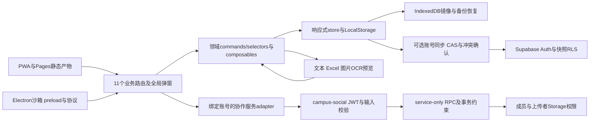

# 项目工程审计

> 2026-10-10 最终本地工程审计。307文件2771测试、Node22完整check、正式Web/desktop产物及613浏览器检查均通过；源码冻结校验一致。生产迁移、部署、真实双账号/多连接及物理Safari等明确未验证，不能视为生产发布批准。

## 1. 状态、范围与证据

项目是“三两事”，以本机数据为主的学习生活工作台。实际工程包含 Vue 3 / Vue Router SPA、Vite 8、PWA、可选 Supabase 邮箱账号与自动同步、好友/齐行协作、Cloudflare Pages 及 Windows Electron 外壳。课程、任务、日程、账本、清单、重要日期、专注及回顾沿同一套本地领域模型工作。

本次执行了分工源码审查、真实失败复现、最小修复及定向回归。没有清空真实存储或数据库，没有提交、部署或应用生产迁移。开始时工作区已有未提交改动；并行齐行/任务时间功能已协调冻结，最终签名由主审计统一核对。不能将基线到当前的全部 Diff 都归为审计修改。

| 快照 | 全部盘点文件 | 自有文件 | 可解析源文件 | 解释 |
| --- | ---: | ---: | ---: | --- |
| 初始 inventory-before | 703 | 694 | 以初始 AST 记录为准 | 已含用户未提交内容 |
| 第一次候选静态盘点 | 741 | 732 | 660 | 主审计提供的候选快照；不是最终交付 |
| 草稿读取时最新静态盘点 | 745 | 736 | 663 | 继续加入并行成果修复/测试；0解析错误 |
| 最终交付快照（含CSV） | 761 | 752 | 673 | 330 src、316测试文件（307实际suite）、0解析错误；9份vendor/二进制 |

完整逐文件记录见 [PROJECT_FILE_COVERAGE.csv](PROJECT_FILE_COVERAGE.csv)，761个路径逐行对应最终枚举。每行保留归属、风险、审阅方法、问题ID、SHA256、修复及验证边界；CSV自身哈希记N/A避免自引用。静态语法通过不等于所有业务分支已执行。

原始证据保留在仓库外 `D:/study-life/audit/engineering-audit-20261010`，本仓库只加入脱敏结论与可复用测试，不复制 JSON 日志、截图、数据库、实际环境内容或用户记录：

- [inventory-before.json](../../audit/engineering-audit-20261010/inventory-before.json)、[static-review.json](../../audit/engineering-audit-20261010/static-review.json)：盘点、哈希、AST及循环。
- [data-review.json](../../audit/engineering-audit-20261010/data-review.json)：202个composable完整审阅及最新2模块补读、25项复现修复；其中23项本组实施，2项工作台生命周期由外部并行变更实施后验证。
- [backend-review.json](../../audit/engineering-audit-20261010/backend-review.json)：40份源码/配置审阅、11项发现、HTTP/服务/桌面及本地SQL证据。
- [frontend-review.json](../../audit/engineering-audit-20261010/frontend-review.json)：110份前端文件（104 Vue、6 CSS）及共享上下文、14项发现；原29文件291用例与新增CSP5例分开验证，最终全库307文件2771例通过。
- [independent-review.json](../../audit/engineering-audit-20261010/independent-review.json)：独立复核及续修。11项独立发现均resolved；最后135+11+8+1定向绿，701文件验证窗口无哈希漂移。
- [cloud-metadata.json](../../audit/engineering-audit-20261010/cloud-metadata.json)、[cloudflare-metadata.json](../../audit/engineering-audit-20261010/cloudflare-metadata.json)：只读云元数据，未修改生产。
- 性能、手机端和测试细节分别见 [OPTIMIZATION_REPORT.md](OPTIMIZATION_REPORT.md)、[TEST_REPORT.md](TEST_REPORT.md)。

问题级别沿用用户定义：P0为阻断或严重安全风险，P1为主要业务/隔离/数据正确性风险，P2为一般错误及可用性问题，P3为文档/维护问题。不同报告可能记录同一问题的发现、实施与复核，不把这些ID相加冒充独立缺陷数量。

对outline-offset/outline-color不能仅因“不改布局”宣称不绘制，通常优先transform/opacity并实际测量；本轮只纠正注释。[浏览器动画性能官方说明](https://web.dev/articles/animations-guide)。

## 2. 实际架构与数据边界

- **界面与领域数据**：视图及编辑器通过 commands 操作领域记录；selectors 负责下一行动、关系、排序及回顾。模块级状态有意用于跨弹窗预览，但异步操作必须绑定账号、项目、对话框或识别会话。
- **持久化与恢复**：LocalStorage为核心轻量数据，IndexedDB为设备内镜像和壁纸存储。防抖任务、外部storage事件、恢复及撤销以版本/指纹判定归属；损坏外部数据不得取消可保存的本地编辑。
- **导入**：文字、Excel及OCR先进入预览，确认后写正式课表/作息；取消、换号或配置改变使旧计划失效。普通无并发撤销保留；后续有新编辑时拒绝全快照覆盖并说明原因。
- **账号同步**：可选邮箱账号、归属隔离、快照CAS、合并与冲突确认；离线修改保留。跨标签关闭同步必须立即反映到当前标签。
- **协作服务**：前端显式绑定已检查JWT；Edge验证账号/邮箱与输入，授权在服务/数据库实施。项目表和内部RPC为服务专用；文件权限另按有效成员与上传者检查。
- **部署与桌面**：Pages设备同步旧接口已退役为410；不把空的旧coordinator缓存目录当活跃服务。Electron检查沙箱、隔离preload、协议路径、外部链接、更新控制；未执行真实签名安装/更新。

### 2.1 四个静态循环的判定

静态图有四个循环：scheduleOcrFlow↔recognitionSchemes、timePlanDraft↔timePlanTools、recognitionSchemes↔timeImportPlan，以及scheduleOcrFlow→recognitionSchemes→timeImportPlan→scheduleOcrFlow。已检查顶层初始化和延迟绑定：相关依赖在函数、lazy computed或非immediate回调中读取；没有仅为消除图环而重写架构。

[engineeringDataImportValidation.test.js](../tests/engineeringDataImportValidation.test.js)以五种真实入口顺序验证文本解析→识别草稿→导入计划→正式导入→LocalStorage→撤销。五条通过说明所测入口无初始化故障，不能推断所有未来入口均安全。继续保持延迟读取约定。

## 3. 真实功能与关键链路

路由来自 [src/router/routes.js](../src/router/routes.js)，不是重新手抄测试实现。共11个实际业务路由，/today及/notes为兼容重定向，未知路径有NotFound。

| 路由 | 实际功能 | 本轮检查链路 | 尚缺的线上/物理验证 |
| --- | --- | --- | --- |
| / | 今天聚合、下一行动、课程/任务/日程/账单/节点、专注入口 | selectors排序/限额、年度节点、路由首屏CLS与加载 | 物理终端和生产首访 |
| /schedule | 学期/校区/作息/节次课表、特殊日期、导入及裁剪 | 文本/Excel/OCR→预览→确认→存储→撤销；补课与取消共享语义 | 真实照片准确率、手机拍摄权限/手势 |
| /course | 课程进度与学习记录 | 模型、任务/课程关系、现有回归 | 物理终端权限/真实账号链 |
| /tasks | 待办、阶段/时间窗口、重复、改期、任务工作进度 | 时间边界、阶段、关系、行动桶、项目任务桥接/队列 | 多设备同时真实编辑 |
| /exams | 重要日期、年度/农历节点及关联专注 | 年度发生实例、真实日期校验、倒计时关系 | 真机提醒/时区切换 |
| /events | 日程、占用与冲突、日历导出 | 日期/时区、跨午夜忙时、会议桥接 | 系统日历客户端导入行为 |
| /lists | 清单与条目状态 | 领域命令、双向滑动和隐藏动作键盘状态 | 真机多指/触控笔 |
| /bills | 交易/固定账单、分摊/退款、分类、预算/汇率、导入导出 | 账单失败反馈、个人实付FX、保存与报表 | 多账号真实财务同步与设备存储配额 |
| /review | 回顾、图表、日/月/年复盘 | 任务/课程/专注/交易选取、年度节点和多币种报告 | 超大真实数据导出峰值性能 |
| /together | 好友、共同空闲、邀请/通知、共同日程 | 账号切换、真实click刷新、订阅清理、跨日历冲突 | 双真实账号、真实WebSocket/SMTP |
| /projects | 齐行项目、分工/依赖/检查点、成果/版本/验收、会议/邀请、个人任务桥接 | JWT→真实Edge处理→RPC约束；账号/项目/对话框世代；并发业务结果与busy归属 | 真实Storage HTTP、多连接PG17/PostgREST、真实云端expectedRevision验收 |

全局能力还包括账号注册/登录/找回/验证、快速记录与通知理解、备份/恢复、搜索/设置、壁纸/主题、PWA安装/离线/更新及桌面外壳。这些在源码和已有/新增测试中被检查；真实SMTP发信、系统安装更新、摄像头/语音/剪贴板权限未被假称为已执行。

## 4. 模块与文件覆盖矩阵

本表按全量文件范围组织，目录数量为交付盘点；完整方法、归属及最终哈希见CSV。风险级别表示检查重点，不是目录内每个文件都有漏洞。当前330份src包括204composable、106SFC和8CSS；前端领域110文件及根App/新增DraftRecovery分别完整补读。

| 模块 | 文件范围/已盘点数量 | 功能与风险 | 检查状态/发现 | 修复与验证 |
| --- | --- | --- | --- | --- |
| 启动/壳/路由 | src/main.js、App.vue、router/**（3）、index.html | 启动恢复、空屏、懒加载、焦点与导航；P1 | AST/入口审查、真实boot判据；R02/R04/R06 | 定向红绿、最终生产性能与boot负例已验证 |
| 业务页面 | src/views/**（26） | 11路由及页面子面板；P1/P2 | 前端全范围审阅/编译；FE004/005/009等 | 定向与最终全库绿，正式297页面组合/613断言绿 |
| UI组件 | src/components/**（85）及公共CSS | 表单、弹窗、菜单、虚拟列表、裁剪、移动交互；P2 | 前端领域110文件及App/DraftRecovery补读，模板/样式/资源生命周期 | FE001-009与手机裁剪实测；物理Safari未验 |
| 领域/store/持久化 | composables/domain/**、store/**及dataVault/backup/account模块 | CRUD/迁移/备份/多标签/离线/CAS；P1 | 202composable完整审阅及2个最新并行模块补读；DATA01-08/18-21 | 真实domain/storage/恢复调用链回归；云端并发未验 |
| 任务/时间/日程/重要日期 | composables/tasks/**、time*、events/**、zonedTime、lunar* | 重复/跨日/夏令时/周年/冲突；P1/P2 | 完整审阅并重读外部时间修改；DATA05/09/10/12/13/15 | 实际selector、导入、报告回归；保留用户阶段/改期修改 |
| 导入/识别/解析 | OCR/Excel/iCal/notice/quickRecord及time import模块 | 预览、取消、异常输入、恢复；P1/P2 | 所有分配文件阅读；DATA15/17-25；4延迟循环 | 5入口循环、跨页/ABA、真实Vue paste、真实WASM样例 |
| 账本/复盘 | ledger*、ledgerView/**、retrospective | 金额精度、个人分摊、退款与FX；P2 | 完整审阅；DATA16/FE009 | 分摊/汇率/报告与失败反馈回归；汇率为当前配置估算 |
| 前端账号/服务/共享工具 | src/services/**（4）、src/utils/**（1）、types/**、env声明 | JWT/配置/请求边界；P1 | 全后端服务审阅及root类型检查；B01/B09 | 显式令牌绑定、严格日期；真实JWT轮换链路未验 |
| 协作本地桥接 | composables/projects/**、project*Bridge、collaborationContext | 个人数据隔离、离线队列、对话框生命周期；P1 | DATA08/11/22/23，FE010-013；新增5个project模块及DraftRecovery补读 | 定向与独立复核；外部workbench/成果功能不冒领 |
| Supabase | supabase/**（19自有文件，含13迁移与3SQL套件） | RLS/RPC/Storage/限流/请求上限/并发约束；P1 | 全后端审阅+B02-07/B11；云元数据只读 | PG18.3 scratch最新13迁移11组绿；云端PG17、多连接/真实HTTP未验 |
| Pages/退役同步 | functions/**（1）、wrangler.jsonc、旧sync-coordinator | SPA/缓存/410退役接口；P2 | 配置、源码、Worker本地构建；preview遗留绑定记录 | 本地编译绿；线上只读，未清理旧绑定 |
| 桌面 | desktop-app/**（6）、desktop/**（4自有+2二进制）、electron-builder*.yml | preload/协议/沙箱/更新/证书；P1/P2 | 全后端源码配置与公开证书元数据；B08/B10 | 定向更新/签名配置测试绿；本地dir/未签名NSIS包已验，真实签名安装/更新未验 |
| 工程配置与脚本 | 根配置、scripts/**（25）、.github/**（2） | 锁文件/构建/CI/环境/审计可靠性；P1/P2 | R01-05及B10，YAML解析/版本边界 | lint/typecheck、严格棘轮、隔离ci安装、审计；Node22最终完整check/2771例/build绿，远程CI未执行 |
| 测试 | tests/**（316盘点文件，307执行suite）及supabase/tests | 行为/集成/源码守卫/SQL；P1 | AST声明扫描、夹具/失败原因核对、原始要求保留 | 新增29个engineering文件共154例；中间失败保留，最终稳定两种Node全库复跑绿 |
| 文档/设计说明 | docs/**（29含CSV）、README、AGENTS、DESIGN_TOKENS | 功能/部署/归档准确性；P3 | R03/R07及本次三文；旧归档保留 | 最终CSV和版本说明已补齐，不复制运行数据 |
| 自有静态资源 | public自有SVG/manifest/HTML、desktop资源引用 | 路径、主题/PWA图标、体积；P2 | 引用/构建/二进制元数据检查 | 不能把元数据检查写成逐像素视觉验证 |
| 第三方与二进制 | 3份OCR vendor、6份图标/证书二进制 | 供应链/运行加载/许可/体积 | 不逐行审查vendor；识别归属、哈希、版本/构建及加载 | 本地WASM真实样例通过，模型质量/签名信任链未完整验证 |

### 4.1 明确排除与未检查范围

- `node_modules/**`、构建产物dist/dist-desktop、coverage、缓存和自动生成临时目录不作为自有源码逐行阅读；锁文件、版本、相关配置、构建及漏洞清单被检查。
- 三份OCR第三方文件为chi_sim.traineddata、tesseract-core-simd-lstm.wasm.js、tesseract-worker.min.js；二进制图标/公开cer只检查归属/引用/元数据，不声称逐行或逐像素审阅。
- 不主动检索、人工阅读或输出 `supabase/.temp`、认证profile、真实.env/私钥、用户备份/上传/数据库和浏览器用户状态。Vite及配置门禁会按工具默认流程加载环境文件，本轮正式构建用显式虚构公开URL/key覆盖；没有读取真实业务行，也没有把环境内容复制到报告。
- 物理Safari/iOS软键盘、安全区、真实系统权限与桌面安装/签名信任链、SMTP、双真实账号、实际Storage HTTP、云端多设备竞争、线上PostgREST/JWT及多连接PG17事务未执行。
- 本地原交互141项/66组合、正式dist613断言/297组合、离线/CRUD、boot正负例、Node22完整check、Web/desktop/未签名NSIS构建与独立复核已通过。没有真实签名安装/更新、物理Safari/软键盘或托管业务写入；13本地迁移11组通过仍不能替代生产PG17多连接验收。

## 5. 全部问题与修复记录

### 5.1 主审计问题

| ID/级别 | 根因/影响 | 最小修复 | 红/绿证据与状态 |
| --- | --- | --- | --- |
| R01 / P2 | loadEnv只接受Supabase前缀，VITE_APP_RELEASE覆盖被丢弃，比较值/version.txt不随环境设置 | 明确加载VITE_APP_RELEASE，与版本默认值共用同一结果 | engineeringConfig2例验证覆盖及默认；root-regressions-green2文件7例。最终正式产物构建/版本检查通过 |
| R02 / P1 | first-visit/iPhone审计仅看页面/空#app，静默白屏可能假绿 | boot-verdict断言实际main挂载、无错误/骨架、有效导航与至多一次受控恢复 | blank/启动骨架/异常等模块负例及5行为例绿；真实浏览器blank负例两工具均RED/exit1 |
| R03 / P2 | calc字号“下界”忽略负数/未知项，误当大字以3:1放过小字 | 不能证明下界时保守使用4.5:1；修正WCAG的CSS px与pt说明 | contrast-calc-red.log实际4红→4绿；最终audit:contrast已通过，不能推断整站WCAG认证 |
| R04 / P2 | 启动/恢复实际HTML中的3条小字颜色仅约2.35/4.47，对比不足 | 调整启动文字颜色至约4.804，保持布局/恢复逻辑 | actual index.html解析的3红→3绿；startup-contrast-green关联2文件59例 |
| R05 / P1 | 依赖存在6项high及9项moderate，CI还曾屏蔽高危结果 | 使用兼容版本升级与一致lock，不批量跨大版本、不强制降级electron-builder | 总15→8moderate/0high；运行依赖/desktop0；隔离npm ci --ignore-scripts753包exit0，不等于postinstall |
| R06 / P2 | Today的生产力面板晚加载改变布局 | HomeProductivityPanel随Today路由加载，消除晚插入布局变化 | 同条件3冷样本CLS0.155611→0；LCP略慢而非改善。最终actualdist三冷样本CLS0、LCP中位数4388ms |
| R07 / P3 | 历史归档路径、README审计入口及idle能力注释过时 | 更新真实文件/当前能力引用，纠正style.css将outline宣称必然合成层动画的注释，保留历史归档 | 源/文档与最终CSV链接核对；仅修正说明，无动画性能提升承诺 |
| R08 / P2 | App.vue挂载6s后读取sl_backup_nudge_at遇SecurityError抛未捕获异常，备份提醒入口丢失 | 窄try/catch允许读不可用时仍显示入口；写Quota时仍可关闭，保留7天去重 | engineeringShellStorage新增3例，真实1失败2通过→关联5文件38例绿；前两次mock/Proxy污染属于fixture错误 |
| R09 / P2 | utils/formatters.js dayLabel用减86400000推导昨天，夏令时后凌晨可落前天，错标账本日期 | 用本地setDate减1保留本地日历契约，不把日期变为UTC | 真实nativeNode独立TZ4例2红2绿→2文件10例绿，新增4例验证NY春/秋、Berlin春、Shanghai跨年offset |

主审计详细日志见 [root-regressions-green.log](../../audit/engineering-audit-20261010/root-regressions-green.log)、[audit-tools-green.log](../../audit/engineering-audit-20261010/audit-tools-green.log)、[contrast-calc-red.log](../../audit/engineering-audit-20261010/contrast-calc-red.log)、[startup-contrast-red.log](../../audit/engineering-audit-20261010/startup-contrast-red.log)、[startup-contrast-green.log](../../audit/engineering-audit-20261010/startup-contrast-green.log)、[shell-storage-red.json](../../audit/engineering-audit-20261010/shell-storage-red.json)、[shell-storage-green.json](../../audit/engineering-audit-20261010/shell-storage-green.json)、[formatter-dates-red.json](../../audit/engineering-audit-20261010/formatter-dates-red.json)、[formatter-dates-green.json](../../audit/engineering-audit-20261010/formatter-dates-green.json)。

另记测试辅助问题TEST-01：既有projectsFormErrorBinding.functionBody按花括号截取函数体，将selectProject解构参数当成body，实际clearAll仍存在，导致最新全库唯一失败。主审计改为TypeScript AST取完整函数，保留全部原业务断言；[project-form-ast-green.log](../../audit/engineering-audit-20261010/project-form-ast-green.log)5文件37例绿。它是测试解析缺陷，不虚算产品回归。

### 5.2 数据与业务状态：DATA-01至DATA-25

### DATA-01 · P1 · 跨标签损坏数据覆盖待保存编辑

- 范围：[src/composables/store/core.js](../src/composables/store/core.js)。
- 触发与根因：当前标签已编辑且防抖写入未完成，另一标签发出无效 JSON 或错误顶层结构的 storage 事件。 外部事件先取消待保存任务，解析或结构验证失败后本地编辑失去持久化机会。
- 修复：解析及结构验证成功后才接受外部快照；失败保留内存及待保存写入并报告读取错误。
- 状态：代码已修，定向回归通过；最终307文件2771例全库通过。
- 红证据：5 failed / 1 passed（真实 domain/core 调用链的基线复现）。
- 绿证据：6 files / 41 tests passed。回归：[tests/engineeringDataPersistence.test.js](../tests/engineeringDataPersistence.test.js)；详情见 [DATA-01 原始记录](../../audit/engineering-audit-20261010/data-review.json)。

### DATA-02 · P1 · 外部删除或清空后 watcher 复活旧数据

- 范围：[src/composables/store/core.js](../src/composables/store/core.js)。
- 触发与根因：另一标签删除已注册键或执行 localStorage.clear()，当前标签的 watcher 随后刷新。 恢复默认 ref 触发 watcher，但外部默认快照没有成为持久化基线；clear 的 key=null 未按全部注册键处理。
- 修复：建立外部恢复的规范序列化基线，取消对应旧写入；delete/clear 重置默认值和指纹，后续真实本地修改仍会写入。
- 状态：代码已修，定向回归通过；最终307文件2771例全库通过。
- 红证据：跨标签删除回归失败，旧数组重新写入。
- 绿证据：6 files / 41 tests passed。回归：[tests/engineeringDataPersistence.test.js](../tests/engineeringDataPersistence.test.js)；详情见 [DATA-02 原始记录](../../audit/engineering-audit-20261010/data-review.json)。

### DATA-03 · P2 · 存储读取异常中断整批保存

- 范围：[src/composables/store/core.js](../src/composables/store/core.js)。
- 触发与根因：浏览器隐私或存储权限使 getItem 抛 SecurityError，多个 ref 同批需要保存。 获取旧值及指纹比较位于每键异常捕获之外。
- 修复：将每键读取及比较纳入 try/catch，使错误记录和其它键写入继续。
- 状态：代码已修，定向回归通过；最终307文件2771例全库通过。
- 红证据：SecurityError 场景失败。
- 绿证据：包含在 41-test 绿色关联组。回归：[tests/engineeringDataPersistence.test.js](../tests/engineeringDataPersistence.test.js)；详情见 [DATA-03 原始记录](../../audit/engineering-audit-20261010/data-review.json)。

### DATA-04 · P1 · 另一标签关闭云同步后当前标签仍持旧开关

- 范围：[src/composables/accountSyncMode.js](../src/composables/accountSyncMode.js)、[src/composables/store/core.js](../src/composables/store/core.js)。
- 触发与根因：另一标签将 account_sync_mode 设 off，或清空 localStorage；也检查 sessionStorage 事件。 模式 ref 没有订阅外部模式键/clear，storage 来源也未被统一过滤。
- 修复：同步模式监听 localStorage 模式键及 clear，忽略 sessionStorage；store 同样过滤来源。
- 状态：代码已修，定向回归通过；最终307文件2771例全库通过。
- 红证据：跨标签 opt-out 失败。
- 绿证据：包含在 41-test 绿色关联组。回归：[tests/engineeringDataPersistence.test.js](../tests/engineeringDataPersistence.test.js)；详情见 [DATA-04 原始记录](../../audit/engineering-audit-20261010/data-review.json)。

### DATA-05 · P2 · 无效日历日期通过共享校验

- 范围：[src/composables/zonedTime.js](../src/composables/zonedTime.js)。
- 触发与根因：请求/配置传入 2026-02-31、2026-04-31 等形似 YYYY-MM-DD 的日期。 正则只验证格式，Date.UTC 自动归一化非法日期。
- 修复：用有限 UTC 时间和完整 ISO 往返值确认真实日历日期，保持合法低年份行为。
- 状态：代码已修，定向回归通过；最终307文件2771例全库通过。
- 红证据：5 非法日期用例在基线失败；合法日期和 server 真实入口参与回归。
- 绿证据：6 files / 41 tests passed。回归：[tests/engineeringDataCalendar.test.js](../tests/engineeringDataCalendar.test.js)；详情见 [DATA-05 原始记录](../../audit/engineering-audit-20261010/data-review.json)。

### DATA-06 · P1 · 旧饮食模块退役前紧急备份遗漏待删除数据

- 范围：[src/composables/emergencyExport.js](../src/composables/emergencyExport.js)。
- 触发与根因：foodRetirement 按规则移除 foodPlaces、foodHistory、foodFilters、packages。 紧急导出白名单已经去除旧字段，退役先备份实际不含这些值。
- 修复：将四个旧键纳入紧急归档字段，保持正式模块退役及当前恢复范围；真实退役调用链验证先归档再删除。
- 状态：代码已修，定向回归通过；最终307文件2771例全库通过。
- 红证据：1 failed，归档缺失 legacy 键。
- 绿证据：2 files / 6 tests passed。回归：[tests/engineeringDataRetirement.test.js](../tests/engineeringDataRetirement.test.js)；详情见 [DATA-06 原始记录](../../audit/engineering-audit-20261010/data-review.json)。

### DATA-07 · P1 · 旧 IndexedDB 镜像任务覆盖明确恢复值

- 范围：[src/composables/dataVault.js](../src/composables/dataVault.js)。
- 触发与根因：同键旧镜像已排队或 await get 进行中，此时用户恢复备份并调用 mirrorLocalValues。 待写队列/在途任务没有逐键版本，恢复写入后旧任务仍执行或重排队。
- 修复：维护逐键版本与队列序号，批量镜像恢复先使旧任务失效；每次 await 后以及重排队前核验版本。
- 状态：代码已修，定向回归通过；最终307文件2771例全库通过。
- 红证据：2 failed，pending 和 in-flight 旧镜像覆盖恢复。
- 绿证据：5 files / 23 tests passed。回归：[tests/engineeringDataVaultRace.test.js](../tests/engineeringDataVaultRace.test.js)；详情见 [DATA-07 原始记录](../../audit/engineering-audit-20261010/data-review.json)。

### DATA-08 · P1 · 离线项目队列旧响应删除新追加或更新项

- 范围：[src/composables/projectTaskBridge.js](../src/composables/projectTaskBridge.js)。
- 触发与根因：flush await 网络期间，用户离线添加另一任务或再次修改同任务状态。 完成时用启动瞬间的 remaining 快照覆盖实时队列。
- 修复：只确认响应对应的同版本条目；从实时队列去除确认项，保留追加项及更新版本，并维持 owner 发布校验。
- 状态：代码已修，定向回归通过；最终307文件2771例全库通过。
- 红证据：2 failed：新任务项与同任务新状态均丢失；最初 mock 导出设置错误已纠正后才采用该红证据。
- 绿证据：2 files / 8 tests passed。回归：[tests/engineeringDataProjectQueue.test.js](../tests/engineeringDataProjectQueue.test.js)；详情见 [DATA-08 原始记录](../../audit/engineering-audit-20261010/data-review.json)。

### DATA-09 · P2 · 相同紧急级别的任务排序比较器不满足反对称性

- 范围：[src/composables/domain/selectors.js](../src/composables/domain/selectors.js)。
- 触发与根因：同为 overdue 或同为高优先级的任务顺序相反地输入 Action Center。 比较器在两边都命中同桶时仍固定返回 -1/1。
- 修复：先比较布尔桶差值，相同桶再按 dueAt 等稳定排序。
- 状态：代码已修，定向回归通过；最终307文件2771例全库通过。
- 红证据：2 failed，包含逆序输入的同桶排序复现。
- 绿证据：4 files / 11 tests passed。回归：[tests/engineeringDataActionCenter.test.js](../tests/engineeringDataActionCenter.test.js)；详情见 [DATA-09 原始记录](../../audit/engineering-audit-20261010/data-review.json)。

### DATA-10 · P2 · Action Center 限额之外的任务从后续行动桶消失

- 范围：[src/composables/domain/selectors.js](../src/composables/domain/selectors.js)。
- 触发与根因：四个 overdue 任务，首桶限额三条，第四条应进入今日后续行动。 take 在 slice 前将全部候选标记为已使用。
- 修复：只标记实际选取条目，使限额外候选可被后续桶选择。
- 状态：代码已修，定向回归通过；最终307文件2771例全库通过。
- 红证据：溢出第四任务不可见的红回归失败。
- 绿证据：4 files / 11 tests passed。回归：[tests/engineeringDataActionCenter.test.js](../tests/engineeringDataActionCenter.test.js)；详情见 [DATA-10 原始记录](../../audit/engineering-audit-20261010/data-review.json)。

### DATA-11 · P1 · 项目工作台旧保存响应影响新账号或新打开任务

- 范围：[src/composables/projects/useProjectTaskWorkbench.js](../src/composables/projects/useProjectTaskWorkbench.js)。
- 触发与根因：save await 后切换账号、项目、关闭面板或打开其它任务。 保存响应后未经原 owner/task/project 校验即 notify、loadProject、open；旧错误也会写入新任务面板。
- 修复：捕获原 owner、任务引用和项目，在每次 await 后检查上下文；错误仅发布到仍匹配的面板。
- 状态：代码已修，定向回归通过；最终307文件2771例全库通过。
- 红证据：旧响应触发新上下文载入/通知以及旧错误污染用例失败。
- 绿证据：4 files / 11 tests passed。回归：[tests/engineeringDataProjectWorkbench.test.js](../tests/engineeringDataProjectWorkbench.test.js)；详情见 [DATA-11 原始记录](../../audit/engineering-audit-20261010/data-review.json)。

### DATA-12 · P2 · 首页年度纪念日展示历史起始日期而非今年发生日期

- 范围：[src/composables/home/nextUp.js](../src/composables/home/nextUp.js)。
- 触发与根因：2020 年开始的年度生日，在 2026 年主页 next-up 中计算。 年度规则未通过当前发生实例求目标日期。
- 修复：使用 countdownState 及 policyDateKey 得到本年度/下一年度实际发生日。
- 状态：代码已修，定向回归通过；最终307文件2771例全库通过。
- 红证据：2 failed（首页与月复盘各一）。
- 绿证据：3 files / 10 tests passed。回归：[tests/engineeringDataAnnualMilestones.test.js](../tests/engineeringDataAnnualMilestones.test.js)；详情见 [DATA-12 原始记录](../../audit/engineering-audit-20261010/data-review.json)。

### DATA-13 · P2 · 月度复盘年度纪念日筛选截取错误位置

- 范围：[src/composables/retrospective.js](../src/composables/retrospective.js)。
- 触发与根因：历史年份的年度纪念日应计入当前月份。 将 date 的月份与 monthPrefix 的错误子串比较。
- 修复：统一读取 YYYY-MM 的月份位置，保留常规单次纪念日规则。
- 状态：代码已修，定向回归通过；最终307文件2771例全库通过。
- 红证据：2 failed（首页与月复盘各一）。
- 绿证据：3 files / 10 tests passed。回归：[tests/engineeringDataAnnualMilestones.test.js](../tests/engineeringDataAnnualMilestones.test.js)；详情见 [DATA-13 原始记录](../../audit/engineering-audit-20261010/data-review.json)。

### DATA-14 · P2 · 壁纸 IndexedDB 请求成功但事务中止仍被报告成功

- 范围：[src/composables/wallpaperStorage.js](../src/composables/wallpaperStorage.js)。
- 触发与根因：put/delete/clear request onsuccess 后其 transaction abort。 只 await request 成功便增加 revision 并关闭数据库。
- 修复：同时等待 request 和 transaction complete；中止拒绝，revision 不变，数据库关闭一次。
- 状态：代码已修，定向回归通过；最终307文件2771例全库通过。
- 红证据：3 failed（set/delete/clear）。
- 绿证据：2 files / 7 tests passed。回归：[tests/engineeringDataWallpaperCommit.test.js](../tests/engineeringDataWallpaperCommit.test.js)；详情见 [DATA-14 原始记录](../../audit/engineering-audit-20261010/data-review.json)。

### DATA-15 · P2 · OCR 和人工导入草稿接受越界时分

- 范围：[src/composables/scheduleRecognition.js](../src/composables/scheduleRecognition.js)、[src/composables/timePlanDraft.js](../src/composables/timePlanDraft.js)。
- 触发与根因：OCR 识别 25:00 或 08:99，或用户手工将草稿时间改成越界/非法格式。 字符串拆分缺少 hour/minute 范围校验，NaN 比较也不能阻止保存。
- 修复：严格匹配并限制 0..23 / 0..59，草稿行先检查 finite，再比较顺序。
- 状态：代码已修，定向回归通过；最终307文件2771例全库通过。
- 红证据：5 failed / 5 passed，非法 OCR 时间及手工草稿红回归；入口循环基线可加载。
- 绿证据：4 files / 47 tests passed。回归：[tests/engineeringDataImportValidation.test.js](../tests/engineeringDataImportValidation.test.js)；详情见 [DATA-15 原始记录](../../audit/engineering-audit-20261010/data-review.json)。

### DATA-16 · P2 · 日月年复盘直接相加异币种且金额标签不正确

- 范围：[src/composables/retrospective.js](../src/composables/retrospective.js)。
- 触发与根因：CNY 基准账本含 USD 分摊支出、退款、收入，缺少 JPY 汇率，或基准币为 USD。 复盘绕过 ledgerFx，对原始分币直接求和，报告金额固定按人民币展示。
- 修复：复用个人实付口径 mySpendYuan 和 summarizeLedgerInBase；基准总额按基准币标注，记录按本币标注，缺汇率记录排除统计并保留记录与说明。
- 状态：代码已修，定向回归通过；最终307文件2771例全库通过。
- 红证据：6 failed，真实 useLedgerFx 保存 + 日/月/年报告调用链。
- 绿证据：4 files / 52 tests passed。回归：[tests/engineeringDataRetrospectiveFx.test.js](../tests/engineeringDataRetrospectiveFx.test.js)；详情见 [DATA-16 原始记录](../../audit/engineering-audit-20261010/data-review.json)。

### DATA-17 · P2 · 取消或换号后的 Excel/OCR 迟到响应仍发布预览

- 范围：[src/composables/scheduleOcrImport.js](../src/composables/scheduleOcrImport.js)、[src/composables/scheduleOcrFlow.js](../src/composables/scheduleOcrFlow.js)、[src/composables/recognitionSchemes.js](../src/composables/recognitionSchemes.js)。
- 触发与根因：Excel parser 按需加载、图片 OCR 或识别引擎 await 中点击取消、换账号或开始新识别。 AbortSignal 只覆盖 OCR 网络/引擎部分，后续 parser await 和旧进度/错误发布缺少会话归属。
- 修复：单调 generation 与 owner/abort 守卫贯穿每个 await；旧进度、fallback、错误、识别草稿发布均拒绝，清空识别使按需加载请求失效。
- 状态：代码已修，定向回归通过；最终307文件2771例全库通过。
- 红证据：3 真实取消症状失败；Excel 初次 mock 设置错误修复后以单独 -t Excel 运行确认 1 failed。
- 绿证据：5 files / 36 tests passed。回归：[tests/engineeringDataImportCancellation.test.js](../tests/engineeringDataImportCancellation.test.js)、[tests/engineeringDataImportValidation.test.js](../tests/engineeringDataImportValidation.test.js)；详情见 [DATA-17 原始记录](../../audit/engineering-audit-20261010/data-review.json)。

### DATA-18 · P1 · 课程导入待加载的旧审阅快照覆盖另一标签新课表

- 范围：[src/composables/scheduleImportReview.js](../src/composables/scheduleImportReview.js)。
- 触发与根因：begin/commit 的加载 await 期间，另一标签通过 storage 事件恢复新课表。 审阅依据旧快照，但提交未验证 live courses 仍等于该快照。
- 修复：begin 与 commit 在每次 await 后验证 owner/epoch/快照；busy 在 await 前置，失败或并发变化保留最新课表；后续词汇学习也验证提交指纹。
- 状态：代码已修，定向回归通过；最终307文件2771例全库通过。
- 红证据：6 failed / 1 passed 的基线组包含 pending 课程快照覆盖；真实 domain + storage 事件。
- 绿证据：4 files / 28 tests passed。回归：[tests/engineeringDataImportConcurrency.test.js](../tests/engineeringDataImportConcurrency.test.js)；详情见 [DATA-18 原始记录](../../audit/engineering-audit-20261010/data-review.json)。

### DATA-19 · P1 · 课程与时间导入撤销或失败回滚覆盖后续编辑

- 范围：[src/composables/scheduleImportReview.js](../src/composables/scheduleImportReview.js)、[src/composables/timeImportPlan.js](../src/composables/timeImportPlan.js)。
- 触发与根因：导入成功后追加课程/修改时间配置，再点撤销；或导入 await 期间出现新编辑后失败。 全量旧快照无条件替换 live ref，未确认仍拥有将撤销的状态。
- 修复：记录导入后完整指纹及 owner/epoch，仅当 live 状态仍匹配自己的提交才允许全量撤销/回滚；否则保留新编辑并说明，普通无并发撤销不变。
- 状态：代码已修，定向回归通过；最终307文件2771例全库通过。
- 红证据：基线课程/时间 undo 后新编辑被覆盖，用例失败；正常课程撤销基线通过。
- 绿证据：4 files / 28 tests passed，正常导入撤销与失败恢复关联契约通过。回归：[tests/engineeringDataImportConcurrency.test.js](../tests/engineeringDataImportConcurrency.test.js)、[tests/engineeringDataImportValidation.test.js](../tests/engineeringDataImportValidation.test.js)；详情见 [DATA-19 原始记录](../../audit/engineering-audit-20261010/data-review.json)。

### DATA-20 · P1 · 时间导入旧计划或保存 await 后发布虚假成功

- 范围：[src/composables/timeImportPlan.js](../src/composables/timeImportPlan.js)。
- 触发与根因：打开旧配置的导入计划后另一标签恢复配置，或 runImport 保存 await 中外部恢复。 草稿与具体 cfg 引用/快照不绑定；await 后旧导入继续并生成成功/撤销快照。
- 修复：计划绑定 owner、epoch、cfg 引用和快照；每个阶段 await 后验证期望指纹，自己的写入后更新期望值，外部变化终止并保留最新配置。
- 状态：代码已修，定向回归通过；最终307文件2771例全库通过。
- 红证据：修正 real-store 正规化默认字段的断言后，保存 await 红复现 1 failed，旧结果仍误标成功。
- 绿证据：4 files / 28 tests passed。回归：[tests/engineeringDataImportConcurrency.test.js](../tests/engineeringDataImportConcurrency.test.js)、[tests/engineeringDataImportValidation.test.js](../tests/engineeringDataImportValidation.test.js)；详情见 [DATA-20 原始记录](../../audit/engineering-audit-20261010/data-review.json)。

### DATA-21 · P1 · A→B→A 账号切换允许旧课程或时间导入继续

- 范围：[src/composables/scheduleImportReview.js](../src/composables/scheduleImportReview.js)、[src/composables/timeImportPlan.js](../src/composables/timeImportPlan.js)。
- 触发与根因：await 期间 owner 从 A 换到 B 再回到 A；字符串 owner 再次相同。 仅比较当前 owner 值不能识别中途失效的账号会话。
- 修复：同步 owner watcher 增加单调 accountGeneration，清除审阅/撤销上下文；旧操作同时验证原 epoch，防止返回原账号后恢复旧请求。
- 状态：代码已修，定向回归通过；最终307文件2771例全库通过。
- 红证据：2 failed（课程 + 时间）；其余 7 用例只在这次隔离红验证中跳过。
- 绿证据：4 files / 28 tests passed。回归：[tests/engineeringDataImportConcurrency.test.js](../tests/engineeringDataImportConcurrency.test.js)；详情见 [DATA-21 原始记录](../../audit/engineering-audit-20261010/data-review.json)。

### DATA-22 · P1 · 工作台关闭再打开同任务后旧保存响应清空新草稿

- 范围：[src/composables/projects/useProjectTaskWorkbench.js](../src/composables/projects/useProjectTaskWorkbench.js)。
- 触发与根因：save pending → close → open 同一个对象 → 编辑新草稿 → 旧响应成功。 task 引用、owner、project 再次匹配，旧响应重新载入并重置对话框。
- 修复：open/close 增加单调 dialog generation，save 校验 token，finally 仅释放该世代的 busy。
- 状态：外部并行变更实施，本审计保留并验证；不归功于本组独立实现。
- 红证据：2 real lifecycle regressions failed on pre-continuation source。
- 绿证据：5 files / 24 tests passed。回归：[tests/engineeringDataProjectWorkbench.test.js](../tests/engineeringDataProjectWorkbench.test.js)；详情见 [DATA-22 原始记录](../../audit/engineering-audit-20261010/data-review.json)。

### DATA-23 · P2 · 旧任务开始执行响应关闭新任务工作台

- 范围：[src/composables/projects/useProjectTaskWorkbench.js](../src/composables/projects/useProjectTaskWorkbench.js)。
- 触发与根因：start A pending → close → open B → A 请求成功。 start 的 await 后无条件 close，没有对话框归属。
- 修复：start 捕获 dialog generation + owner 并校验后关闭；旧 finally 不释放后来请求的 busy。
- 状态：外部并行变更实施，本审计保留并验证；不归功于本组独立实现。
- 红证据：2 real lifecycle regressions failed on pre-continuation source。
- 绿证据：5 files / 24 tests passed。回归：[tests/engineeringDataProjectWorkbench.test.js](../tests/engineeringDataProjectWorkbench.test.js)；详情见 [DATA-23 原始记录](../../audit/engineering-audit-20261010/data-review.json)。

### DATA-24 · P1 · 粘贴作息解析冷加载期间换号后旧文本重新发布

- 范围：[src/composables/recognitionSchemes.js](../src/composables/recognitionSchemes.js)、[src/components/schedule/TimeSettingsModal.vue](../src/components/schedule/TimeSettingsModal.vue)。
- 触发与根因：真实 TimeSettingsModal.runParsePaste await parser 期间 A→B 或 A→B→A。 startRecognition 在解析完成后重新捕获世代，不能感知上游解析已经失效。
- 修复：beginRecognitionSession 在解析前占有 generation+owner，贯穿 parser、startRecognition 和成功反馈；每次 await 后校验。
- 状态：代码已修，定向回归通过；最终307文件2771例全库通过。
- 红证据：3 failed：换号/切回原账号发布旧草稿，实际 Vue 组件入口；取消空结果同时失败。
- 绿证据：5 files / 24 tests passed。回归：[tests/engineeringDataPasteLifetime.test.js](../tests/engineeringDataPasteLifetime.test.js)；详情见 [DATA-24 原始记录](../../audit/engineering-audit-20261010/data-review.json)。

### DATA-25 · P2 · 放弃识别后空暂存结果导致设置入口异常

- 范围：[src/composables/recognitionSchemes.js](../src/composables/recognitionSchemes.js)、[src/components/schedule/TimeSettingsModal.vue](../src/components/schedule/TimeSettingsModal.vue)。
- 触发与根因：startRecognition await 加载 API 中 clearRecognition，使其返回 null。 runParsePaste 直接访问 draftValue.schemes，没有接纳取消结果。
- 修复：识别返回后检查非空及原 session 再显示成功提示。
- 状态：代码已修，定向回归通过；最终307文件2771例全库通过。
- 红证据：取消用例产生 TypeError Cannot read properties of null (reading schemes)；实际组件+真实 startRecognition/clearRecognition。
- 绿证据：5 files / 24 tests passed。回归：[tests/engineeringDataPasteLifetime.test.js](../tests/engineeringDataPasteLifetime.test.js)；详情见 [DATA-25 原始记录](../../audit/engineering-audit-20261010/data-review.json)。

### 5.3 服务、数据库和桌面：B01至B11

### B01 · P1 · 协作写请求可能使用后切换账号的 JWT

- 范围：[src/services/social.js](../src/services/social.js)。
- 触发与根因：验证 A session 后 SDK 延迟读取默认 token 时账号已换成 B；仅检查返回身份无法撤销已发送的服务端写入。
- 修复：要求有效 access_token，并向 SDK 显式传入已检查 session 的 Authorization。
- 状态：代码/配置已修并定向验证，最终307文件2771例全库通过。
- 红绿证据：令牌绑定和缺令牌用例基线失败；最终真实 service adapter 测试确认使用 A 的 token，缺 token 时零调用。 见 [B01 原始记录](../../audit/engineering-audit-20261010/backend-review.json)；测试标题、命令和局部边界以原记录为准。
- 限制：An operation already sent under A may complete under A after a local switch; the response is discarded.

### B02 · P1 · 共同空闲计算忽略单次取消和补课

- 范围：[supabase/functions/campus-social/availability.js](../supabase/functions/campus-social/availability.js)。
- 触发与根因：server 与持久化 schedule 的 session_off/session_makeup、假日及 courseSlots 语义不一致。
- 修复：与当前 store 规则对齐，保留取消优先级、旧节次格式；缺失/非法补课节次返回 unknown。
- 状态：代码/配置已修并定向验证，最终307文件2771例全库通过。
- 红绿证据：取消、假日补课、旧格式及缺节次四条红回归转绿。 见 [B02 原始记录](../../audit/engineering-audit-20261010/backend-review.json)；测试标题、命令和局部边界以原记录为准。
- 限制：Schedule selectors remain separate portable browser/server implementations; fixtures now cover shared semantics but every possible import shape was not exhaustively enumerated.

### B03 · P1 · 跨午夜忙时与负数课前缓冲被丢弃

- 范围：[supabase/functions/campus-social/availability.js](../supabase/functions/campus-social/availability.js)。
- 触发与根因：负 modulo 产生非法时间；是否允许预约周末错误地决定是否读取周末已有事件。
- 修复：规范分钟 modulo，保守取整缓冲；独立计算前/当/后日忙时，跨午夜会议只计一次。
- 状态：代码/配置已修并定向验证，最终307文件2771例全库通过。
- 红绿证据：早课与周日到周一用例红转绿，新增次日早课占前夜边界也通过。 见 [B03 原始记录](../../audit/engineering-audit-20261010/backend-review.json)；测试标题、命令和局部边界以原记录为准。

### B04 · P1 · 好友空闲及邀请遗漏已确认小组会议

- 范围：[supabase/functions/campus-social/index.ts](../supabase/functions/campus-social/index.ts)。
- 触发与根因：social 路径没有读取接受参与者的 confirmed project meetings。
- 修复：好友与项目共同使用确认日历 loader；查询失败 fail closed，冲突邀请在 RPC 前返回409。
- 状态：代码/配置已修并定向验证，最终307文件2771例全库通过。
- 红绿证据：真实转译 Edge handler 的日历排除、RPC 前拒绝和查询错误三条通过。 见 [B04 原始记录](../../audit/engineering-audit-20261010/backend-review.json)；测试标题、命令和局部边界以原记录为准。
- 限制：HTTP handler runs locally with fictional SDK/query fixtures; hosted PostgREST relationship embedding was not exercised.

### B05 · P1 · 跨项目及社交会议可重复预订参与者

- 范围：[supabase/migrations/20261008045623_friend_collaboration.sql](../supabase/migrations/20261008045623_friend_collaboration.sql)、[supabase/migrations/20261008064042_qixing_project_collaboration_dispatch.sql](../supabase/migrations/20261008064042_qixing_project_collaboration_dispatch.sql)、[supabase/migrations/20261010050926_collaboration_integrity_guards.sql](../supabase/migrations/20261010050926_collaboration_integrity_guards.sql)。
- 触发与根因：旧冲突 helper 只看社交；project confirmation 缺共享参与者锁及跨日历检查。
- 修复：新增 service-only 统一日历检查，沿用排序后的逐用户 advisory lock 键，按半开区间检查。
- 状态：本地迁移及回归已验证，生产迁移未应用；线上约束仍待部署后验证。
- 红绿证据：PGlite 基线允许冲突为红；本地新增迁移后跨项目、双方日历冲突及相邻不重叠场景绿。 见 [B05 原始记录](../../audit/engineering-audit-20261010/backend-review.json)；测试标题、命令和局部边界以原记录为准。
- 限制：Migration is not applied to production. PGlite uses one connection; actual simultaneous independent PostgreSQL transactions and hosted runtime remain unverified. Existing conflicting rows are not rewritten.

### B06 · P1 · 成果提交/验收绕过任务依赖约束

- 范围：[supabase/migrations/20261008064042_qixing_project_collaboration_dispatch.sql](../supabase/migrations/20261008064042_qixing_project_collaboration_dispatch.sql)、[supabase/migrations/20261010050926_collaboration_integrity_guards.sql](../supabase/migrations/20261010050926_collaboration_integrity_guards.sql)。
- 触发与根因：deliverable_submit/review 改状态没有统一依赖检查，部分写路径锁顺序不一致。
- 修复：统一 task dependency trigger；保留外部 RPC 签名，私有 core 外包项目锁 wrapper。
- 状态：本地迁移及回归已验证，生产迁移未应用；线上约束仍待部署后验证。
- 红绿证据：基线错误接受依赖未完成的提交；补丁后拒绝且版本回滚，完成前置后提交/验收成功，完成的依赖任务阻止重开前置。 见 [B06 原始记录](../../audit/engineering-audit-20261010/backend-review.json)；测试标题、命令和局部边界以原记录为准。
- 限制：Additive migration is unapplied to production; no historical tasks or payloads are rewritten. Future project_dispatch replacements must preserve the wrapper reservation or fold it into a reviewed implementation.

### B07 · P2 · 分块请求超限仍先读完整 body

- 范围：[supabase/functions/campus-social/index.ts](../supabase/functions/campus-social/index.ts)。
- 触发与根因：无可信 Content-Length 时 request.text() 全量读取后才判断32KiB。
- 修复：流式计数和 UTF-8 解码，溢出立即 cancel、释放 reader；保留 Content-Length 快拒绝。
- 状态：代码/配置已修并定向验证，最终307文件2771例全库通过。
- 红绿证据：基线9次pull，修后第3个16KiB chunk即取消且不认证；32KiB边界及拆分UTF-8有效输入通过。 见 [B07 原始记录](../../audit/engineering-audit-20261010/backend-review.json)；测试标题、命令和局部边界以原记录为准。

### B08 · P2 · 桌面更新检查并发逃逸

- 范围：[desktop-app/updaterController.cjs](../desktop-app/updaterController.cjs)。
- 触发与根因：in-flight 标志依赖 updater 事件；事件前及 update-available 后 Promise 未完成时会二次 check。
- 修复：同步占位，另用 Promise 生命周期 checkInFlight 并在 finally 释放。
- 状态：代码/配置已修并定向验证，最终307文件2771例全库通过。
- 红绿证据：两个时序用例基线均调用2次；修后只1次，既有更新事件/错误/下载/安装契约测试通过。 见 [B08 原始记录](../../audit/engineering-audit-20261010/backend-review.json)；测试标题、命令和局部边界以原记录为准。
- 限制：Updater provider/signature/install behavior was not executed against a real installed Windows application.

### B09 · P2 · 项目和任务日期接受不存在的日历日

- 范围：[src/services/projects.js](../src/services/projects.js)、[supabase/functions/campus-social/index.ts](../supabase/functions/campus-social/index.ts)。
- 触发与根因：仅 YYYY-MM-DD 正则允许2月31日等进入 SQL，再变成 generic service error。
- 修复：client 复用 DATA-05 严格 validDate；Edge create/update 使用 assertDate，在 RPC 前拒绝。
- 状态：代码/配置已修并定向验证，最终307文件2771例全库通过。
- 红绿证据：client与真实Edge红转绿；合法2028-02-29通过，非法日期返回400且不调用SQL。 见 [B09 原始记录](../../audit/engineering-audit-20261010/backend-review.json)；测试标题、命令和局部边界以原记录为准。
- 限制：Shared validDate was fixed by the data agent and reviewed by backend integration; this agent did not edit composables.

### B10 · P2 · CI 隐藏严重依赖风险且遗漏桌面 lock

- 范围：[.github/workflows/ci.yml](../.github/workflows/ci.yml)。
- 触发与根因：npm audit --audit-level=high || true 将风险变为成功，未检查 desktop-app。
- 修复：移除无条件成功 fallback，分别安装及审计根、桌面依赖。
- 状态：代码/配置已修并定向验证，最终307文件2771例全库通过。
- 红绿证据：这是配置证据，无虚构红测试或远程Actions执行；本地desktop audit0，根审计高危归零。 见 [B10 原始记录](../../audit/engineering-audit-20261010/backend-review.json)；测试标题、命令和局部边界以原记录为准。
- 限制：GitHub workflow was source-reviewed only; no remote CI or release execution. Remaining root moderate advisories are documented by the root audit.

### B11 · P2 · 日历参与者历史查询被行数限制静默截断

- 范围：[supabase/functions/campus-social/index.ts](../supabase/functions/campus-social/index.ts)。
- 触发与根因：先读全部历史参与者ID再查询有效会议，Data API 默认返回上限会遗漏后来的 confirmed booking。
- 修复：用 !inner 和时间窗在行限制前过滤，exact count检测截断并返回 schedule_unknown。
- 状态：代码/配置已修并定向验证，最终307文件2771例全库通过。
- 红绿证据：没有独立before红运行；修后1001条取消历史后的有效预订保留，1001条有效会议被截断时 fail closed。 见 [B11 原始记录](../../audit/engineering-audit-20261010/backend-review.json)；测试标题、命令和局部边界以原记录为准。
- 限制：Query cap/truncation is modeled locally and matches primary Supabase documentation; no hosted PostgREST service was contacted.

### 5.4 前端、交互和后续回归：FE-001至FE-014

### FE-001 · P2 · 多实例对话框与菜单的 DOM id 重复

- 范围：[src/components/PromptDialog.vue](../src/components/PromptDialog.vue)、[src/components/ContextMenu.vue](../src/components/ContextMenu.vue)、[src/components/ActionSheet.vue](../src/components/ActionSheet.vue)。
- 触发与根因：同页挂载两份相同组件。script setup 内的计数器每个实例从 0 开始，第二实例的 label/aria-labelledby 指向第一实例。 组件实例内计数器每次重新从0开始，导致 aria-labelledby/label 关联到另一实例。
- 修复：采用 Vue useId 生成实例 id。
- 状态：定向回归已绿，最终全库及稳定产物613浏览器检查通过。
- 红证据：3 项失败；两份 PromptDialog 的 label 以及两份 ContextMenu/ActionSheet 的标题 id 不唯一。
- 绿证据：3 项通过。回归：[tests/engineeringFrontendInteractions.test.js](../tests/engineeringFrontendInteractions.test.js)；详情见 [FE-001 原始记录](../../audit/engineering-audit-20261010/frontend-review.json)。

### FE-002 · P2 · VirtualList 默认高度误判触发整表扫描

- 范围：[src/components/VirtualList.vue](../src/components/VirtualList.vue)。
- 触发与根因：itemHeight 默认 null 经 Number(null) 转成 0，hasItemHeights 为真，5000 项仍全量构建偏移表。 Number(null) 得到0，错误进入全列表高度/偏移计算。
- 修复：只接受高度函数或有限正数，默认估算高度走可见窗口计算。
- 状态：定向回归已绿，最终全库及稳定产物613浏览器检查通过。
- 红证据：1 项失败；5000 条虚构 Proxy 记录产生 5027 次元素读取，要求少于 100。
- 绿证据：1 项通过；相同 5000 条用例元素读取小于 100。回归：[tests/engineeringFrontendInteractions.test.js](../tests/engineeringFrontendInteractions.test.js)；详情见 [FE-002 原始记录](../../audit/engineering-audit-20261010/frontend-review.json)。

### FE-003 · P2 · 模糊壁纸切换保留旧画面与 Blob URL

- 范围：[src/components/WallpaperLayer.vue](../src/components/WallpaperLayer.vue)。
- 触发与根因：关闭效果、切换页面或壁纸 revision、下一资源缺失/失败时，旧 blurVariantUrl 未及时撤销。 新资源世代启动前没有及时撤销旧 blur Blob URL 和画面。
- 修复：每次新资源世代开始立即撤销并清空现有模糊变体，再等待新变体。
- 状态：定向回归已绿，最终全库及稳定产物613浏览器检查通过。
- 红证据：4 项失败；效果关闭、路由切换待返回、新 revision 无图片、新 revision 读取失败。
- 绿证据：4 项通过。回归：[tests/engineeringFrontendWallpaper.test.js](../tests/engineeringFrontendWallpaper.test.js)；详情见 [FE-003 原始记录](../../audit/engineering-audit-20261010/frontend-review.json)。

### FE-004 · P1 · 一起约的异步响应和确认状态跨账号残留

- 范围：[src/views/TogetherView.vue](../src/views/TogetherView.vue)。
- 触发与根因：账号 A 查询共同好友时间或订阅尚未完成时换到 B；同好友 id 的旧响应可重新显示，旧订阅覆盖当前取消函数；旧移除确认可保持打开。 异步响应、私有草稿和迟到订阅没有完整账号世代所有权。
- 修复：账号世代用于加载、写操作、availability、proposal 和错误/忙状态；清空敏感草稿/确认；迟到订阅立即取消；邮箱验证状态变更也触发加载。
- 状态：定向回归已绿，最终全库及稳定产物613浏览器检查通过。
- 红证据：3 项失败；旧可约结果、迟到订阅清理、旧好友移除确认。
- 绿证据：3 项通过。回归：[tests/engineeringFrontendSocialLifecycle.test.js](../tests/engineeringFrontendSocialLifecycle.test.js)；详情见 [FE-004 原始记录](../../audit/engineering-audit-20261010/frontend-review.json)。

### FE-005 · P1 · 齐行旧账号加载与分工接受污染视图或个人桥接

- 范围：[src/views/ProjectsView.vue](../src/views/ProjectsView.vue)。
- 触发与根因：A 列表 pending 时切 B 仍共用 refreshPromise；登出后旧 detail 可触发会议同步；旧接受分工调用 ensureProjectTaskTodo(..., null, domain)；旧进展响应重新开私有任务对话框。 列表共用refreshPromise、detail及个人桥接使用变化后的账号/项目上下文。
- 修复：增加账号/list/inbox/detail/进展世代，刷新只清自身 promise；换号清私有数据和全部草稿/确认/标题；本地任务桥接、文件上传、好友/邀请链接/进展加载检查原账号与项目上下文。
- 状态：定向回归已绿，最终全库及稳定产物613浏览器检查通过。
- 红证据：5 项失败；原 3 条列表/detail/私有草稿失败；后补 2 条接受分工与私有进展失败。
- 绿证据：5 项通过。回归：[tests/engineeringFrontendProjectsLifecycle.test.js](../tests/engineeringFrontendProjectsLifecycle.test.js)；详情见 [FE-005 原始记录](../../audit/engineering-audit-20261010/frontend-review.json)。

### FE-006 · P2 · 共同日程组件迟到订阅泄漏与登录状态加载错误

- 范围：[src/components/SocialCalendarEvents.vue](../src/components/SocialCalendarEvents.vue)。
- 触发与根因：账号改变或组件卸载/停用时 load/subscribe 尚未完成；pending 加载登出后 loading 未清，邮箱从未验证变已验证但 id 不变。 活跃/卸载/验证状态未贯穿加载及订阅建立，旧订阅覆盖清理函数。
- 修复：活跃状态与世代在 load 前/后检查，迟到 unsubscribe 立即执行，停用/卸载清理，setup 清 loading，watch 包含邮箱验证。
- 状态：定向回归已绿，最终全库及稳定产物613浏览器检查通过。
- 红证据：4 项失败。
- 绿证据：4 项通过。回归：[tests/engineeringFrontendCalendarLifecycle.test.js](../tests/engineeringFrontendCalendarLifecycle.test.js)；详情见 [FE-006 原始记录](../../audit/engineering-audit-20261010/frontend-review.json)。

### FE-007 · P2 · 右滑被负向位移限制阻断且另一侧隐藏动作可 Tab 聚焦

- 范围：[src/components/SwipeActionItem.vue](../src/components/SwipeActionItem.vue)。
- 触发与根因：tasks/lists 旧双向 label API，右滑向正 x；原统一 clamp 到 [-distance,0]，右滑不能展开。恢复右滑后发现 open 时双方动作均 tabindex=0。 统一负向 clamp 阻止右滑；恢复后未限制隐藏对侧按钮的Tab停靠。
- 修复：按方向 clamp、相同展开阈值、保持已展开方向进行反向关闭；只有当前展开侧 tabindex=0。
- 状态：定向回归已绿，最终全库及稳定产物613浏览器检查通过。
- 红证据：3 项失败；右滑超过阈值与回滑前提 2 条红；隐藏反方向按钮 tabindex 另 1 条红。
- 绿证据：4 项通过；4 条新增（含短右滑不展开 sanity）和原左滑 10 条通过。回归：[tests/engineeringFrontendSwipe.test.js](../tests/engineeringFrontendSwipe.test.js)；详情见 [FE-007 原始记录](../../audit/engineering-audit-20261010/frontend-review.json)。

### FE-008 · P2 · 长截图裁剪选框坐标容器与图片错位

- 范围：[src/components/schedule/ImageCropModal.vue](../src/components/schedule/ImageCropModal.vue)。
- 触发与根因：200×1600 虚构长图以 max-height 缩小居中，stage 仍全宽，百分比选框相对 stage 而裁剪像素相对 img。 百分比选框以stage为坐标容器，实际图片却缩小居中，导出裁剪相对img。
- 修复：stage align-self:center + width:fit-content + max-width:100%，让选择框和图片共用同一矩形。
- 状态：定向回归已绿，最终全库及稳定产物613浏览器检查通过。
- 红证据：390视口stage350.84px而image64.10px，选框与图片不共坐标，crop-before.json。
- 绿证据：320/390/1440三宽stage/image均约64.098px并共坐标，crop-after.json；关联键盘守卫通过。回归：[tests/engineeringFrontendCropLayout.test.js](../tests/engineeringFrontendCropLayout.test.js)；详情见 [FE-008 原始记录](../../audit/engineering-audit-20261010/frontend-review.json)。

### FE-009 · P2 · 固定账单被移除/保存异常仍丢失反馈或误报成功

- 范围：[src/views/ledger-panels/BillFormModal.vue](../src/views/ledger-panels/BillFormModal.vue)。
- 触发与根因：表单打开后账单被同步删除，updateBill 返回 null 仍 notify 成功并关窗；域更新抛错无就地 alert。 域更新返回null或抛错没有保存失败反馈，表单仍误报成功或关闭。
- 修复：校验 updateBill 的返回值，捕获域保存异常，就地保留草稿与错误提示。
- 状态：定向回归已绿，最终全库及稳定产物613浏览器检查通过。
- 红证据：2 项失败。
- 绿证据：2 项通过。回归：[tests/engineeringFrontendFinanceForms.test.js](../tests/engineeringFrontendFinanceForms.test.js)；详情见 [FE-009 原始记录](../../audit/engineering-audit-20261010/frontend-review.json)。

### FE-010 · P2 · 切换项目后 busy 残留及旧 finally 清除新上下文 busy

- 范围：[src/views/ProjectsView.vue](../src/views/ProjectsView.vue)、[src/composables/collaborationContext.js](../src/composables/collaborationContext.js)。
- 触发与根因：A分工接受/状态/上传挂起后切B，旧响应因失效跳过清理；简单清理还会在A→B→A和旧leave finally释放新请求busy guarded finally 与上下文切换清理不完整；简单释放也会清掉新请求busy。
- 修复：项目generation在选择时失效并清理所属状态；共享模块以request lease拥有busy，finally只能清理自己的lease；账号、项目和channel有效性另行检查
- 状态：定向回归已绿，最终全库及稳定产物613浏览器检查通过。此项包含审计强化/提取过程中引入、由独立复核发现并继续修复的回归，不能统计为原有基线缺陷。
- 红证据：7 项失败；3项A→B busy残留、3项A→B→A错误清理、1项旧leave清掉B正在确认；同期B上传与不同任务并发为sanity绿例。
- 绿证据：9 项通过；9项切项目/ABA/上传/不同任务busy保护；同一任务重复click拒绝断言额外保留。回归：[tests/engineeringFrontendProjectsLifecycle.test.js](../tests/engineeringFrontendProjectsLifecycle.test.js)；详情见 [FE-010 原始记录](../../audit/engineering-audit-20261010/frontend-review.json)。

### FE-011 · P2 · 旧项目退出响应解绑当前新项目的个人任务

- 范围：[src/views/ProjectsView.vue](../src/views/ProjectsView.vue)、[src/composables/collaborationContext.js](../src/composables/collaborationContext.js)。
- 触发与根因：A的member_leave确认等待期间切B，旧await完成读取当前project.value.id并detach B 旧确认await后再次读取project.value.id，因而解绑新选项目。
- 修复：在确认入口捕获原projectId；commit同时检查账号/项目generation和busy lease，再使用捕获id执行个人桥接清理
- 状态：定向回归已绿，最终全库及稳定产物613浏览器检查通过。
- 红证据：1 项失败；B项目id出现在detachTodos调用中。
- 绿证据：1 项通过；旧A退出不detach B；FE-010另有旧确认不清新busy回归。回归：[tests/engineeringFrontendProjectsLifecycle.test.js](../tests/engineeringFrontendProjectsLifecycle.test.js)；详情见 [FE-011 原始记录](../../audit/engineering-audit-20261010/frontend-review.json)。

### FE-012 · P2 · 一起约原生刷新按钮把 MouseEvent 当 generation token 导致永久加载

- 范围：[src/views/TogetherView.vue](../src/views/TogetherView.vue)、[src/composables/collaborationContext.js](../src/composables/collaborationContext.js)。
- 触发与根因：原生click直接调用loadFriends/loadInvitations/loadNotifications，Vue传入MouseEvent；原token比较响应和finally均被拒绝 原生click传入MouseEvent，被当成generation token，响应与finally都失效。
- 修复：共享run只接受function作为有效current guard，否则捕获当前账号context；三种原生按钮都恢复更新和busy清理
- 状态：定向回归已绿，最终全库及稳定产物613浏览器检查通过。此项包含审计强化/提取过程中引入、由独立复核发现并继续修复的回归，不能统计为原有基线缺陷。
- 红证据：3 项失败；真实button.click的好友/邀请/通知刷新三项红。
- 绿证据：3 项通过；刷新结果可见且按钮disabled/loading清除，原3账号生命周期回归同样保留。回归：[tests/engineeringFrontendSocialLifecycle.test.js](../tests/engineeringFrontendSocialLifecycle.test.js)；详情见 [FE-012 原始记录](../../audit/engineering-audit-20261010/frontend-review.json)。

### FE-013 · P2 · 不同项目任务并发请求的成功桥接、错误反馈和返回值被共享 busy 丢弃

- 范围：[src/composables/collaborationContext.js](../src/composables/collaborationContext.js)。
- 触发与根因：同项目两个不同任务并发，后请求接管shared busy lease；先请求成功、后一请求失败，先请求个人todo桥接完全丢失；先请求有效失败也被吞掉，非commit成功返回false 把同一busy ref的最新lease与业务结果有效性合并，丢弃仍有效的独立请求结果。
- 修复：operation与catch使用账号/项目/channel guard；仅commit额外要求busy lease并接收完整commit guard；finally保持lease owner清理，无commit独立成功正常返回
- 状态：定向回归已绿，最终全库及稳定产物613浏览器检查通过。此项包含审计强化/提取过程中引入、由独立复核发现并继续修复的回归，不能统计为原有基线缺陷。
- 红证据：4 项失败；accept/status个人桥接缺失、有效较早失败不显示、公开run成功返回false。
- 绿证据：4 项通过。回归：[tests/engineeringFrontendProjectsLifecycle.test.js](../tests/engineeringFrontendProjectsLifecycle.test.js)；详情见 [FE-013 原始记录](../../audit/engineering-audit-20261010/frontend-review.json)。独立复核真实DOM1红→1绿，84项关联检查绿；此前未ready的评估仍需最终源码快照复核。

### FE-014 · P2 · 邮箱验证返回页脚本被生产CSP阻止且构建门禁漏检

- 范围：[public/_headers](../public/_headers)、[public/desktop-auth-return/index.html](../public/desktop-auth-return/index.html)、[scripts/verify-pages-config.mjs](../scripts/verify-pages-config.mjs)。
- 根因：全局script-src只批准根index启动脚本；独立返回页有另一内联脚本，而原validator只扫根页并跳过module。错误/成功提示停在“正在确认邮箱”，query/hash没有清除。
- 最小修复：加入精确SHA256，递归扫描全部2份自有HTML、classic/module，并只接受script-src中的hash；没有unsafe-inline/eval，callback本体未改。
- 证据：真实隔离Chrome4独立文档同HTML/输入、旧头4红→当前头4绿，0CSP violation，文案/地址清理正确；5条真实CLI断言4红1绿→5绿，已纳入最终2771例。
- 初次并行全库14:35:05开始，validator14:35:15修复，4个fixture复制旧validator，真实exit0而应exit1；不是随机EPERM。保留TDD红记录。
- 限制：用虚构账号结果，无真实邮件/Token/生产请求；本地fixture favicon404前后均存在，与CSP无关。[详细证据](../../audit/engineering-audit-20261010/pages-csp-review.json)。

### TEST-01 · P2（验证工具）· 解构参数被当成函数体

[projectsFormErrorBinding.test.js](../tests/projectsFormErrorBinding.test.js)用首次花括号提取functionBody，新增selectProject(id, {automatic=false})时截到参数而非主体，实际clearAll仍存在。改为TypeScript AST提取完整FunctionDeclaration，所有原业务断言保留；300文件全库唯一失败→5文件37例定向绿→最终2771全绿，未删除测试或提高预算。

## 6. 云端只读审查与尚存风险

| 范围 | 实际只读结果 | 处理与限制 |
| --- | --- | --- |
| Supabase版本/迁移 | 远端PostgreSQL17.11，11条迁移，campus-social v3 | 新协作完整性迁移未应用；并行expectedRevision第13迁移也未应用，本地修复不等于云端约束已生效 |
| Auth | 密码泄露保护未启用，安全advisor给出警告 | 记录为未关闭配置风险；未擅改套餐/设置或执行真实注册/SMTP |
| RLS advisor | 15条INFO：服务专用表启用RLS但无客户端policy | 结合GRANT/RPC边界判定为有意隔离，不盲加policy放开访问 |
| 索引 advisor | 30条unused index INFO | 不凭短期使用统计删除索引；线上负载和迁移成本未验证 |
| Cloudflare production | 2026-10-09成功部署旧产物 | 不证明本次源码已发布；未部署或改生产配置 |
| Cloudflare preview | 仍有legacy SYNC_*及Durable Object过时绑定 | 记录配置漂移，未删绑定/真实配置或改变现网 |
| 依赖 | 剩8moderate均沿electron-builder链追溯同一sprintf-js问题 | 底层无修补版本；npm建议的builder变更是强制降级风险，不执行audit fix --force |
| 数据库并发 | PGlite PG18.3 scratch最新13迁移、3永久SQL套件+8附加场景共11组通过 | 不是PG17多连接、PostgREST/JWT或真实Storage验证；云端仍11旧迁移 |
| 独立复核 | 11项IR全部resolved，最终135+11+8+1绿 | ready=Yes仅所复核本地范围；701文件前后无漂移，生产和未测终端不在批准范围 |

RLS同时受表授权与行策略控制，不能看到无policy提示就放宽客户端权限。此处判定依据项目源码/本地角色回归和只读元数据，并参考 [Supabase RLS官方说明](https://supabase.com/docs/guides/database/postgres/row-level-security)。

## 7. 最终验证、兼容性与剩余边界

- 初始用户dirty及并行齐行/任务时间代码保留；所有Diff不归功本次审计。工作台世代、成果自动保存/冲突恢复、逐任务在途保护及第13迁移属于并行聊天实施，本审计复现并只读复核。
- 正式候选为2026年10月10日-版本2，Windows1.0.15，声明及实际源码签名均为0da1052396。签名只覆盖source-signature.mjs的RELEASE_INPUTS；Supabase、审计脚本、测试和文档另外用全量SHA256矩阵绑定，不能以Web签名替代后端校验。
- Node26 coverage：307文件2771例、0失败0跳过，53.58s；Node22完整npm run check：307文件2771例、0失败0跳过，测试116.97s，README/Pages/lint/typecheck/strict/build均exit0。strict2914→2889，基线未提高，仍有2889条历史严格诊断。
- coverage分母为实际V8报告336文件，不是全部761文件：行20204/25840=78.18%，语句24428/33259=73.44%，函数5411/7924=68.28%，分支21398/32121=66.61%。源审全量覆盖不等于运行分支100%。
- Web build1.24s、PWA165项/2139.67KiB；desktop renderer1.35s；本地Windows x64未签名NSIS和原包校验均exit0。目录target不生成更新feed，原校验因此正确拒绝；改用真实NSIS target后生成配置并通过，没有手工补文件或放松校验。没有安装、签名、上传或执行真实更新。
- 正式dist浏览器613断言全绿、297组合（11路由×9视口×empty/500虚构任务/dark）、0异常/网络失败。视口320×844、375×844、390×844、430×844、768×1024、1024×900、1440×900、1920×1080、844×390。列表和账本在“populated”场景仍是空数据，不能写成每类业务都有500记录。
- 实际DOM新增任务含特殊字符并刷新恢复、重要日期持久化、SW控制、11路由断网访问及离线新增后刷新恢复通过；原交互脚本141项/66组合另外通过。12张生产手机截图人工核对；没有用截图替代所有状态的操作测试。
- 普通首次访问及缺少idle API/固定20点分支均GREEN、只一次导航；空#app负例两工具都正确RED/exit1；缺Today分包副本22s观测只有2次加载、显示本机数据保留及重试界面，无永久骨架。
- 无其它验收任务争用时重新量测3冷样本：最终LCP5020/4376/4388ms，CLS均0；基线5220/4324/4296及0.155611。LCP中位数4324→4388（慢64ms），不宣称加载速度提升、统计显著性或现场Core Web Vitals达标。
- 本地PG18.3应用13迁移、3永久套件+8附加场景共11组通过；独立另14场景通过。新迁移/Edge/CSP配置未部署，远端PG17仍旧状态；实际PostgREST/Storage/JWT/SMTP/双账号/多连接事务需后续环境验收。
- 密码泄露保护配置警告、8条同源sprintf-js moderate、preview旧绑定、30unused索引、4延迟静态循环与高复杂函数/严格类型债保留，均有具体理由。没有声称“没有问题”或生产已修复。
- 验证前后760文件仅另一聊天的齐行验收文档更新，所有源码/测试/config无漂移；独立701个源/测试/公共资源/config窗口无漂移。报告/CSV随后写入，最终静态盘点与隐私检查记录这一文档差异。

### 7.1 独立复核闭环

独立报告phase=complete，62份source及40份工程/项目测试完整补读；11项IR均resolved，所复核本地范围open P0/P1/P2为0。其ready仅指本地复核范围，不是签名、生产或未测平台批准。

| ID | 原真实失败 | 实施与最新绿 |
| --- | --- | --- |
| IR-010 / P2 | 保存凭证A pending后继续输入B，旧成功清草稿覆盖B | 并行拥有者捕获实际发送值，仅清仍匹配的草稿，保留B；相同8例独立真实DOM组先6绿2红→8/8绿，仓库新增回归和最终全库同样通过 |
| IR-011 / P2 | 接受A pending后接受B，共享busy使A的相反回应重新可发 | 并行拥有者增加按taskId的在途Set，回应/状态与所有对应按钮共用守卫；保留不同任务并行，旧finally只清旧Set；同8例组和最终全库绿 |
| 后续空时区/上传边界 | profile未加载便调用真实meeting bridge；上传中采用远端草稿可能复活文件 | 等profile时区加载后才桥接；恢复后恰1条正确09:30–10:30日程。editor在fileUploadBusy时拒绝冲突采用；独立真实bridge及15th editor回归绿。仅验证空时区，不承诺任意无效IANA兜底 |

[最终独立报告](../../audit/engineering-audit-20261010/independent-review.json)、[8例独立项目绿](../../audit/engineering-audit-20261010/independent-review-latest-project-frozen.json)、[真实时区桥接绿](../../audit/engineering-audit-20261010/independent-review-meeting-timezone-green.json)。独立最后组135前端+11真实转译Edge+8项目+1原并发目标绿；-t目标运行另15例非目标跳过，最终主全库0跳过。

## 8. 用户20项验收逐项答复

| # | 验收项 | 状态 | 依据及具体边界 |
| ---: | --- | --- | --- |
| 1 | 枚举整个项目自有代码和配置 | 是 | 交付761文件、752自有、673可解析源文件，另9份vendor/二进制；CSV逐路径对应 |
| 2 | 所有模块进入覆盖矩阵 | 是 | 本文模块表及761行CSV，含审阅方法、归属、问题ID、SHA256、验证和排除原因 |
| 3 | 所有核心功能经过检查 | 是（所列范围） | 11路由源码、2771测试、141交互检查及正式dist297页面组合；所列线上流程仍未实测 |
| 4 | 每条关键业务链路经过验证 | 部分 | 本地CRUD/导入/恢复/离线/可控HTTP/SQL已验；双真实账号、SMTP、实际Storage、云多设备与多连接事务未验 |
| 5 | 审计所有适用前后端逻辑 | 是（方法明确） | 全330份src、服务/Edge/SQL及工程配置；源审与运行分支覆盖分开，不声称历史测试/文档每字人工重读 |
| 6 | 检查性能瓶颈 | 是 | 同条件冷样本、CLS、长列表访问、体积与裁剪几何；最终LCP未改善，无INP/API/内存提升数字 |
| 7 | 完成UI/UX检查 | 是（本地范围） | 106SFC/8CSS纳入，全部路由多视口及12张生产截图人工复核；没有整站WCAG认证或屏幕阅读器真机结论 |
| 8 | 手机端专项检查 | 部分 | 9视口含全部指定常见宽度和横屏、触摸/裁剪/焦点检查通过；物理Safari、软键盘、安全区和多指未测 |
| 9 | 检查存储、迁移与同步 | 是（审计） | 全204composable、storage/IDB/备份/CAS、13本地迁移11组；线上多设备及PG17竞争验证未完成 |
| 10 | 检查安全风险 | 是（保留剩余风险） | JWT绑定、服务授权/RLS、输入/上传边界、CSP、依赖和只读云元数据；8moderate、密码保护配置及托管行为仍明确未关闭 |
| 11 | 检查依赖和部署 | 是（本地范围） | 锁文件/隔离安装/3份npm audit、Node22完整check、Web/desktop/Functions构建；远程Actions、签名与生产发布未执行 |
| 12 | 修复可安全修复问题 | 是（本地可实施项） | 全部列出的可复现审计问题及IR010/011闭环；未强制降级builder、删索引或改生产配置 |
| 13 | 关键修复增加回归 | 是 | 29个engineering文件154例，3永久SQL套件；并行齐行新增回归另计 |
| 14 | 执行所有可运行测试 | 是（当前环境） | Node26 coverage与Node22完整check均307文件2771例、0失败0跳过；真实浏览器、OCR、SQL和包校验均实际执行，环境不可运行项见4.1 |
| 15 | 生产构建检查 | 是 | 最新签名0da1052396，Node22 Web build、desktop build及本地未签名NSIS校验通过；不是生产部署 |
| 16 | 重新检查新增回归 | 是（本地范围） | 全量两种Node、独立135+11+8+1定向绿、701文件无漂移，所有11项独立发现resolved |
| 17 | 保留原功能与真实数据 | 是 | 初始dirty/并行工作保留，无真实存储清空、数据读写、reset/clean/提交/部署 |
| 18 | 记录未检查与未解决项 | 是 | 本文4.1/6/7及TEST_REPORT列明vendor、物理终端、托管服务、签名、未修补依赖、strict债务和测量限制 |
| 19 | 用证据证明优化有效 | 是（指定收益） | CLS0.155611→0、5027→少于100列表访问、裁剪/事务/并发/DST红绿；明确LCP慢64ms及产物体积增加 |
| 20 | 完整交付审计/测试报告 | 是 | 三份最终报告与761行CSV，命令、失败历史、源码哈希、实际结果、剩余风险均有证据链接 |
