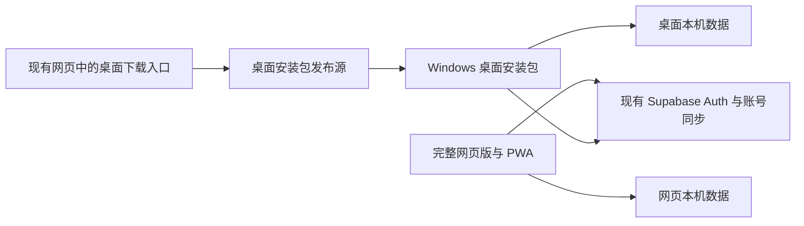

# 学习生活台：保留手机网页版、增加 Windows 桌面版方案

评估日期：2026-10-07（Asia/Shanghai）。用户确定保留现有完整网页版，新增 Windows 桌面版。
本文件给出实现和发布方案，不表示桌面安装包已经构建。

## 推荐结论

基于当前 Vue 3 + Vite 应用，新增 Electron + electron-builder Windows x64 安装包：电脑主要使用独立桌面应用，手机继续使用现有完整网页版/PWA。网页版继续在现有 Cloudflare Pages 域名提供移动端的今日、课程、账本等功能；桌面版复用主要业务界面和本地 OCR，两端并行提供。

两种版本共享主要业务组件，但数据储存在各自浏览器/桌面应用目录。电脑桌面版与手机网页版登录同一个 Supabase 账号后，可以沿用账号自动同步和冲突确认流程；本机访客数据用现有 JSON 备份导入桌面版。设备码、绑定码、同步空间与二维码迁移均已停用。应用不自动读取另一个 origin 的本机存储。

网页版与桌面版分别发版。网页发布继续使用现有 Cloudflare Pages/PWA 流程；桌面发行版用独立安装包及更新流程。二者只通过 Supabase 账号同步共享数据；旧同步空间 API 已停用，旧空间中的远端数据不会由客户端自动删除。

## 组成与数据流



| 项目 | 方案 |
|---|---|
| 网页（手机） | 继续提供完整功能、账号同步、移动端布局及现有 PWA 安装体验。|
| Windows 应用（电脑） | 作为电脑主要使用入口；Electron + electron-builder + NSIS x64 安装包，本地功能离线启动。|
| 数据 | 桌面版设置固定本机数据目录；沿用 localStorage/IndexedDB 和已有备份格式。登录同一账号后使用现有账号同步。|
| 账号同步 | 保留当前 Supabase Auth、`account_sync_snapshots`、RLS 和版本冲突流程。桌面 CORS、邮件确认回跳和账号切换需要真实环境验收。|
| 旧同步空间 | 设备码、绑定码、空间与旧 API 已停用；客户端不自动删除旧空间远端数据。|
| 下载 | Beta 安装包可先放 GitHub Releases。Pages 继续托管网页；安装包太大时应使用独立文件源。|
| 网页下载入口 | 可加在现有网页版首页、帮助或“关于”页，显示 Windows 支持范围和版本，不影响现有功能。|

## 首版边界

目标为普通 Windows 用户下载 `.exe` 后直接安装，不需 Node/npm。先交付 x64 单用户 NSIS 安装版，不同时加入便携版、Windows ARM、macOS 或 Linux 构建。以 Windows 11 完成测试；是否支持其他 Windows 版本，以实际安装包验证后公布。

使用有安装向导的 NSIS，而非一点即装模式。安装向导提供文件夹选择、磁盘剩余空间和最终确认；D 盘可写且空间足够时默认建议 `D:\StudyLife`，也允许用户浏览选择其他目录。electron-builder 支持在安装向导里更改安装路径（`oneClick: false`、`allowToChangeInstallationDirectory: true`）。[NSIS 安装选项](https://www.electron.build/docs/nsis/)

安装路径作为本机文件的统一根目录，示意如下：

```text
D:\StudyLife\
├─ StudyLife.exe 及程序和随包 OCR 资源
├─ data\profile\ 业务 LocalStorage/IndexedDB、本机凭据与登录会话
├─ data\backups\ 默认保存的 JSON 备份
├─ cache\ 浏览器网络缓存、JS 代码缓存
├─ updates\ 桌面更新下载与暂存文件
└─ logs\ 应用日志和崩溃报告
```

主进程在 Electron 启动早期把 `userData`、`sessionData`、`cache`、`logs`、`crashDumps` 指向所选安装根目录；创建 Chromium Session 后，将代码缓存路径也明确设在其中。下载的桌面更新和应用默认生成的备份同样放进根目录的相应子文件夹。用户自行另选的备份导出路径仍按他的选择保存。Electron 提供设置应用数据目录、会话目录和代码缓存目录的接口，必须在创建 session 与读写本地数据前设置并用成品包核验。[Electron app paths](https://www.electronjs.org/docs/latest/api/app)、[Electron session cache](https://www.electronjs.org/docs/latest/api/session)。

**可保证的是本应用主动创建的持久文件和缓存跟随安装盘。** Windows 自己管理的安装器解压临时区、注册表里的卸载登记、开始菜单和桌面快捷方式、系统临时文件与页面文件不由应用目录控制；因此不能承诺整台电脑在 C 盘完全不留下系统级记录。向导应明确显示实际应用数据路径，不能暗中把用户数据或缓存回退到 `%APPDATA%` 或 `%LOCALAPPDATA%`。

安装位置首次确定后，覆盖升级默认沿用它；更改位置必须通过单独的迁移流程先复制并校验 `data`，成功后才清理旧路径，避免应用误认为是全新安装。卸载时默认移除程序文件、缓存及更新暂存并保留个人 `data` 和备份；提供明确的“同时删除本机数据”选项。D 盘不存在、不可写或空间不足时，在安装前说明原因并让用户另选位置，不静默转存数据到系统盘。
向导依次显示欢迎页、安装目录选择、剩余空间检查、程序与数据目录预览、确认安装和完成页。目录预览明确标出个人资料、缓存、更新下载、日志与默认备份都位于所选根目录下面。采用当前用户安装；目标目录不可写时提示权限或请用户另选，不要求用户从源码自行运行。

首版复用现有网页：页面和核心流程保留，验证离线启动、课程与待办、账本、Excel 导入、离线 OCR、备份还原及账号同步。再加入单实例、合理的窗口尺寸、关闭行为、版本信息、检查更新及桌面通知。

托盘可在第一版或后续加入。现有提醒依赖活动页面的定时器；窗口隐藏、Windows 睡眠和完全退出的提醒表现需要分别设计和实测，不宣传关机后仍可提醒。浏览器 Web Speech API 也需在 Electron 中实测，不保证语音识别可用；文字输入继续作为常规路径。

## 实施改动

新增 `desktop/` 保存 Electron 主进程、preload、安全本地协议及构建配置；现有 `src/` 和 `public/ocr/` 继续作为业务 UI 和静态资源来源。桌面 Vite 构建使用独立目录和构建标志；保持网页原来的 `dist/`、PWA 插件、Cloudflare Pages 资源和发布工作流。桌面构建关闭 Service Worker 注册和网页更新逻辑，但保留数据启动闸门、账号恢复、Vault 初始化和本机数据迁移。

| 现有位置 | 需要调整的内容 |
|---|---|
| `src/main.js` | 按构建目标停用桌面版的 PWA 注册/网页更新；保留 Vault 初始化和未完成账号同步事务恢复。网页路径保持原行为。|
| `src/services/supabase.js`、`src/composables/accountAuth.js` | 桌面使用生产 Supabase 项目 URL 和 publishable key；保持会话只存于本机。将桌面的验证邮件跳转明确指向原 HTTPS 网页回调，核对 Supabase 允许的 Redirect URLs 与邮件模板。验证后用户返回桌面登录同一账号，不跨应用传递 session token。|
| `src/composables/accountSyncEngine.js`、`src/services/accountSync.js` | 桌面与网页版共用 Supabase 账号同步；维持 RLS 所有权隔离、离线重试和冲突保护，并验收登录回跳与冲突恢复。旧 `/api/sync/*` 只返回 410，不纳入桌面兼容范围。|
| `src/composables/appUpdate.js` | 网页版本继续用当前 PWA 更新机制。桌面版本切换到单独的安装包版本检查，不执行 SW 注销、缓存清理和浏览器页面刷新。|
| `src/composables/dataVault.js`、`src/composables/store/core.js` | 沿用现有 localStorage 和 IndexedDB 镜像；首次启动和升级时使用稳定的桌面 origin 和 userData。|
| `src/composables/dataManagerBackup.js` | 复用备份校验、schema 兼容、壁纸选项和原子恢复。导入后展示预览并确认，不覆盖网页本机数据。|
| `src/composables/ocrPipeline.js` | 将 `public/ocr/` 资源随桌面包发布，验证安全本地协议下 Worker/WASM 路径、CSP 与首次离线识别。|
| `vite.config.js`、`package.json` | 保持既有 Web 构建不变，增加桌面专用 mode/script 和 NSIS 包装。生产 Windows 下载包不含 `.env`、秘密或本地数据。|
| `.github/workflows/ci.yml`、`scripts/source-signature.mjs`、发布配置 | 保留网页质量门禁与 `dist/` 上传，新增 Windows 构建和发行物校验任务；分开 Web 发布与桌面发布。|

桌面应用只加载本地签名资源，禁止 renderer 直接访问 Node.js。Electron 配置保持 `sandbox`、`contextIsolation` 和 CSP，只通过窄而校验参数的 preload 接口提供原生能力。外部网页由系统浏览器打开。自定义协议的 host、规范化资源路径和目录穿越拒绝规则必须验收。[Electron 安全说明](https://www.electronjs.org/docs/latest/tutorial/security)、[protocol API](https://www.electronjs.org/docs/latest/api/protocol)。

## 账号、回跳和数据同步

当前项目包含 `@supabase/supabase-js`、邮箱认证和自动账号同步。桌面继续使用账号，而非自行发明一套桌面专属登录。桌面会有独立 Supabase 会话存储；网页保持自己的会话。两端登录同一个邮箱账号后，使用既有云端快照和冲突处理完成设备间同步。

验证邮件首先跳转到现有 HTTPS 网页上受控的确认回调，然后提示用户回到桌面应用登录。这样不需要把邮箱链接里的会话令牌通过自定义协议、命令行或日志转交。须在 Supabase 生产 URL allowlist 和邮件模板中加入精确的桌面回调路径；桌面账号流程在内测前端到端验证。Supabase 官方指出 `emailRedirectTo` 目标必须在允许列表中，邮件模板需使用相应回跳 URL。[Redirect URLs](https://supabase.com/docs/guides/auth/redirect-urls)、[Email templates](https://supabase.com/docs/guides/auth/auth-email-templates)。

桌面构建只允许包含 Supabase project URL 与 publishable key。安装包是可被检查的公共客户端，绝不能包含 `secret` / `service_role` 密钥；数据库数据隔离继续由 Auth/JWT 与数据库 RLS 实施。Supabase 官方明确 publishable key 可随 desktop app 发布，secret key 必须留在服务器端。[Supabase API keys](https://supabase.com/docs/guides/getting-started/api-keys)。

登录后若当前设备还有访客数据，应继续复用现有首次登录合并确认流程。切换账号沿用本地隔离和恢复逻辑。电脑中有重要数据却没有账号同步时，用户可在网页导出 JSON、桌面预览并导入，原数据保留。账号同步备份不包含 Supabase session，桌面登录需重新认证。

现有配置文档指出生产自定义 SMTP 和邮箱确认流程仍待真人收信验收。因此，在启用桌面发行和公开账号注册前，按 Supabase 文档完成邮件服务、精准回调 URL 和真实邮箱注册—确认—重新登录测试。没有配置邮件之前，只能把账号链路标成尚未完成，不得把点击按钮通过的本地模拟当作生产验证。

## 网页与桌面共存及下载

手机继续用现有网页版或 PWA 处理日常记录；原 Cloudflare Pages 域名、功能、Service Worker、静态资源与 PWA 更新机制保持不变。电脑访客在网页可见区域获得 Windows 安装包下载入口，下载完成后在电脑上使用桌面应用。手机界面保留完整工作台，不显示只有 Windows 才能使用的安装流程，也不强制跳转。

下载按钮通过小型版本清单获取文件版本、文件名、大小、SHA-256、Windows 要求和备用下载。Beta 可直接链接 GitHub Releases 附件；正式下载可选 R2 生产自定义域名并保留 GitHub 镜像，先在实际目标网络上验证。

Cloudflare Pages 静态文件的单个体积上限为 25 MiB，因此不把预计较大的 Windows 安装包放进页面构建目录，改用 GitHub Releases 或 R2。[Pages limits](https://developers.cloudflare.com/pages/platform/limits/)。正式的 R2 下载需要生产自定义域名，`r2.dev` 不作正式下载渠道；不能假定普通 Cloudflare 域名能保证中国大陆下载速度。[R2 public buckets](https://developers.cloudflare.com/r2/buckets/public-buckets/)、[完整分发研究](desktop-distribution.md)。

## 更新与发布

网页版沿用当前版本说明和 PWA Service Worker 更新。Windows 桌面包使用独立 SemVer；`electron-updater` 的 NSIS 通道已实现用户确认后下载、重启安装。桌面包必须将生产依赖打入应用，并随公开 GitHub Release 提供同次构建的 `latest.yml`、NSIS 安装程序及差分元数据；桌面不能用 Service Worker 或网页 `version.txt` 更新自身。[electron-builder auto-update](https://www.electron.build/v26/docs/features/auto-update/)。

CI 在 main / Pull Request 上运行 Web 完整门禁，并在 Windows runner 构建目录包，检查 `app.asar` 中存在 `electron-updater` 且 `app-update.yml` 指向目标仓库。推送与 `desktop-app/package.json` 版本一致的 `v*` 标签后，独立发布工作流再运行完整门禁、重复包校验，并将 NSIS 安装程序、`latest.yml` 和差分文件发布到 GitHub Release。发布后仍需做真实已安装版本的覆盖升级、卸载与本机数据保留验收；自动化包检查不能替代真实更新演练。

公开分发应评估 Windows 代码签名、SmartScreen 提示及签名费用；买到签名证书不保证永远没有首次安装提示。精确边界见[桌面分发研究](desktop-distribution.md)。

## 阶段和验收

| 阶段 | 交付 | 验收 |
|---|---|---|
| A：本地 Beta | Electron 窗口、可选安装目录的 NSIS x64 安装包 | 在 `D:\StudyLife` 与另一可写盘各完成一次安装；验证业务数据、账号会话、浏览器/代码缓存、日志、更新下载及默认备份都在所选目录内，目录不足时给出提示，不能静默落到系统盘。普通用户无需 Node。 |
| B：同步与回跳 | 账号同步、邮件验证、冲突恢复 | 使用两个虚构测试账号和实际邮箱，完成注册、回跳、重新登录、数据同步/冲突；分别测桌面与网页版，RLS 隔离有效。旧绑定路径已停用。|
| C：桌面体验 | 关闭行为、通知、版本提示、更新演练 | 前台与隐藏窗口分别测试提醒；睡眠和退出行为给出真实边界；覆盖升级保留本机数据。 |
| D：并行发布 | 完整网页版继续在线、Beta 下载链接、桌面发布清单 | 现有网页版、手机布局和 PWA 更新通过既有 Web 门禁；测试版从干净 Windows 可下载、安装、启动和更新。 |

建议先做本地桌面 Beta，再加入网页“下载 Windows 版”入口。此时完整网页版继续照常可访问和使用。首次可运行安装包约 1–2 开发日；含账号回跳、同步验收、桌面体验和可下载 Beta 的整体估计约 6–12 开发日（一个开发者，Windows x64，复用现有功能）。邮件服务、签名和目标网络下载问题可能另计，首次产包后再调整估时。

实施后至少验证：从向导选择 D 盘、完成安装并逐项核对磁盘写入路径；更换目标目录后升级沿用原路径；D 盘不可写和空间不足时的提示；卸载分别选择保留或删除本机数据；重装恢复原数据。另验证离线首次启动和 OCR、主要业务页面、Excel 导入、备份导入/导出与壁纸、本机断网后恢复、同一账号网页版—桌面往返同步、两个账号隔离、冲突确认、邮件确认回跳、关闭/重开和覆盖升级、下载安装校验值。保留网页端既有 CI 和发布审计，不以桌面验收替代它们。
